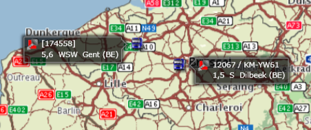
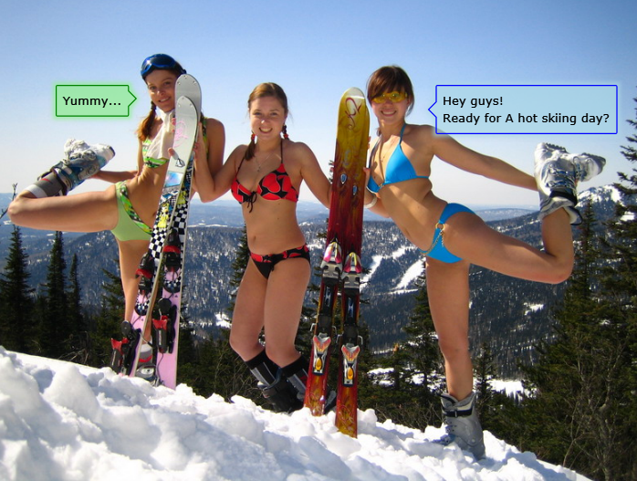

Recently, I was trying to find a Silverlight control, which works like a standard Border, but looks like a Speech Bubble instead. This means the border would have a "leader" triangle, which could point to a related visual element. See the following example:

Here we have two objects on a map: two vehicle icons. Each of them has a related bubble pop-up with some status information. When we get many objects on the map, the pop-up "leaders" will help user grasp the relations between icons and info labels.

First, I started with requirements list to a Bubble control; here's what I got:
1. The control should act like a standard content control, i.e. it must allow any like of XAML content inside.
2. It must auto scale up and down whenever the content size changes.
3. The "leader" position must be flexible: I need a way to switch it to appear on the left, on the right or totally hidden in design/runtime. I also need to set "leader" top position and size.
4. The control look must be customizable with styles/templates. The look from the picture above should be doable, which means I need a way to setup background opacity, border color (make sure the "leader" and pop-up body has a unite border) and solid shadow.
5. It must be open source, free to use and modify for a commercial application.

Unfortunately, I failed to find a ready-to-use control on the web, so I had to write one on my own. You can download the Bubble control test application [here](https://skydrive.live.com/redir.aspx?cid=c010011792a4b538&resid=C010011792A4B538!126&parid=root).
Here is a brief review of the code.

First, we declare the Bubble control and derive from ContentControl to get a ready-to-use Content property for placing child control.

    public class Bubble : ContentControl
    {
        public Bubble()
        {
            this.DefaultStyleKey = typeof(Bubble);
        }
    }

Then, we go to Themes/Generic.xaml resource dictionary to declare the (default) control template. Here's how it looks:

    <Setter Property="Template">
        <Setter.Value>
            <ControlTemplate TargetType="localcontrols:Bubble">
                <Grid>
                    <Path x:Name="OuterPath" Fill="#020202" StrokeThickness="0" Opacity="0.7">
                        <Path.Effect>
                            <BlurEffect Radius="6"/>
                        </Path.Effect>
                    </Path>
                    <Path x:Name="InnerPath" Stroke="#8F8F8F" StrokeThickness="1">
                    </Path>
                    <ContentPresenter x:Name="ContentContainer" ContentTemplate="{TemplateBinding ContentTemplate}" Content="{TemplateBinding Content}"
                                        HorizontalAlignment="Center" VerticalAlignment="Center" />
                </Grid>
            </ControlTemplate>
        </Setter.Value>
    </Setter>

The three elements are placed into ControlTemplate:

*   OuterPath is a Path control to render background and shadow. I didn't manage to get the exact required look with a single Path control with DropShadowEffect, so I decided to use two controls instead. We apply Fill, Opacity and BlurEffect to this control.
*   InnerPath is a Path control to render the border. We apply Stroke and StrokeThickness to this control.
*   ContentContainer is a ContentPresenter to render child control hierarchy.

Now, we can get the references to template's controls in our Bubble's method OnApplyTemplate(). We are going to render the bubble with Path controls, with pixel-based API. So, any time the content size changes, we need to adopt Paths. Let's subscribe to SizeChanged event then.

    private Path _OuterPath;
    private Path _InnerPath;
    private ContentPresenter _ContentContainer;

    public override void OnApplyTemplate()
    {
        base.OnApplyTemplate();
        _OuterPath = (Path)GetTemplateChild("OuterPath");
        _InnerPath = (Path)GetTemplateChild("InnerPath");
        _ContentContainer = (ContentPresenter)GetTemplateChild("ContentContainer");
        if (_OuterPath != null && _ContentContainer != null)
            _ContentContainer.SizeChanged += new SizeChangedEventHandler(OnSizeChanged);
    }

    private void OnSizeChanged(object sender, SizeChangedEventArgs e)
    {
        Render();
    }

We'll need several properties to customize the look of Bubble control: Corner radius and Leader size & position.

    /// 

    /// Corner radius
    /// 

    public static readonly DependencyProperty CornerRadiusProperty = DependencyProperty.Register("CornerRadius", typeof(int), typeof(Bubble), new PropertyMetadata(null));
    public int CornerRadius
    {
        get
        {
            return (int)GetValue(CornerRadiusProperty);
        }
        set
        {
            SetValue(CornerRadiusProperty, value);
        }
    }

    /// 

    /// Leader (arrow pointer) size
    /// 

    public static readonly DependencyProperty LeaderSizeProperty = DependencyProperty.Register("LeaderSize", typeof(int), typeof(Bubble), new PropertyMetadata(null));
    public int LeaderSize
    {
        get
        {
            return (int)GetValue(LeaderSizeProperty);
        }
        set
        {
            SetValue(LeaderSizeProperty, value);
        }
    }

    /// 

    /// Leader (arrow pointer) position - relative to upper border
    /// 

    public static readonly DependencyProperty LeaderTopProperty = DependencyProperty.Register("LeaderTop", typeof(int), typeof(Bubble), new PropertyMetadata(null));
    public int LeaderTop
    {
        get
        {
            return (int)GetValue(LeaderTopProperty);
        }
        set
        {
            SetValue(LeaderTopProperty, value);
        }
    }

    /// 

    /// Leader (arrow pointer) position - left, right or none (hidden)
    /// 

    public static readonly DependencyProperty LeaderPositionProperty = DependencyProperty.Register("LeaderPosition", typeof(BubbleLeaderPosition), typeof(Bubble), new PropertyMetadata(OnPropertyChanged));
    public BubbleLeaderPosition LeaderPosition
    {
        get
        {
            return (BubbleLeaderPosition)GetValue(LeaderPositionProperty);
        }
        set
        {
            SetValue(LeaderPositionProperty, value);
        }
    }

    public enum BubbleLeaderPosition
    {
        None,
        Left,
        Right
    }

Now we only need to implement Render() method - quite a lot of routine work: calculating coordinates of "leader", adding Path segments into both OuterPath and InnerPath, setting margins etc.

    protected void Render()
    {
        if (_ContentContainer == null '' _OuterPath == null)
                    return;
        double width = _ContentContainer.ActualWidth + 2 + SHADOW_SIZE * 2 + LeaderSize;
        double height = _ContentContainer.ActualHeight + 2 + SHADOW_SIZE * 2;

        // paint the outer path - used for shadow effect
        RenderPath(_OuterPath, 0, 0, width, height, SHADOW_SIZE);

        // paint the inner path - used for border rendering
        // may be skipped in control template
        if (_InnerPath != null)
            RenderPath(_InnerPath, SHADOW_SIZE, SHADOW_SIZE, width - SHADOW_SIZE, height - SHADOW_SIZE, 0);

        switch (LeaderPosition)
        {
            case BubbleLeaderPosition.None:
                _ContentContainer.Margin = new Thickness(SHADOW_SIZE + 1);
                break;
            case BubbleLeaderPosition.Left:
                _ContentContainer.Margin = new Thickness(LeaderSize + SHADOW_SIZE + 1, SHADOW_SIZE + 1, SHADOW_SIZE + 1, SHADOW_SIZE + 1);
                break;
            case BubbleLeaderPosition.Right:
                _ContentContainer.Margin = new Thickness(SHADOW_SIZE + 1, SHADOW_SIZE + 1, SHADOW_SIZE + 1 + LeaderSize, SHADOW_SIZE + 1);
                break;
        }
    }

    private void RenderPath(Path path, double left, double top, double right, double bottom, double shadowSize)
    {
        PathGeometry geometry = new PathGeometry();
        PathFigure figure = new PathFigure { IsClosed = true };
        geometry.Figures.Add(figure);
        switch (LeaderPosition)
        {
            case BubbleLeaderPosition.None:
                figure.StartPoint = new Point { X = left, Y = top + CornerRadius };
                figure.Segments.Add(new ArcSegment { Point = new Point { X = left + CornerRadius, Y = top }, SweepDirection = SweepDirection.Clockwise, Size = new Size { Width = CornerRadius, Height = CornerRadius } });
                figure.Segments.Add(new LineSegment { Point = new Point { X = right - CornerRadius, Y = top } });
                figure.Segments.Add(new ArcSegment { Point = new Point { X = right, Y = top + CornerRadius }, SweepDirection = SweepDirection.Clockwise, Size = new Size { Width = CornerRadius, Height = CornerRadius } });
                figure.Segments.Add(new LineSegment { Point = new Point { X = right, Y = bottom - CornerRadius } });
                figure.Segments.Add(new ArcSegment { Point = new Point { X = right - CornerRadius, Y = bottom }, SweepDirection = SweepDirection.Clockwise, Size = new Size { Width = CornerRadius, Height = CornerRadius } });
                figure.Segments.Add(new LineSegment { Point = new Point { X = left + CornerRadius, Y = bottom } });
                figure.Segments.Add(new ArcSegment { Point = new Point { X = left, Y = bottom - CornerRadius }, SweepDirection = SweepDirection.Clockwise, Size = new Size { Width = CornerRadius, Height = CornerRadius } });
                break;

            case BubbleLeaderPosition.Left:
                figure.StartPoint = new Point { X = left + LeaderSize, Y = top + CornerRadius };
                figure.Segments.Add(new ArcSegment { Point = new Point { X = left + LeaderSize + CornerRadius, Y = top }, SweepDirection = SweepDirection.Clockwise, Size = new Size { Width = CornerRadius, Height = CornerRadius } });
                figure.Segments.Add(new LineSegment { Point = new Point { X = right - CornerRadius, Y = top } });
                figure.Segments.Add(new ArcSegment { Point = new Point { X = right, Y = top + CornerRadius }, SweepDirection = SweepDirection.Clockwise, Size = new Size { Width = CornerRadius, Height = CornerRadius } });
                figure.Segments.Add(new LineSegment { Point = new Point { X = right, Y = bottom - CornerRadius } });
                figure.Segments.Add(new ArcSegment { Point = new Point { X = right - CornerRadius, Y = bottom }, SweepDirection = SweepDirection.Clockwise, Size = new Size { Width = CornerRadius, Height = CornerRadius } });
                figure.Segments.Add(new LineSegment { Point = new Point { X = left + LeaderSize + CornerRadius, Y = bottom } });
                figure.Segments.Add(new ArcSegment { Point = new Point { X = left + LeaderSize, Y = bottom - CornerRadius }, SweepDirection = SweepDirection.Clockwise, Size = new Size { Width = CornerRadius, Height = CornerRadius } });
                figure.Segments.Add(new LineSegment { Point = new Point { X = left + LeaderSize, Y = top + LeaderTop + 2 * LeaderSize + 2 * shadowSize } });
                figure.Segments.Add(new LineSegment { Point = new Point { X = left, Y = top + LeaderTop + LeaderSize + shadowSize } });
                figure.Segments.Add(new LineSegment { Point = new Point { X = left + LeaderSize, Y = top + LeaderTop } });
                break;

            case BubbleLeaderPosition.Right:
                figure.StartPoint = new Point { X = left, Y = top + CornerRadius };
                figure.Segments.Add(new ArcSegment { Point = new Point { X = left + CornerRadius, Y = top }, SweepDirection = SweepDirection.Clockwise, Size = new Size { Width = CornerRadius, Height = CornerRadius } });
                figure.Segments.Add(new LineSegment { Point = new Point { X = right - LeaderSize - CornerRadius, Y = top } });
                figure.Segments.Add(new ArcSegment { Point = new Point { X = right - LeaderSize, Y = top + CornerRadius }, SweepDirection = SweepDirection.Clockwise, Size = new Size { Width = CornerRadius, Height = CornerRadius } });
                figure.Segments.Add(new LineSegment { Point = new Point { X = right - LeaderSize, Y = top + LeaderTop } });
                figure.Segments.Add(new LineSegment { Point = new Point { X = right, Y = top + LeaderTop + LeaderSize + shadowSize } });
                figure.Segments.Add(new LineSegment { Point = new Point { X = right - LeaderSize, Y = top + LeaderTop + 2 * LeaderSize + 2 * shadowSize } });
                figure.Segments.Add(new LineSegment { Point = new Point { X = right - LeaderSize, Y = bottom - CornerRadius } });
                figure.Segments.Add(new ArcSegment { Point = new Point { X = right - LeaderSize - CornerRadius, Y = bottom }, SweepDirection = SweepDirection.Clockwise, Size = new Size { Width = CornerRadius, Height = CornerRadius } });
                figure.Segments.Add(new LineSegment { Point = new Point { X = left + CornerRadius, Y = bottom } });
                figure.Segments.Add(new ArcSegment { Point = new Point { X = left, Y = bottom - CornerRadius }, SweepDirection = SweepDirection.Clockwise, Size = new Size { Width = CornerRadius, Height = CornerRadius } });
                break;
        }

        path.Data = geometry;
    }

You can download the Bubble control test application [here](https://skydrive.live.com/redir.aspx?cid=c010011792a4b538&resid=C010011792A4B538!126&parid=root). It will show you something like this :)
