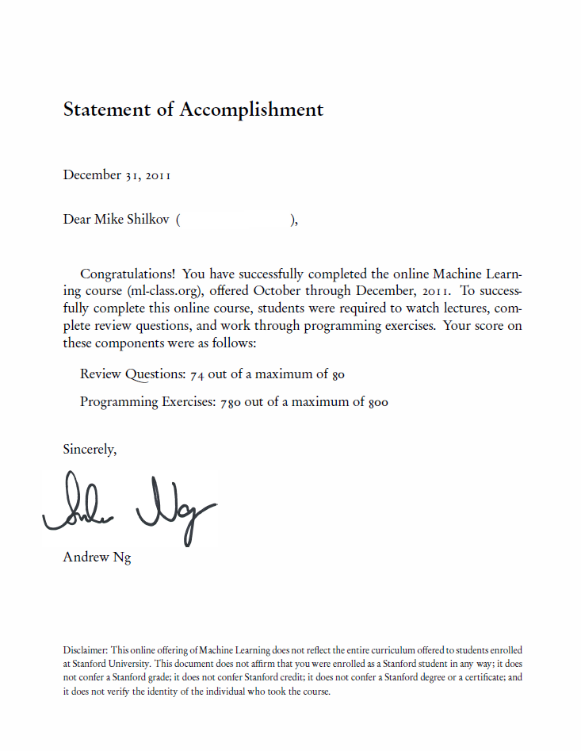

Several days ago, I've received a Statement of Accomplishment document from Andrew Ng and Machine Learning online class team.

My score is below the maximum just because I started about two weeks late, and thus got a penalty for first exercises.

Overall, that was a great experience of online learning, thanks to Andrew and his team. If you still haven't heard of Stanford online courses, please visit [Machine Learning class page](http://http://www.ml-class.org "Machine Learning class"). There you'll also find the list of other classes to be available soon, I'm already signed to some of them.

Join, it's gonna be fun!