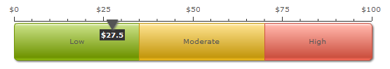
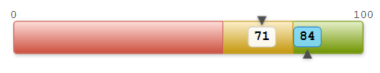

While developing the dashboard to display several performance indexes, I bumped into the task of visualizing the pair of numbers on a single gauge. One number would show a person's performance metric, while the other one would display the person group's performance indicator to compare with. I couldn't find a ready control to use, so I decided to design my own.

I took the look idea from [Fusion Charts](http://www.fusioncharts.com/demos/gallery/gauges/chart.asp?id=linear_1 "Fusion Chart gauge sample") flash controls (highly recommended), which I was using a couple of years ago:

I needed the same thing, but with two values displayed at the same time. Requirements are pretty simple:

*   Three colored zones (low-red / average-yellow / high-green) with configurable thresholds
*   Configurable min and max values
*   One value marker on top of the gauge and another one on the bottom
*   Bubble with exact value next to each marker
*   All control properties are ready to be data-bound
*   Flexible size
*   No ticks needed
Here is what I ended up with:

Quite minimalistic and sexy ;-)  The control usage is self-explanatory:

    <local:Gauge x:Name="Gauge" Value="71" SecondValue="84" RedThreshold="60" YellowThreshold="80"
                     MinValue="0" MaxValue="100" Width="400" />

Source code has no rocket-science inside, so I won't post it here. You can download the Gauge control test application [here](https://skydrive.live.com/redir.aspx?cid=c010011792a4b538&resid=C010011792A4B538!127&parid=root).