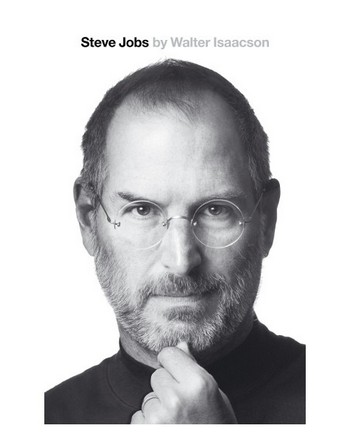

**"Steve Jobs" **by Walter Isaacson ([link](http://www.amazon.com/Steve-Jobs-Walter-Isaacson/dp/1451648537 "Steve Jobs on Amazon"))

I guess it's one of the most popular books in the world at the moment. The story of the most influential person in IT world ever, that reveals the intense personality and extraordinary talent.

I never used a single product of Apple company, but still I'm very impressed with what Steve did and with the way how he did that. Now I understand that many things are possible, even if everyone _knows_ they are not.

The book is pretty long and detailed, but it's worth the time. I rate it 4 out of 5.

 **"How to Become a Businessman"** by Oleg Tinkov ([link](http://tinkov.com/payment/5/ "Tinkov books"))

A book by the most famous Russian entrepreneur. Short, simple and sharp, it gives a portion of good advice for young businessmen.

To me it appeared to be really motivating. The main idea is "keep your head clean and your work hard - and you'll earn your million".

The book is quite short (you'll probably finish it in one or two nights) and well structured (how to find the idea, make the brand, start, develop and sell the business) with real life example.

5 star reading for a rookie businessman in Russia.

**"I'm Just Like Anyone Else"** by Oleg Tinkov ([link](http://itunes.apple.com/us/book/im-just-like-anyone-else/id407756421 "Oleg Tinkov"))

Another book of same author. He didn't mean to teach the reader, but instead he tells the story of his life and all of his businesses to the moment.

The biography of strong entrepreneur and charismatic leader is definitely worth reading. And while doing that, you'll probably learn some hints and ideas on business in Russia.

Rating is 4*.

**
"The Art of  the Start"** by Guy Kawasaki ([link](http://www.guykawasaki.com/the-art-of-the-start/ "Guy Kawasaki"))

Guy is a former evangelist for Apple's Macintosh computer and now - a Silicon Valley venture capitalist.

While he gives some generic valuable hints on start-up business, the book did not seem the right one for me at the moment. The author goes into great detail when it comes to raising capital, preparing awesome presentations and self-marketing.

You know, I don't expect myself to form the board of directors any soon... So I'll give this book 3*, as it's good but not relevant enough for my needs.