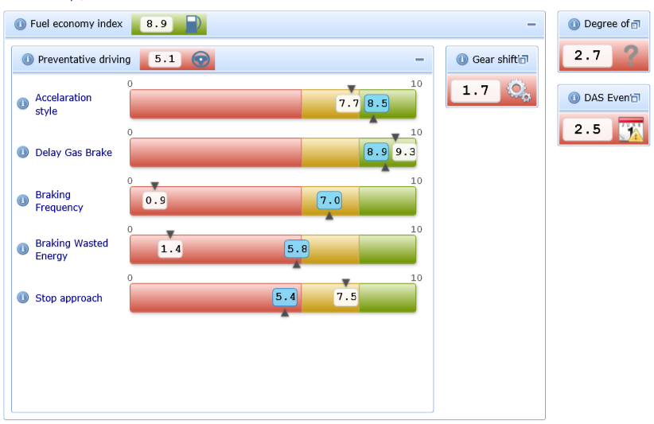

We were investigating the options for visual representation of hierarchical dashboard in our Silverlight application. This means, we want to display the number of gauges with tree-like structure. Here is a sample:

    Dashboard
    --- Fuel economy index
    ------ Preventative driving
    --------- Accelaration style
    --------- Braking frequency
    --------- Stop approach
    ------ Gear shifting index
    --------- ...
    --- Degree of difficulty
    ------ ...
    --- Events
    ------ ......

One of the options was to use [Telerik's TileView control](http://www.telerik.com/products/silverlight/controls/tileview.aspx "Telerik"). It doesn't support hierachies out of the box, but we've made a prototype control, which proves that the task is doable. Here is how nested TileView's look like:

Everything works with templates and data binding, no dirty tricks needed. You can download the sample project with multi-level TileView's from [here](https://skydrive.live.com/redir.aspx?cid=c010011792a4b538&resid=C010011792A4B538!128&parid=root "Multi-level TileView sample project").