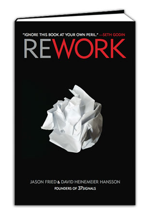
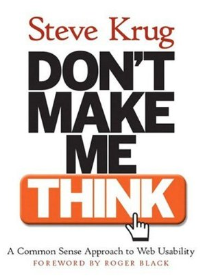
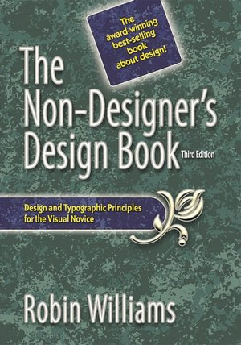

**"Rework"** by Jason Fried and David Heinemeier Hansson ([link](http://www.amazon.com/Rework-Jason-Fried/dp/0307463745 "Rework book"))

Short but practical and inspiring  entrepreneurial handbook for the twenty-first century. The guys from [37signals](http://37signals.com/ "37 signals") give no boring theory but dozens of useful hints for a business "starter".

The book is not deap, just a 'one-evening-reading'. And the advice they give is quite the opposite to what people teach in business schools.

Great reading for those who want to start their own business, have their own business, or are just interested in the subject. But don't believe them blind. Score is 4 of 5.

**"Don't Make Me Think"** by Steve Krug ([link](http://www.amazon.com/exec/obidos/ASIN/0789723107 "Don"))

A very well laid introduction into web site usability. Steve gives several generic rules ("the Krug's laws") on how to get into user's head, how to think usability, how to make pages clear, understandable and consise. Also be ready to good humor and excellent illustrations.

This book may seem old (first published in 2000) but the rules are still up-to-date, and the book became an industry standard. Must-read for software developers, product managers and everyone who's job is related to web site creation.

Score is 5.

 **"The Non-Designer's Design Book"** by Robin Williams ([link](http://www.amazon.com/exec/obidos/ASIN/0321193857 "The Non-Designer"))

I'm far from being a good designer but I'd really love to get at least the very basics of the skill to make beautiful things (UI mostly).

The author of this book explains some really generic principles of design, i.e. contrast, repetition, alignment, proximity and proper font usage. She gives the clear overview of each principle and provides examples and exercises to illustrate them.

We'll see whether the book will help me build good-looking web pages... In any case, it's absolutely worth reading for persons who have interest in the subject.

 **"The Toilet Paper Entrepreneur"** by Mike Michaliwicz ([link](http://www.toiletpaperentrepreneur.com/book/overview/ "The Toilet paper entrepreneur"))

The book is about running a startup without any significant budget available.

To me, this book is mostly about motivation and call to action. Stop crying about not having this or that. Don't wait for a million to come before you start your business. Just start today and work hard!

Otherwise, I don't think I'll take much of Mike's advice. Score is 3 of 5.