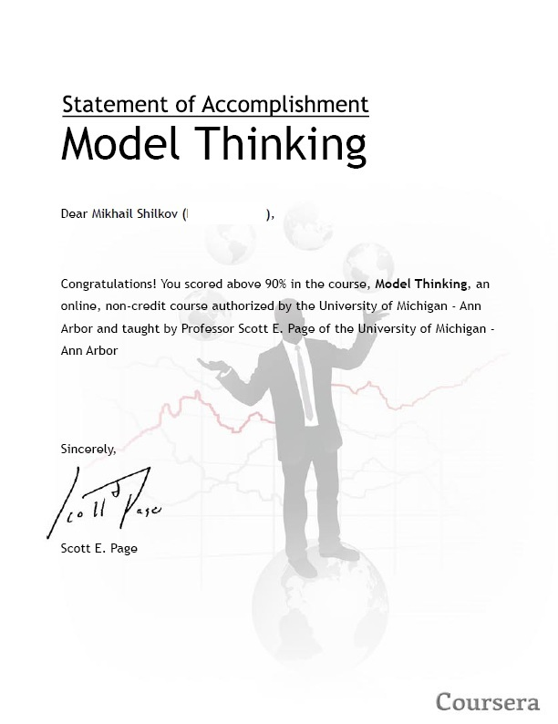

I've recently received a statement of accomplishment document for [Coursera](https://www.coursera.org/ "Coursera")'s online [Model Thinking Class](https://www.coursera.org/course/modelthinking "Model Thinking Class") that I took in April-May this year.

The course was kind of short but very intense, with a broad variety of models reviewed and many many very cool examples of models applied to real-world processes like population segregation, economic growth, disease spread, auctions and sport results. Scott E Page is a cool teacher who knows how to explain things in simple words and speaks very fast :)

Thanks to Scott E and University of Michigan. Sign up for more courses coming at [Coursera](Coursera "Coursera")!