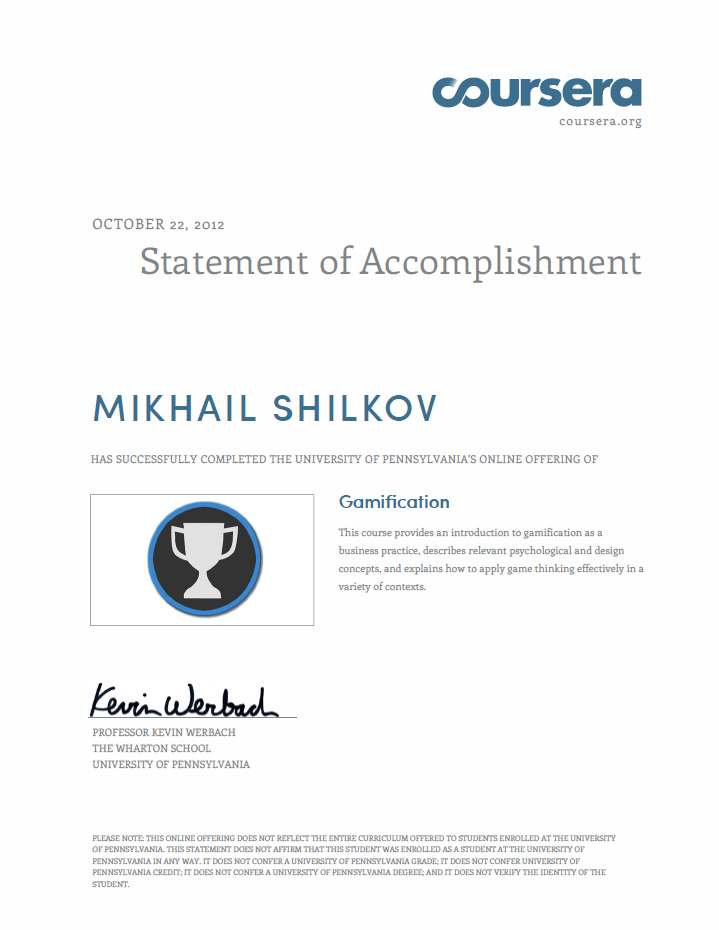

I've recently received a statement of accomplishment document for [Coursera](https://www.coursera.org/ "Coursera")'s online [Gamification class](https://www.coursera.org/course/gamification "Gamification class") that I took in August-October this year.

The course was lead by prof. Kevin Werbach from The Wharton School, University of Pennsylvania. He told us about applying game techniques to non-game world problems: business, social etc. In essence, it's on how to add FUN to processes, that are not supposed to be fun at all. Which is really cool. I loved both informative and well-producted lectures, and peer-reviewed assignments that appeared to be... fun :)

Want to know why Stackoverflow and Foursquare are such a success? Come join this course next time!

I hope I'll have a chance to apply the ideas from the course in real life!