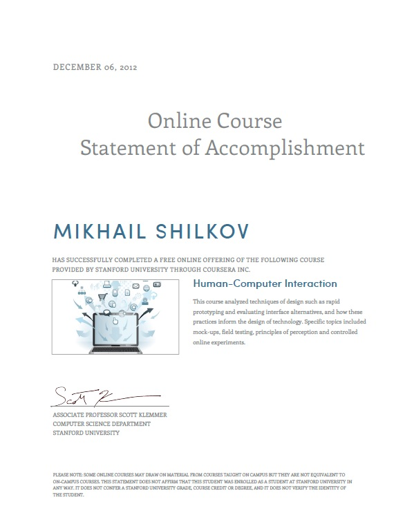

Today I want to give a note about two more online courses that I completed.

The last one (10 weeks in September-November) was called [Introduction to Computational Finance and Financial Econometrics](https://www.coursera.org/course/compfinance) and was lead by Eric Zivot from University of Washington. First of all, it was the most intense course out of all that I took to date. Every of 10 weeks we had about 3-4 hours of videos + homework. The course material was mostly about maths and statistics, and less about application in economics. However, some concepts were new to me and sounded very interesting.

I scored about 95% on all tests and exams (they were relatively easy comparing to video material). But unfortunately, I got no certificate or even course record for this! It seems that University of Washington did not allow Coursera to issue such certificates and records... What a shame! I spent lots of time on it, and a record would be satisfactory. Please be careful if you take this course or other courses of UoW in the future.

However, I got another unexpected certificate. In June, I took a course called [Human-Computer Interaction](https://www.coursera.org/course/hci) about user interface design concepts and approaches. I started it with a big delay because of my vacation, so I thought I wouldn't score enough for a certificate. But I was wrong! I got the certificate 6 months after the course ended:

The course was short but useful. I wish there would be an extension course, which would cover more details on the topic.