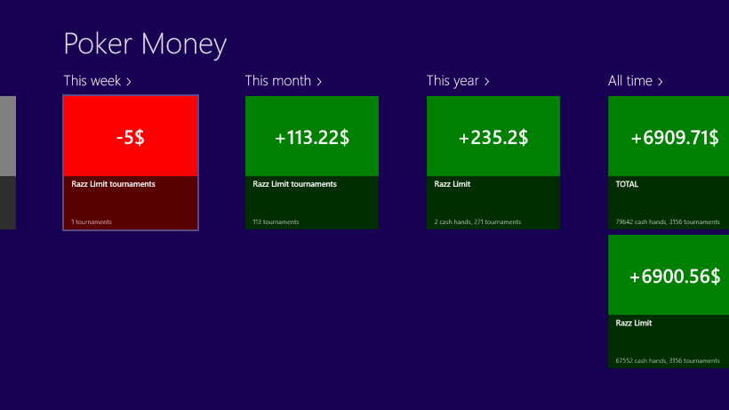

Windows 8 / Windows RT / Windows Store all arrived in October 2012.

I've decided to take a shot on writing a commercial application for this new platform. And that's how Poker Money app appeared.

Here are the links to it:

[Poker Money app official website](http://pokermoneyapp.com "Poker money app official website")

[Windows Store application page](http://apps.microsoft.com/windows/ru-RU/app/poker-money/47c61b67-94ec-4aae-a9c4-f60a37d7cc03 "Poker Money in Windows Store")

[Support thread on 2+2](http://forumserver.twoplustwo.com/45/software/poker-money-app-1282491/ "Support thread for Poker Money")

Poker Money is a basic tool for tracking online poker results, which supports all game types for the two major poker rooms: PokerStars and FullTiltPoker.

Here is a sample screen:
