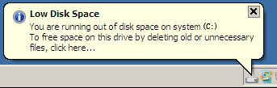
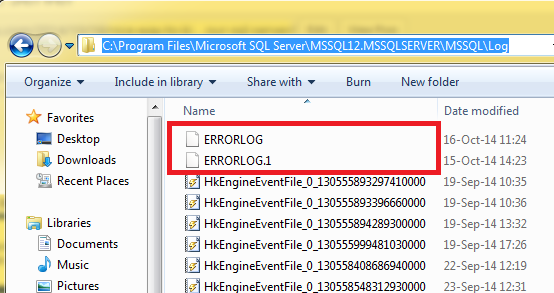

Are you getting enormous amount of

    The activated proc '...' running on queue '...' output the following:
    'The service queue "..." is currently disabled.

errors from SQL Server? Keep on reading!

Yesterday, when I came back from my lunch, I got a heads-up from Windows:

And it was literally out of space: 0 (zero) bytes available on C: drive. Wow...

I cleaned up the binary files from my developments, which gave me 3 GB of free space and some time to do the investigation. A short time, because disk space was counting down at about 300 MB per minute.

It appeared that the SQL Server error log files grew up to 53 GB and were still growing. Here is the default folder where you can find them:

To gain more time, I executed the command

    exec sp_cycle_error

is Management Studio. It renames current ERRORLOG file to ERRORLOG.1 and starts the new current. So now it was safe to delete all .1/.2/etc files and get those 53 GB back. Huh...

Now it's time to figure out the actual issue. Go to Management Studio -> your server -> Management -> SQL Server Logs -> Current -> (right click) -> View SQL Server Log

I saw millions of the following messages there (let's say my queue is named XQueue for simplicity):

    The activated proc '[dbo].[XQueueProcessor]' running
    on queue 'dbo.XQueue' output the following:
    'The service queue "XQueue" is currently disabled.

So, it looks like there is a problem with SQL Server Service Broker, which is constantly trying to read something from disabled queue. Isn't it supposed to stop after 5 attempts (a.k.a. poison messages)? Ok, keep on troubleshooting.

First, let check if the queue is actually disabled

    SELECT Name, is_receive_enabled, is_enqueue_enabled
      FROM sys.service_queues
     WHERE Name = 'XQueue'

Yep, it's disabled:

Do we have anything queued?

    SELECT TOP 1000 *
      FROM [XQueue] WITH(NOLOCK)

I got 9 rows back. This means we got some messages en-queued, and one of them failed to process, the message was considered as poison and the queue was disabled (which is good), but the processor still seems to be running in eternal loop.

So, let's have a look at the processor. We had something like that:

    CREATE PROCEDURE [dbo].[XQueueProcessor]
    AS
    BEGIN
        DECLARE
            @queuing_order BIGINT
            ,@conversation_handle UNIQUEIDENTIFIER
            ,@message_enqueue_time DATETIME
            ,@message_type_name VARCHAR(156)
            ,@message_body VARBINARY(MAX);

        WHILE(1=1) -- MAIN WHILE LOOP RECEIVING THE MESSAGE BATCHES
        BEGIN
            BEGIN TRANSACTION
            BEGIN TRY
                WAITFOR(RECEIVE TOP(1)
                            @queuing_order = [queuing_order],
                            @conversation_handle = [conversation_handle],
                            @message_enqueue_time = message_enqueue_time,
                            @message_type_name = message_type_name,
                            @message_body = message_body
                        FROM [dbo].[XQueue]), TIMEOUT 10

                IF (@@ROWCOUNT = 0)
                BEGIN
                    ROLLBACK TRANSACTION
                    BREAK
                END

                -- SOME CRUD OPERATIONS HAPPEN HERE

                COMMIT TRANSACTION
            END TRY
            BEGIN CATCH
                DECLARE @Error varchar(4000) = ERROR_MESSAGE()
                PRINT @Error
                ROLLBACK TRANSACTION
            END CATCH
        END
    END

A-ha! So, what happens when an error occurs during the message processing? Control goes to CATCH block, error message is printed out (when we are in Service Broker, print goes directly to ERRORLOG file which we saw already), the transaction is rolled back... But we still are inside eternal loop, no BREAK or RETURN statement there, so the processor will try again to get the same message from the queue. After 5th attempt, the message will be marked as poison, the queue will get disabled, but the loop will keep running! The exception will change to "The service queue is currently disabled" and voila, CPU is busy and error logs are floating the disk.

The fix is pretty trivial, just change the CATCH block to

    BEGIN CATCH
        DECLARE @Error varchar(4000) = ERROR_MESSAGE()
        PRINT @Error
        ROLLBACK TRANSACTION
        RETURN
    END CATCH

Be careful!