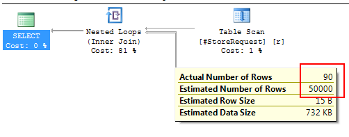
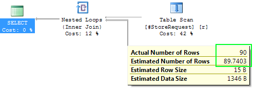
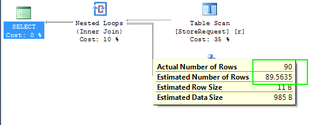

Well, not really... I just reported it to Microsoft and then it got fixed. Anyway, here is the story.

Our production databases were migrated from SQL Server 2012 to SQL Server 2014. Among other improvements in the latter, [the new cardinality estimator was introduced](http://blogs.msdn.com/b/psssql/archive/2014/04/01/sql-server-2014-s-new-cardinality-estimator-part-1.aspx). In two words, cardinality estimator is a piece of SQL functionality which estimates how many rows the engine might get for a specific query or a query part. The new estimator is supposed to be smarter than the old one, of course. It takes more factors into account, and thus should give better results with some query plans. But "new" also means "less tested"...

Immediately after migration we found out that one of the stored procedures got much slower than before. That stored procedure was retrieving thousands of rows from a queue, and then did a series of transformations which took ages to complete. During the investigation we found that the query plan is far from being optimal, with massive scans of partitioned tables; and the reason was in ridiculously high estimations on one of the tables. That table was of moderate size (millions of rows), our query touched only some hundreds rows, while the estimate was... millions!

Here is a repro to show this issue on any test database (database must be in SQL Server 2014 compatibility mode):

    CREATE TABLE [dbo].[Store](
    	Id int IDENTITY(1,1) NOT NULL,
    	City int NOT NULL,
    	Size int NOT NULL,
    	Name varchar(max) NULL,
        CONSTRAINT [PK_Store] PRIMARY KEY CLUSTERED ([Id] ASC)
     )

     GO

     CREATE NONCLUSTERED INDEX [IX_Store] ON [dbo].[Store]
    (
    	City ASC,
    	Size ASC
    )

    GO
     TRUNCATE TABLE Store
    INSERT Store
    SELECT i % 101, i % 11, 'Store ' + CAST(i AS VARCHAR)
      FROM
     (SELECT TOP 100000 ROW_NUMBER() OVER (ORDER BY s1.[object_id]) AS i
      FROM sys.all_objects  s1, sys.all_objects  s2) numbers
    GO

    CREATE TABLE StoreRequest (City int NOT NULL, Size int NOT NULL)

    GO
    DELETE StoreRequest
    INSERT StoreRequest values (55, 1)
    INSERT StoreRequest values (66, 2)

    GO

     SELECT s.City
       FROM StoreRequest AS r
            INNER JOIN Store AS s  WITH(INDEX(IX_Store), FORCESEEK)
                        ON s.City = r.City AND s.Size = r.Size
      WHERE r.Size <> 1 OR s.City <> 55

In this script I create two tables: Store with 100k rows and StoreRequest with 2 rows. And then I make a query where I join them on two columns. The WHERE clause contains two restrictions: one for each of the tables with OR clause in between. It sounds more complicated than it really is.

INDEX and FORCESEEK hints are there to force the engine to use this index to be able to see the statistics. Otherwise it considers the index to be too heavy to use. And that is why:

You see the significant error in Estimated Number of Rows vs Actual Number of Rows. The estimator actually thinks that the query is going to yield half of all rows in that table!

Good news: it's actually easy to fix that problem in this case. We should just change the WHERE clause to use same table for both sides of OR condition:

     SELECT s.City
       FROM StoreRequest AS r
            INNER JOIN Store AS s  WITH(INDEX(IX_Store), FORCESEEK)
                        ON s.City = r.City AND s.Size = r.Size
      WHERE s.Size <> 1 OR s.City <> 55

Estimator is able to handle this situation correctly:

Same fix worked for our production query. That query was much more complicated so it took more time to find the reason.

To prove that this bug is fresh for the new cardinality estimator, we can switch the original query to the legacy cardinality estimator with flag 9481:

     SELECT s.City
       FROM StoreRequest AS r
            INNER JOIN Store AS s  WITH(INDEX(IX_Store), FORCESEEK)
                        ON s.City = r.City AND s.Size = r.Size
      WHERE r.Size <> 1 OR s.City <> 55
     OPTION(QUERYTRACEON 9481)

And then we get this:

Which is as good as the best attempt of SQL Server 2014 and much-much better than the worst one.

I posted this repro to [SQL Server forum](https://connect.microsoft.com/SQLServer/feedback/details/1086125/cardinality-estimator-2014-is-off-with-or-in-where-clause). Here is the comment that I got from Erland Sommarskog, SQL Server MVP:

> The estimate here is clearly incorrect. SQL Server knows the density of Size and City. It knows the cardinality of the temp table. The density information gives how many rows the join will produce. The WHERE clause will then remove a certain number of rows. With no statistics for the temp table, it does not know how many, but it will apply some standard guess.

> 50000 is a completely bogus number, because the join cannot produce that many rows, and SQL Server is able to compute the join with out the WHERE clause decently. (Well, it estimates 90, when the number is 180.) No, this is obviously a case of the cardinality estimator giving up completely.

> It is worth noting that both these WHERE clauses gives reasonable estimates:

>     WHERE r.Size <> 11 OR r.City <> 550
>     WHERE s.Size <> 11 OR s.City <> 550

> Whereas these two gives the spooky 50000:

>     WHERE s.Size <> 11 OR r.City <> 550
>     WHERE r.Size <> 11 OR s.City <> 550

> - Erland Sommarskog

Then I also posted it to [SQL Server feedback issue tracker](https://connect.microsoft.com/SQLServer/feedback/details/1086125/cardinality-estimator-2014-is-off-with-or-in-where-clause) and after a couple of weeks got a reply from Microsoft employee:

> Thank you for reporting this issue. I am happy to let you know that we have a fix for this problem, which will be available in one of the upcoming servicing releases for SQL Server 2014 (the details will be published in a KB).

> - Thanks, Alexey, SQL Development

Thanks to Erlang and Alexey for their help. I look forward to the servicing release!
Happy coding!