In this post I'd like to share my experience about the first hackathon that I took part in. It was called [The Green Hackfest](http://the-hackfest.com/past-hacks/green-hackfest-utrecht-2014.html) and took place in Utrecht, the Netherlands on 10-12 October 2014.

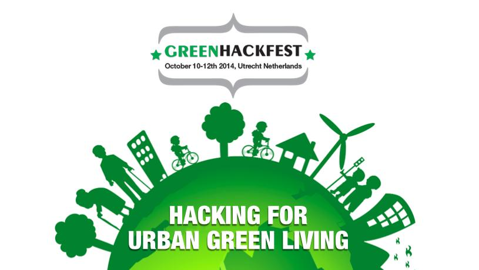

A brief introduction on what hackathon is. A hackathon, or a hackfest in this case (people used these words interchangeably), is an event for programmers, engineers, designers and entrepreneurs where they can get together, form teams and work on solving problems in creative way. The time is very limited, usually from 12 to 24 hours, but in this case we had a 'marathon' of 48 hours. At the start, teams get the challenge definitions and in the end they must pitch their ideas, prototypes and mock-ups to the judges to win the prizes. The participants are traditionally called hackers, which does not mean that they hack bank networks and that kind of stuff, but they rather strive to overcome the usual limitation in whatever area they are competing.

I will start with the most useful part - I'll give several pieces of advice for those who are preparing to their first hackathon. And then I'll get to the description of what was happening this time, so expect quite some photos.

What I learnt
------------

So, in case you are going to take part in one of those hackathons, here is what I can advise you:

- Definitely go. It will be quite a new experience for you, well worth the time.

- Take a laptop with your favourite working environment and any other devices that might be useful. Apart from this and some small personal things, you won't probably need anything else.

- Don't be late. Otherwise you may miss the important parts: briefs and team formation.

- Don't worry if you don't have a team before the event, that's normal.

- Always compete for a prize. Even if it's not particularly important for you, it will help you align your actions and get more drive and fun.

- Don't be shy, talk to people. If you don't know how to start, just join some other discussion by saying hello and your name. Ask what people think about briefs, what their background is, what are they going to do next and so on. Don't be afraid to get out of comfort zone.

- Be nice, smile, make jokes, be open and willing to help others, listen to them.

- Try to join someone who has complementing background for your skills, not someone with the same skill set. If you are a software developer, search for designers, entrepreneurs and pitch speakers.

- Don't come with anything done in advance. You are welcome to bring relevant ideas, but don't bring implementations. The briefs will be too specific for you to fit. And, in any case, it will be transparent to everyone whether you did your prototype on-site or beforehand. You won't have fun if you start cheating.

- Focus on pitch preparation quite early. Think through your demo, and focus on making it shiny and impressive, and don't spend much time on anything else. During last hour, practice your speech and check that you fit into time limit.

- If you are suggested to use a specific technology, use it, you might then compete for two prizes instead of one, which double your chances.

- If you stay overnight, have some sleep. Take a sleeping bag or a mat with you.

- Keep your prototype focused. You only need one impressive idea, not 10 boring ideas.

- There will be someone from sponsors and technology partners to support you. Reach to them and take advice from people who are willing to help you.

- Have fun!

How we scored at Green Hackfest
-------------------------------

So we gathered together on Friday evening, and stayed in the hackspace until Sunday night. Participants are provided with all the infrastructure during this time: power plugs, Wi-Fi, tables & chairs, food, drinks and sleeping room. All free of charge.

The whole story starts with introduction from hosts and then with briefs from sponsors. Here is Richard Kastelein, the event organizer, giving his kick-off speech:

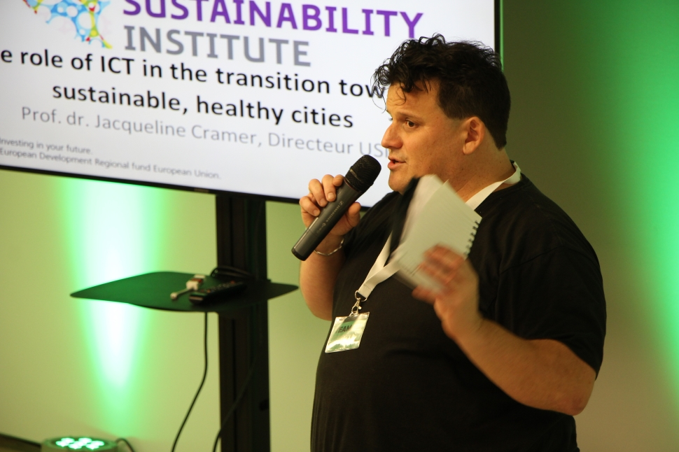

This way we got the tasks for these 2 days. There were several tasks, so everyone could choose which one suits them the best. Some folks were late, so they were having troubles afterwards to get the idea of what's expected from them.

I think there were about 70 participants in beginning, and about 50 of them made it to the end. Most people came alone or in pair; and I think there were two pre-formed teams of several people.

Most people were Dutch, but a lot were not. Many international students, scientists and entrepreneurs live in the Netherlands these days, and they were all welcome. So, while some teams were speaking Dutch within the group, English was the default language for other communication all the time, which is very handy. Some participants came to the Netherlands specifically to take part in this event: I remember guys from UK, Belgium and even Serbia.

I am the software developer and I expected the majority of hackers to be developers too, mostly on experienced side. But I was quite wrong. Many people were from entrepreneurial background, coming from ventures on early stage, or research environments. Many folks were students with no career set yet. In result, I was the only person who was able to write code in our team, and one of the most experienced programmers overall (my guess).

So the first task for everyone was to build a team for yourself. There was no formal procedure for that. You just meet people, ask what they think about the challenges and try to start the discussion, then go to someone else, and repeat. Sooner or later, you should find someone with whom you are ready to spend the next 45 hours working on a project. The normal team is of 2 to 5 people, and you should ideally join diverse skills. So if you are a developer, search for entrepreneurs or other idea generators, and also someone with design skills.

This time we had the following briefs, all of them were more or less related to green tech:

- Crowdfunding challenge: find new applications for an existing crowdfunding platform

- Optimize manufacturing line based on monitoring data to use less energy without compromising the production schedule

- Make people in Utrecht use more bicycles instead of cars (tough task, as Utrecht is one of the cities were pretty much everyone is already using bicycles)

- Visualize the sustainability of electric car stations

- Show off anything with IBM BlueMix platform

And there was the main prize for the best overall Hack Green.

Here is the prize structure:

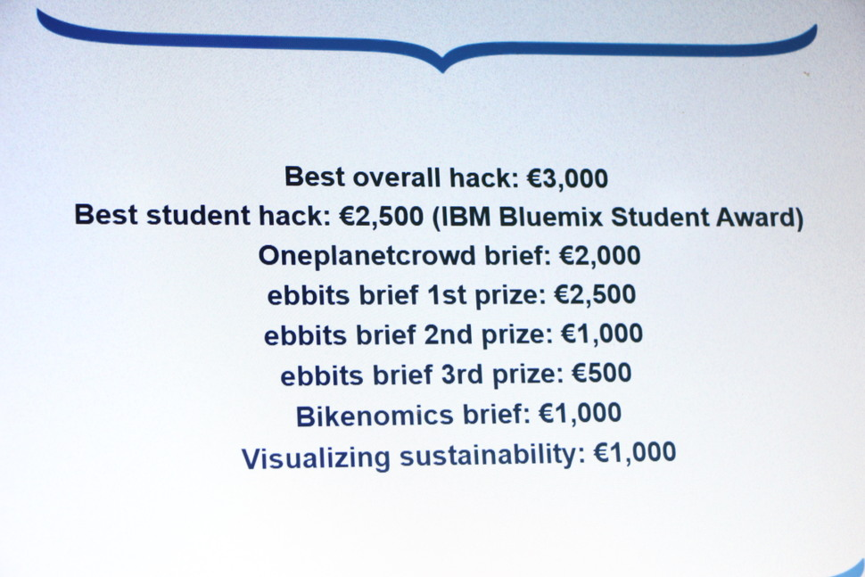

(the student award was eventually transformed to IBM technology award)

Quite quickly I decided that Ebbits brief looks the most promising. First, it provided some test data and API to play with, so we had at least something to start with. Second, it did not sound as romantic as some other topics, so I hoped that not many teams would pick it. And last but not least, there were 3 prizes for this same brief, so any of the top 3 teams were going to cash!

Here is the manager from Ebbits presenting his manufacturing brief:

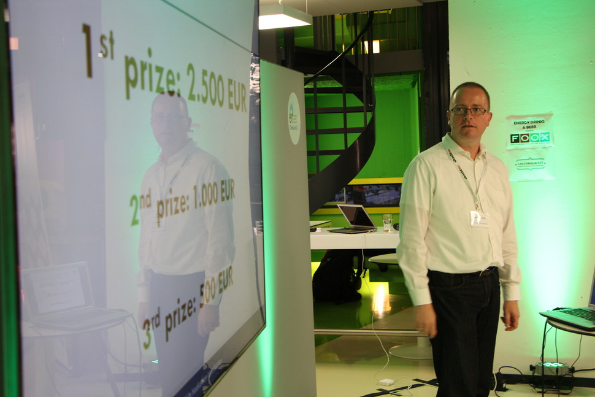

So I joined several discussions until I found folks who were thinking more or less on the same page, and were equally enthusiastic about smart factory challenge.

The hackspace was available for the whole 48 hours of the hackfest. There was one big open space containing many open cabins with tables, couches and chairs inside:

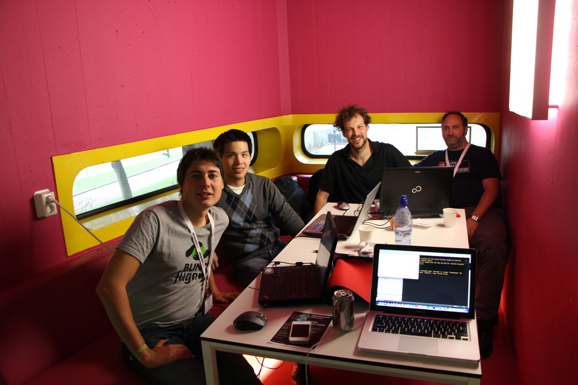

So usually one team could fit into one cabin:

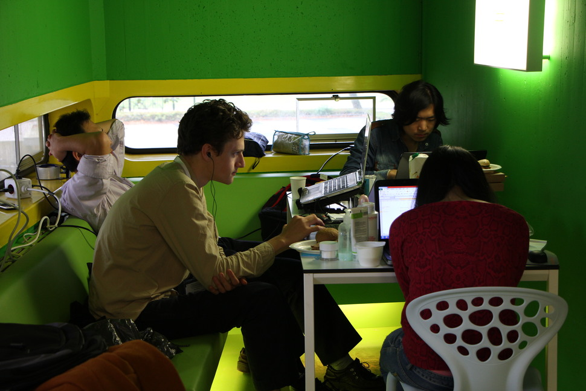

Not too much space, but enough to put two or three laptops + cups or beers aside:

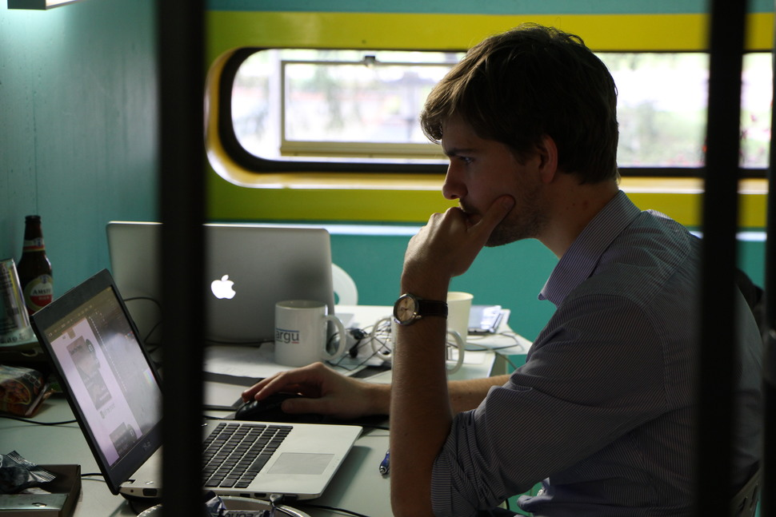

The gathering area was located in the centre of this room. People got together for all briefs, intermediate meet-ups, final pitches and prizes.

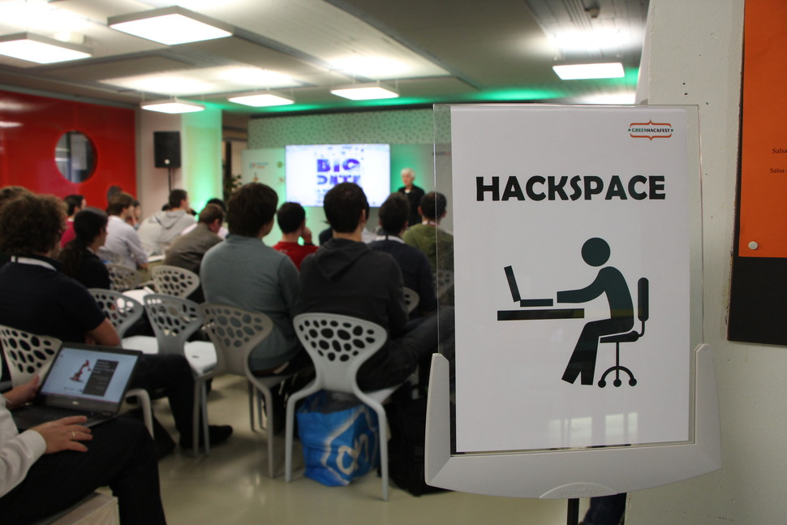

These guys had won the previous hackfest of same series, and I think they didn't speak to anyone, so nobody knew what they were doing:

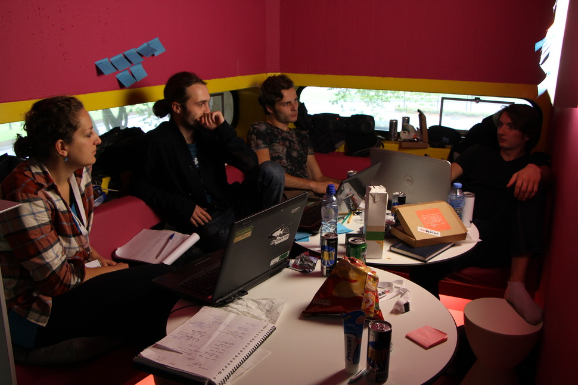

We took the large space behind the scene, and also got a big white board for brainstorming:

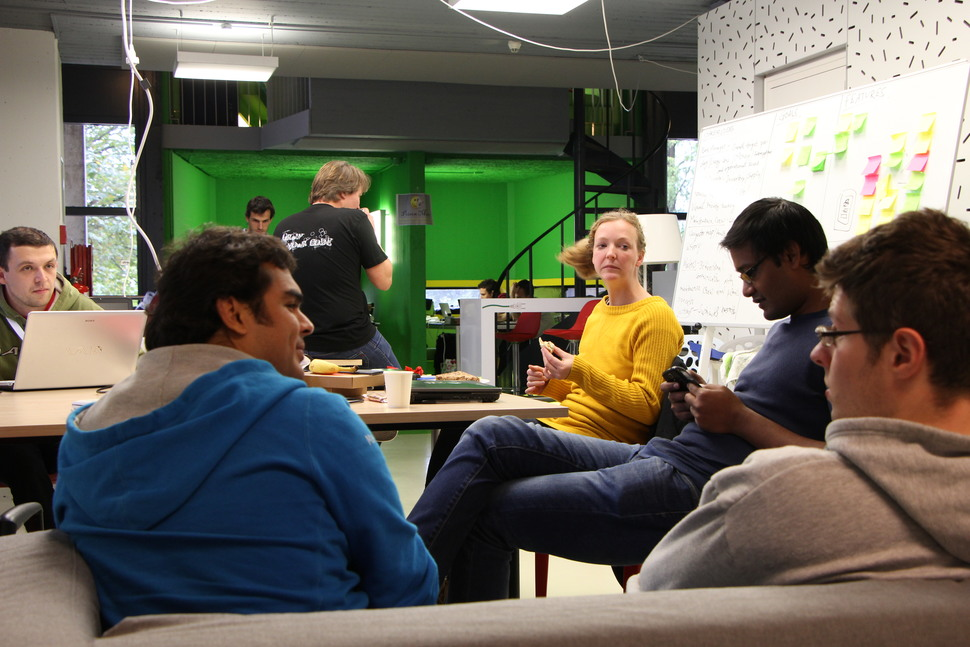

Wi-Fi was free and fast enough for the participants. Power plugs were everywhere, sometimes hanging from the ceiling:

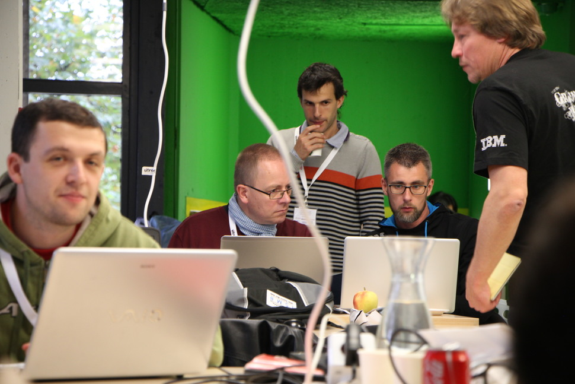

Food and beverages (including beer) were also provided in effectively unlimited quantities. Breakfasts, lunches, dinners plus night snacks - all for free for hackers. Biological green food for green hack fest:

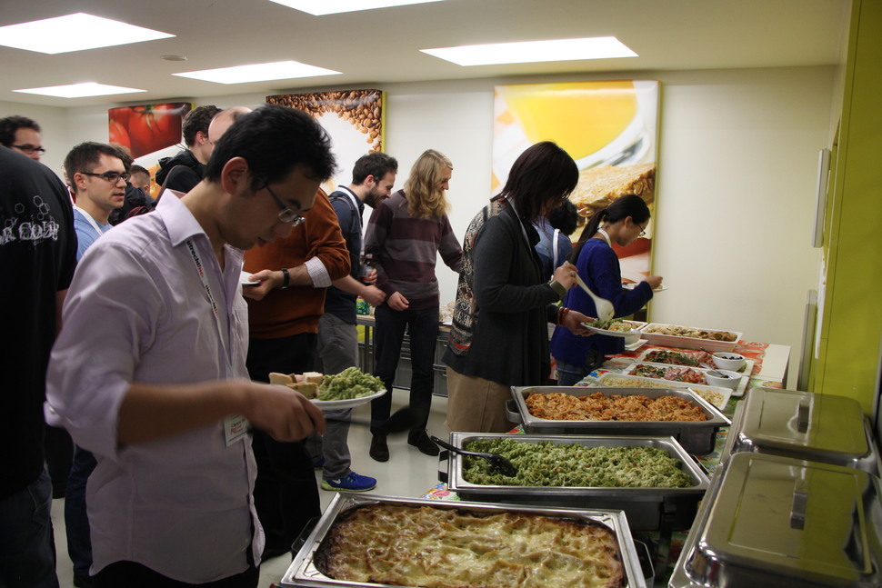

There were two sleeping areas as well. I don't have any photos of those, but they were really basic: just separate empty rooms where you could put a sleeping bag and take a nap. I'm not sure how many teams slayed late in the night, but we were lazy and went to sleep at midnight or so :)

In terms of prize winning odds, the most important part of the whole process is the final pitch. Each team had just 2 minutes to make a demo and do the speech. The demo doesn't need to show off a finished product, but everyone had to prepare prototypes, some pieces of working UI. Powerpoint slides were not enough. After the demo, the jury had 3 to 5 minutes to ask questions, and then the next team takes over. There was a training on how to pitch effectively, but I skipped that one.

So, you should leave quite some time before the pitch starts to actually prepare your demo. Focus on what you will say, and implement only the features that will be demoed, don't waste your time on anything else. Try showing something relatively small, specific and easy to understand, but also give a short overview of how you can see this can be expanded. Highlight the strengths of your team and why you are good candidates to do the job that you started.

During the pitch, the team is standing next to a big screen. One member is showing the demo on his laptop, while another member explains the whole story behind. Here is how it looked like:

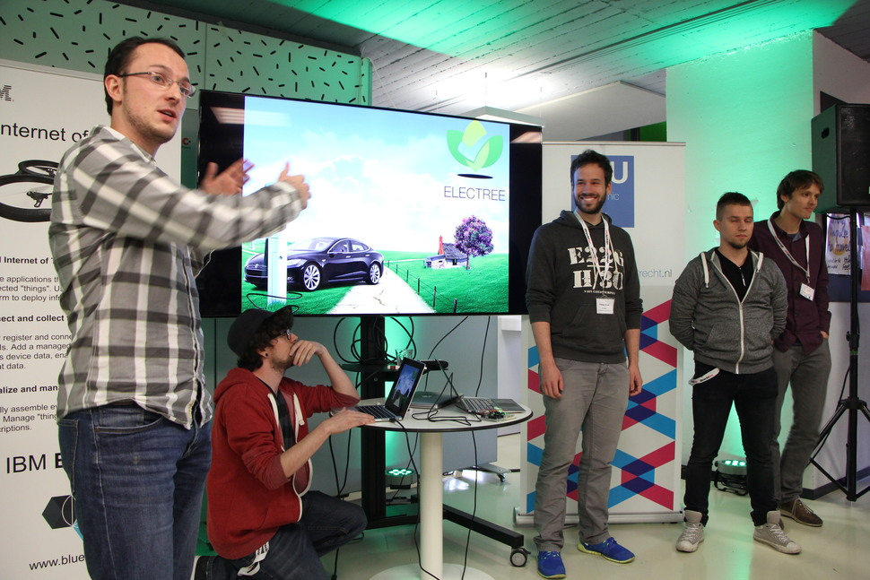

There were four Judges in the jury, consisting of sponsor representatives and serial entrepreneurs. Here are those smart powerful guys:

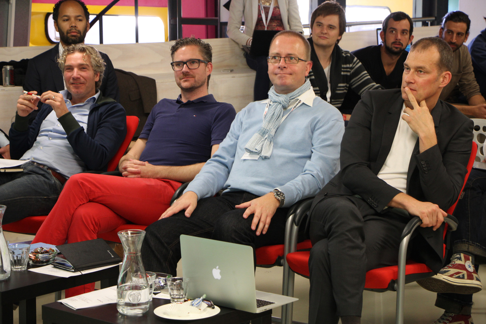

We ended up taking the second place in our category. As we chose to participate in a category with 3 prizes, we scored 1000 euros! This is our photo with the sponsor and our prize:

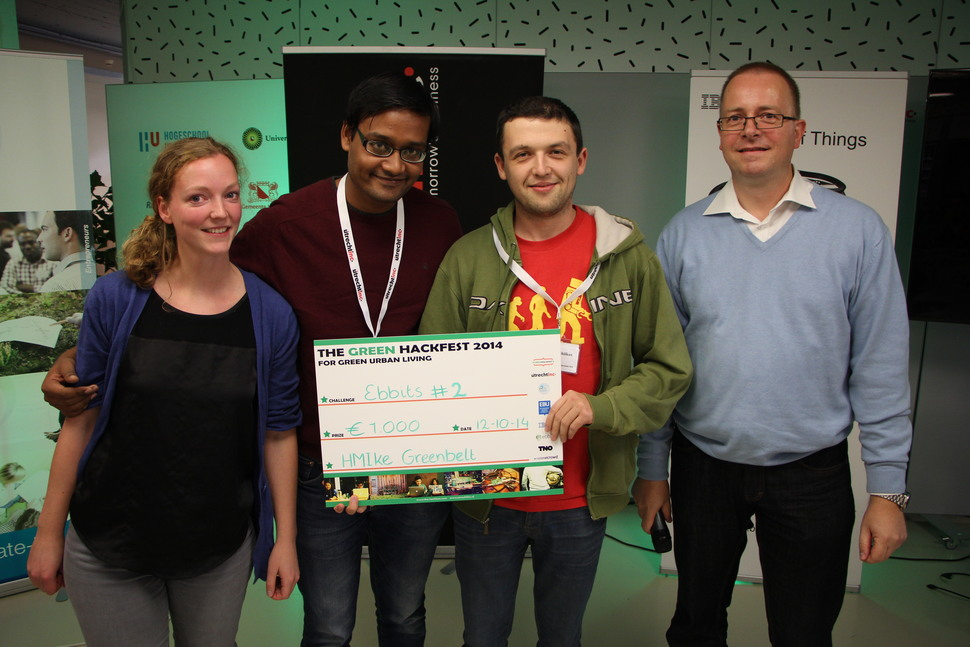

And this is the best overall hack team, congratulations to them:

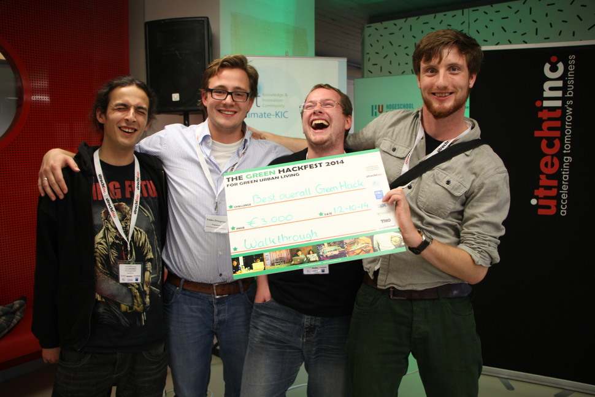

Here are all the hackers who stayed at the fest until the very end:

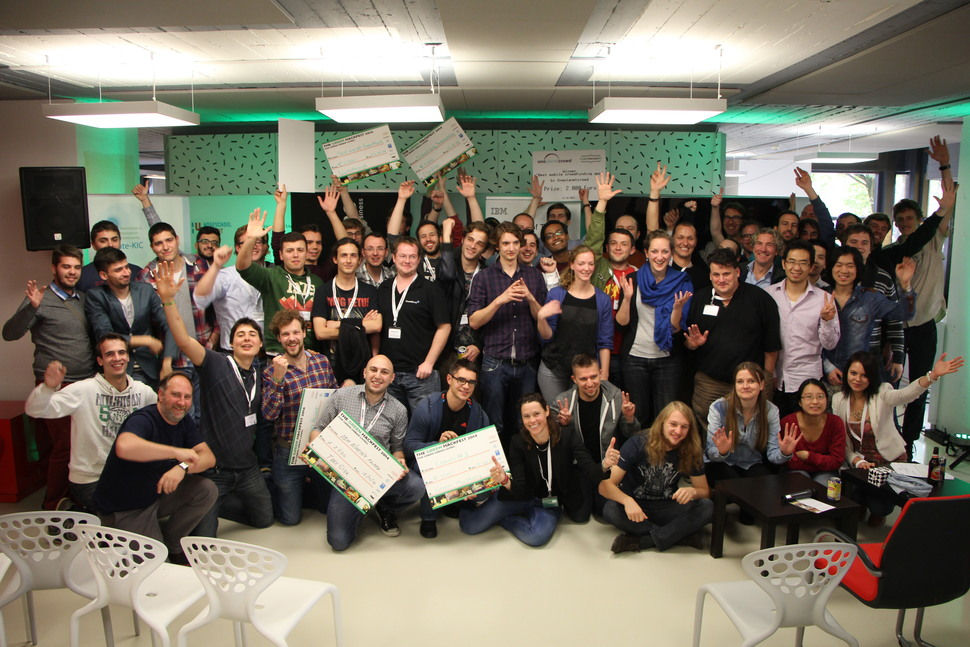

Enjoyable experience, thanks everyone for sharing it.