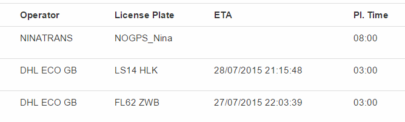

I've been exploring [Aurelia](http://aurelia.io) javascript UI framework recently to get some experience needed
for our next big project. One thing that I couldn't implement out of the box was a kind
of animation.

I have a grid of values bound to View Model. View Model communicates to server, receives
any updates of data and the grid got immediately updated, all that works great with Aurelia.
Now I want to highlight the cell which has just received an updated value with a small
background animation, like this:



Aurelia has a library called [aurelia-animator-css](https://github.com/aurelia/animator-css) with a helper
class to run CSS animation. If you use it directly in your View Model, you will end up with the code like

``` js
this.newMessageReceived =
    msg => {
        this.data.filter(i => i.id === msg.id).forEach(t => {
            let editedItemIdx = this.data.indexOf(i);
            var elem = this.element.querySelectorAll('tbody tr')[editedItemIdx + 1]
                                   .querySelectorAll('td')[3];

            this.animator.addClass(elem, 'background-animation').then(() => {
                this.animator.removeClass(elem, 'background-animation');
            });
        });
    };
```

So we get a new message, find the related item in our data, then find the index of that data. Then we use this
index in query selector to get the exact row that needs animation, find the cell by hard coded index, and
finally use animator to highlight the background.

Ouch... That smells. We spoiled our view model with view details, and all this code is very ugly and fragile.

Good news: we can improve the solution with the Aurelia's feature called Custom Attributes. Let's create a new
javascript file and call it `animateonchange.js`:

``` js
import {customAttribute} from 'aurelia-framework';

@customAttribute('animateonchange')
export class AnimateOnChangeCustomAttribute {

}
```

I declared a class for our new attribute, so far it's empty. I imported customAttribute decorator from
Aurelia framework: that the way we can define a name for our custom attribute. This can be avoided: if I
change the name to `AnimateonchangeCustomAttribute`, Aurelia will infer the name from class name, but I want
to stay explicit and keep the class name readable. Note that capital letters are not allowed in attribute name.

Now, let's declare the constructor of the new class and inject all the dependencies:

``` js
import {inject, customAttribute} from 'aurelia-framework';
import {CssAnimator} from 'aurelia-animator-css';

@customAttribute('animateonchange')
@inject(Element, CssAnimator)
export class AnimateOnChangeCustomAttribute {

    constructor(element, animator) {
        this.element = element;
        this.animator = animator;
    }

}
```

I used dependency injection to get attribute's element and CSS animator and save them into class fields.
Here's how to use them:

``` js
import {inject, customAttribute} from 'aurelia-framework';
import {CssAnimator} from 'aurelia-animator-css';

@customAttribute('animateonchange')
@inject(Element, CssAnimator)
export class AnimateOnChangeCustomAttribute {
    constructor(element, animator) {
        this.element = element;
        this.animator = animator;
        this.initialValueSet = false;
    }

    valueChanged(newValue){
        if (this.initialValueSet) {
            this.animator.addClass(this.element, 'background-animation').then(() => {
                this.animator.removeClass(this.element, 'background-animation');
            });
        }
        this.initialValueSet = true;
    }
}
```

The new method `valueChanged` will be called every time the bound value changes. I want to ignore the
first value (it's not an update yet), so I did that with `initialValueSet` flag. Then I just run CSS
animator. No DOM-related queries!

Here is how we use the custom attribute from a view:

``` html
<template>

    <require from="./animateonchange"></require>

    <table class="table">
        <tr repeat.for="item of data">
            <td>${item.value1}</td>
            <td>${item.value2}</td>
            <td animateonchange.bind="item.value3ToUpdate">${item.value3ToUpdate}</td>
            <td>${item.value4}</td>
        </tr>
    </table>

</template>
```

First, we use `require` element to import custom attribute definition (make sure the path is correct
and no `.js` extension is present).

Second, we use `animateonchange.bind` to bind the value to the custom attributes. And it works!

Of course, you need to define the CSS class, e.g.

``` css
.background-animation-add {
    -webkit-animation: changeBack 0.5s;
    animation: changeBack 0.5s;
}
.background-animation-remove {
    -webkit-animation: fadeIn 0.5s;
    animation: fadeIn 0.5s;
}
@-webkit-keyframes changeBack {
    0% { background-color: white; }
    50% { background-color: lightgreen; }
    100% { background-color: white; }
}
@keyframes changeBack {
    0% { background-color: white; }
    50% { background-color: lightgreen; }
    100% { background-color: white; }
}
```

Here is a [plunkr link to a complete example](http://plnkr.co/edit/oa0Kb1hf6D9M2jl22vWD)

Happy coding!

Useful links:

* [Aurelia Custom Attributes documentation](http://aurelia.io/docs.html#custom-attributes)

* [Animating Apps with Aurelia - Part 1 by Rob Eisenberg](http://blog.durandal.io/2015/07/17/animating-apps-with-aurelia-part-1/)