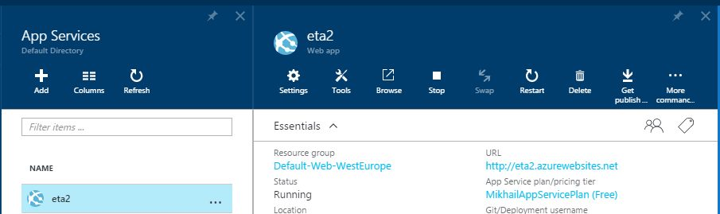
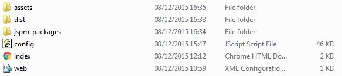
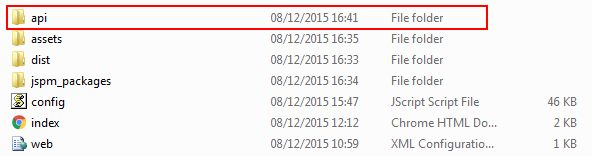
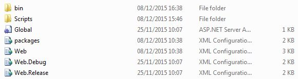

In this post I want to share a simple tutorial on how to deploy your single page application into the Azure cloud.

The goal
------------

Here is the initial setup:

- I have a Single Page Application (SPA) done with HTML/JavaScript in a separate local Git repository

- I have a ASP.NET 4.6 Web API service which serves the data for SPA in another local Git repository

- Now I want to deploy both to the Azure cloud, and make it easy to deploy changes in the future

The solution
------------

We will deploy our application to Azure Cloud Services / Web application.

1. Go to [Azure Portal](https://portal.azure.com) then `App Services -> Add` and follow the wizard to create your Web app. Here is mine:

2. Follow [this guide](https://azure.microsoft.com/en-us/documentation/articles/web-sites-publish-source-control/) to create a new Git repository and setup continuous deployment from this repository to Azure web application. You are good once you see this working (step 6):

3. Copy your SPA files into the root of the new Git repository, here is my repo after I did that:

and push them to `azure` remote. Now you should be able to browse to the web app and see your SPA screen, but with all calls to Web API failing.

4. Inside your new Git repository, create a sub-folder to host Web API services. My SPA expects them under `/api` folder, so that's the folder name that I created:

5. Copy your binary compiled files of your Web API to `/api` sub-folder. This includes the bin folder, config files, asax files etc - whatever you would need in your local IIS deployment. DO NOT copy the sln/csproj files, otherwise the Azure will also try to do the compilation himself and will change the root of your web application to the folder with csproj files. So, my `/api` folder looks like this:

6. Commit the changes and Git push to `azure` remote. Once the files are deployed, your SPA app should be up and running. Well done!

7. You don't want to copy the files manually all the time, so make a PowerShell script or gulp task to do that for you. Remember, your changes will be applied whenever you push a new version to `azure` remote of your Git repo.