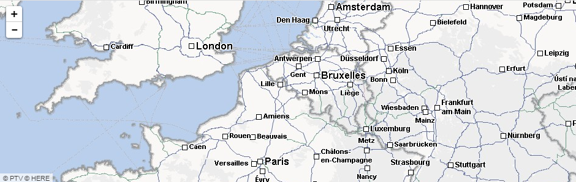

This is a short tutorial on how to create a map control in [Aurelia.js](http://aurelia.io)
application. I am using the [Leaflet](http://leafletjs.com) library with custom tile
source and I also show the way to implement your own overlay layer. Here is what
my map looks like:



So, I assume you already have an existing Aurelia application, and let's start.

Install Leaflet
---------------

The following command will install Leaflet module to the application:

```
jspm install leaflet
```

If you are using TypeScript, don't forget to add type definitions

```
tsd install leaflet
```

Define a Map Component
----------------------

Create a new `map.html` file and put the following contents there:

``` html
<template>
  <require from="leaflet/dist/leaflet.css"></require>
  <div id="mapid" style="height: 100%"></div>
</template>
```

We import the CSS required by leaflet and define the `div` element to host
the map in. Then, create a new `map.js` file (or `map.ts` for typescript),
here is the minimum code:

``` js
export class Map {
}
```

Load the Map with Tiles
-----------------------

First, import the leaflet module in your codebehind:

``` js
import * as L from 'leaflet';
```

Now, define the `attached` function, which would be called by Aurelia when
control's HTML is loaded, and make a map there:

``` js
export class Map {
  attached() {
    let map = L.map('mapid').setView([51.505, -0.09], 13);

    let urlTemplate = 'http://{s}.tile.osm.org/{z}/{x}/{y}.png';
    map.addLayer(L.tileLayer(urlTemplate, { minZoom: 4 }));
  }
}
```

The example above uses the URL template of Open Street Maps as per the Leaflet's
tutorial, but I needed to use our privately hosted maps, so I changed it to
something like:

``` js
let urlTemplate = 'http://www.mysite.com/tiles?layer=background&level={z}&x={x}&y={y}';
map.addLayer(L.tileLayer(urlTemplate, { minZoom: 4, zoomOffset: 8 }));
```

The `zoomOffset` parameter was required to fix impedance mismatch of zoom levels.

Custom Overlay Layer
--------------------

For our custom maps we needed to show two layers on top of each other:

- The usual tile layer for the map background
- The overlay layer for the map labels and additional information

The overlay layer can't be broken down into tiles (not supported by our map provider),
so we need to show the whole layer as a single picture and then refresh it every
time user pans or zooms the map.

The overlay layer can be implemented with `onAdd` and `onRemove` functions
and then feeding an image element to the Leaflet as a layer. Here is the code:

``` js
import * as L from 'leaflet';

export class LabelOverlayLayer {
  map;
  image;

  onAdd(map) {
    this.map = map;

    this.image = L.DomUtil.create('img', 'leaflet-tile-loaded');
    map.getPanes().overlayPane.appendChild(this.image);

    map.on('moveend', this.render, this);
    this.render();
  }

  onRemove (map) {
    map.getPanes().overlayPane.removeChild(this.image);
    map.off('moveend', this.render, this);
  }

  render() {
    let bounds = this.map.getBounds(), mapSize = this.map.getSize();
    let se = bounds.getSouthEast(), nw = bounds.getNorthWest();

    let tileUrl = `http://www.mysite.com/tiles?layer=labels&lonmin=${nw.lng}&latmin=${se.lat}&lonmax=${se.lng}&latmax=${nw.lat}&width=${Math.floor(mapSize.x)}&height=${Math.floor(mapSize.y)}`;
    this.image.src = tileUrl;

    let pos = this.map.latLngToLayerPoint(nw);
    L.DomUtil.setPosition(this.image, pos, false);
  }
};
```

The usage of this layer in the map component is trivial:

``` js
this.map.addLayer(new LabelOverlayLayer());
```

Use the Map Component
---------------------

The map component is ready to be used in the application:

``` html
<require from="./components/map"></require>
<div  style="height: 700px">
  <map></map>
</div>
```

The container around the map should have a non-zero height, so I made it fixed
in the example above.

Don't forget to bundle the leaflet assets by including the following lines
into your `bundles.json`:

``` json
"includes": [
  "aurelia-framework",
  // ...
  "leaflet",
  "leaflet/dist/leaflet.css!text"
],
```