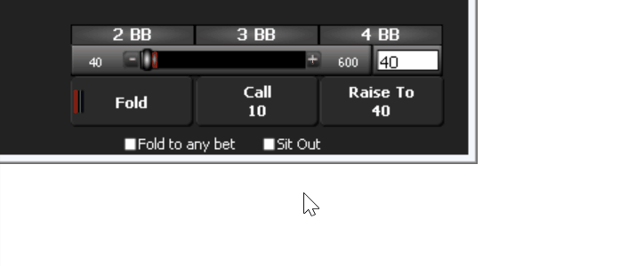

This is the third part of **Building a Poker Bot** series where I describe my experience developing bot software
to play in online poker rooms. I'm building the bot with .NET framework and F# language which makes the task relatively easy and very enjoyable.

Here are the previous parts:

- [*Building a Poker Bot: Card Recognition*](https://mikhail.io/2016/02/building-a-poker-bot-card-recognition/)
- [*Building a Poker Bot: String and Number Recognition*](https://mikhail.io/2016/02/building-a-poker-bot-string-recognition/)

In this short post I write about the last step of the poker bot flow: clicking
the buttons. So, the screen is already recognized, the hand is understood,
the decisions are made and now the bot needs to execute the actions. Except for
the bet sizing, this simply means clicking the right button at the poker table.

The stealthiness of such clicks is a valid concern here. Ideally, we want all
the mouse movements to look as similar as possible to the movements produced
by a human being. For this post, I will simplify the task to the following steps:

- Identify where the mouse cursor is right now
- Decide where the mouse should be moved to
- Gradually move the mouse cursor
- Click the button

Cursor Position
---------------

It's really easy to understand where the mouse cursor currently is: just
use `Control.MousePosition` property from the standard library:

``` fsharp
let currentPosition () =
  let mp = System.Windows.Forms.Control.MousePosition
  (mp.X, mp.Y)
```

Note that your application doesn't have to be based on WinForms, just reference
the required assembly.

Move the Cursor
---------------

I use the third party [WindowsInput](https://inputsimulator.codeplex.com/)
library to control the mouse and the keyboard programmatically. It uses some
weird coordinate system, so the function to move the mouse cursor looks like this:

``` fsharp
let simulator = new InputSimulator()

let moveTo x y =
  let toX = 65535. * x / (Screen.PrimaryScreen.Bounds.Width |> float)
  let toY = 65535. * y / (Screen.PrimaryScreen.Bounds.Height |> float)
  simulator.Mouse.MoveMouseTo(toX, toY)
```

The input parameters `x` and `y` are the pixel location starting at
the top-left corner of the screen.

Move It Smoothly
--------------

Now we want to simulate the human-like movements. It won't be perfect, but
at least it should look decent. For this gradual movement function I used
a nice F# feature called asynchronous workflows. Effectively, it looks like
a loop with async sleep statements inside.

``` fsharp
let moveToWorkflow step (toX, toY) = async {
  let (fromX, fromY) = currentPosition()
  let count = Math.Max(10, (Math.Abs (toX - fromX) + Math.Abs (toY - fromY)) / 20)
  for i = 0 to count do
    let x = step fromX toX count i |> float
    let y = step fromY toY count i |> float
    moveTo x y
    do! Async.Sleep 3
  }
```

The key parameter here is the `step` function of obscure type `int -> int -> int -> int -> int`.
Basically, it calculates a coordinate for n-th step of the movement. We can
plug different implementations of this function to find the right balance of
the movement style. Here is the simplest linear implementation:

``` fsharp
let linearStep from until max i =
  from + (until - from) * i / max
```

The sinus-based implementation is a bit more verbose because of float-int
conversions:

``` fsharp
let sinStep (from:int) (until:int) (max:int) (index:int) =
  let fromf = from |> float
  let untilf = until |> float
  let maxf = max |> float
  let indexf = index |> float
  fromf + (untilf - fromf) * Math.Sin(Math.PI / 2. * indexf / maxf) |> int
```

The following animation illustrates the concept:

<svg width="778" height="190" viewBox="0 0 500 190">
  <image id="mouse1" x="0" y="20" width="16" height="16" xlink:href="/2016/03/building-a-poker-bot-mouse-movements/mouse_cursor-16.png" />
  <image id="mouse2" x="0" y="90" width="16" height="16" xlink:href="/2016/03/building-a-poker-bot-mouse-movements/mouse_cursor-16.png" />
  <image id="mouse3" x="0" y="160" width="16" height="16" xlink:href="/2016/03/building-a-poker-bot-mouse-movements/mouse_cursor-16.png" />

  <animate xlink:href="#mouse1" attributeName="x" from="0" to="0" values="0;450;0" keyTimes="0;0.5;1" repeatCount="indefinite" dur="2s" begin="0s" fill="none" calcMode="discrete" id="img-anim1"/>
  <animate xlink:href="#mouse2" attributeName="x" from="0" to="0" values="0;450;0" keyTimes="0;0.5;1" repeatCount="indefinite" dur="2s" begin="0s" fill="none" id="img-anim2"/>
  <animate xlink:href="#mouse3" attributeName="x" from="0" to="0" values="0;70;139;204;264;318;364;401;428;444;450;380;311;246;186;132;86;49;22;6;0" keyTimes="0;0.05;0.1;0.15;0.2;0.25;0.3;0.35;0.4;0.45;0.5;0.55;0.6;0.65;0.7;0.75;0.8;0.85;0.9;0.95;1" repeatCount="indefinite" dur="2s" begin="0s" fill="none" id="img-anim3"/>
</svg>

The top mouse cursor just
jumps from left to right and back (no animation). The middle cursor moves with
linear speed (`linearStep` function above). The bottom cursor moves based on
the `sinStep` function derived from sinus of time.

Click the Button
----------------

A button is a rectangle and we want to click a random point inside it. So, all
we need is to pick random coordinates, move the mouse there and send a
click event via the simulator:

``` fsharp
let clickButton (minX, minY, maxX, maxY) =
  let r = new Random()
  let p = (r.Next(minX, maxX), r.Next(minY, maxY))
  moveToWorkflow sinStep p |> Async.RunSynchronously
  simulator.Mouse.LeftButtonClick()
```

Demo Time
---------

Here is the demo of the mouse movements:



It looks fun, doesn't it? The full code for the mouse movements can be found in
[my github repo](https://github.com/mikhailshilkov/mikhailio-samples/blob/master/Clicker.fs).

*Proceed to [Part 4 of Building a Poker Bot with Akka.NET Actor](/2016/04/building-a-poker-bot-with-akka-net-actors/).*