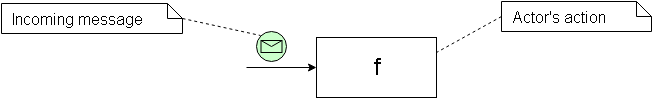
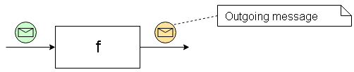
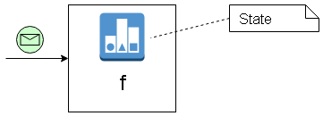
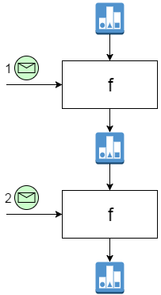
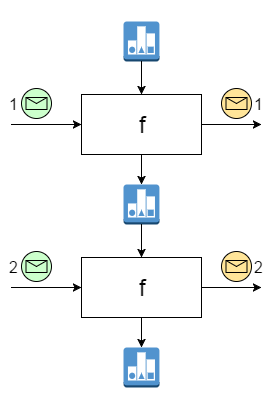
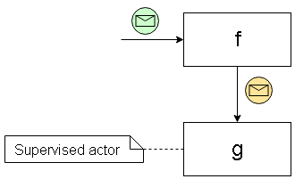
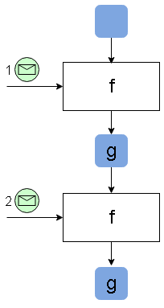
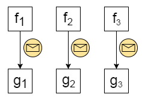
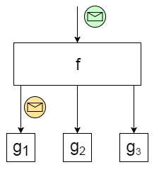
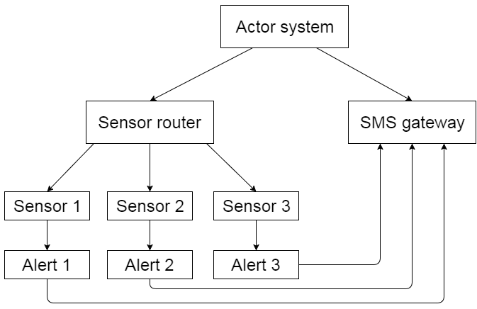

My exploration of Actor model started with [Akka.NET](http://getakka.net) framework - a .NET port of
JVM-based [Akka](http://akka.io). Actor programming model made a lot of sense to me, but once
I started playing with it, some questions arose. Most of those questions were related to the
following [definition](http://doc.akka.io/docs/akka/2.4.2/general/actors.html):

> An actor is a container for `State`, `Behavior`, a `Mailbox`, `Children` and a `Supervisor Strategy`.

So, based on the [Akka.NET Bootcamp](https://github.com/petabridge/akka-bootcamp) course I understood that
an Actor

- knows what kind of messages it can accept
- does some processing of each message
- holds some state which is changed during message processing
- potentially changes its behavior based on the current state
- creates and stores references to child actors
- obtains references to other actors
- sends messages to children and other actors

While it's nice that the framework enables us to develop for different aspects of actor
behavior, it might also be dangerous in case you do all the things in one place. Ball of spaghetti mud
was where I ended up during my first attempt. My actors were doing all the things from
the above list and the code got messy very quick. So, the following questions popped up
in my head:

*How do I avoid mixing several concerns in one piece of code?*

*How do I make the code easily testable?*

*How do I minimize the usage of mutable state?*

*How do I avoid boilerplate code when it's not needed?*

Functional Actors
-----------------

I am now developing the actor-based application in F#, the functional first
language. Functions are easy to reason about, reusable and testable. But the
actors are usually defined in terms of objects and classes. F# supports classes
but that's not the path that I'm willing to go.

How do we make actors out of functions? Well, most of the time actors don't
need all the features of the framework. In this case we can define the required actor
behavior in terms of a minimal function and then use creational patterns to
spawn actor instances out of it.

Let's look at some common patterns that I identified. For each pattern, I will
define

- an example of a core function which implements the business logic
- a generic function to create actors with behavior of a core function
- an example of actor instantiation using the two functions above

---

<a name="MessageSink"></a>
Message Sink
------------

Stateless Message Sink is the simplest type of actor.



It receives a message and executes some action on it. The action is not related
to any other actors, and there is no state, so the processing of each message
is always the same. Obviously, it's related to some kind of side effects:
logging the message, saving the data to the external storage and so on.

So, we don't need the majority of actor features in this case. The whole actor
processing could be represented by a function of type `'a -> unit`. Here
is an example of a core function:

``` fsharp
let print msg =
  printn "Message received: %A" msg
```

So how do we make an actor out of this function? Well, it's already implemented
as `actorOf` helper function in Akka.NET F# extensions:

``` fsharp
let actorOfSink (f : 'a -> unit) = actorOf f
```

And here is how we spawn an actor instance:

``` fsharp
let printActorRef =
  actorOfSink print
  |> spawn system "print-actor"

printActorRef <! 3
// "Message received: 3" is printed
```

That's the simplicity that I'm searching for. Let's look at a slightly more
complex example.

---

<a name="Converter"></a>
Converter
---------

Stateless Converter maps the incoming message into another message and sends
it to another predefined actor.



The core of this actor is a classic function with one input and one output
parameter (type `'a - 'b`):

``` fsharp
let square msg =
  msg * msg
```

The actor function is similar to the one of Message Sink, but it also accepts
a reference to the output actor and knows how to send messages to it:

``` fsharp
let actorOfConvert f outputRef =
  actorOf2 (fun _ msg -> outputRef <! f msg)
```

Here is how we spawn an instance of a Converter using our `print-actor` as the
output:

``` fsharp
let squareActorRef =
  actorOfConvert square printActorRef
  |> spawn system "square-actor"

squareActorRef <! 3
// "Message received: 9" is printed
```

Both actor patterns had no notion of state so far. Let's see how we can
treat the statefulness in a functional way.

---

Stateful Sink
-------------

Let's get back to our Message Sink actor with side-effects, and make it
dependent on its internal state. The state is affected by the incoming
messages and is preserved until the next message comes in.



Does not look very functional, right? But this impression is wrong in fact.
We can represent the state before a message came in - as an extra input parameter,
and  the state after the message got processed - as an output parameter.
We start with an initial state and the output of the
first message becomes the input state of the second message:



Here is an example of a function which prints out the index of a message together
with the message contents:

``` fsharp
let printIndex index msg =
  printn "Message [%i] received: %A" index msg
  index + 1
```

For the actor implementation we need a recursive function so we can't use
`actorOf2` anymore. Actor workflow is a bit more lines but still very simple:

``` fsharp
let actorOfStatefulSink f initialState (mailbox : Actor<'a>) =

  let rec imp lastState =
    actor {
      let! msg = mailbox.Receive()
      let newState = f msg lastState
      return! imp newState
    }

  imp initialState
```

And here is a usage example:

``` fsharp
let printIndexActorRef =
  actorOfSink printIndex 1
  |> spawn system "print-ix-actor"

printActorRef <! 3
// "Message [1] received: 3" is printed

printActorRef <! 4
// "Message [2] received: 4" is printed
```

---

<a name="StatefulConverter"></a>
Stateful Converter
------------------

By now, the core function of the Stateful Converter actor should be a no-brainer for you. The actor
would have two input parameters and two outputs (in a tuple). One of the outputs
is a message and goes to another actor, the other output becomes an input for the
next actor:



Here is a function which squares the messaged number, then calculates the running total
and sends it forward:

``` fsharp
let squareAndSum sum msg =
  let result = sum + msg*msg
  (result, result)
```


In this particular case the output message and state are equal, but they don't
have to be. Here is the actor implementation:

``` fsharp
let actorOfStatefulConvert f initialState outputRef (mailbox : Actor<'a>) =

  let rec imp lastState =
    actor {
      let! msg = mailbox.Receive()
      let (result, newState) = f msg lastState
      outputRef <! result
      return! imp newState
    }

  imp initialState
```

And a usage example:

``` fsharp
let squareAndSumActorRef =
  actorOfConvert square 0 printIndexActorRef
  |> spawn system "square-sum-actor"

squareAndSumActorRef <! 3
// "Message [1] received: 9" is printed

squareAndSumActorRef <! 4
// "Message [2] received: 25" is printed
```

---

<a name="ConverterSupervisor"></a>
Converter-Supervisor
--------------------

In the previous patterns the Converter actors were sending messages
to predefined actor references which were not managed (or supervised in Akka terms)
by those actors. Now, let's say that the actor needs to create a child
to send converted messages to it afterwards:



We can treat such child reference as the state and instantiate it when the first message
comes in. (We can't spawn it before the first message because the
`mailbox` object is required.) The message goes to the actor
reference that we store in the state, something like this:



Here is the generic actor implementation:

``` fsharp
let actorOfConvertToChild f spawnChild (mailbox : Actor<'a>) =

  let rec imp state =
    actor {
      let newstate =
        match state with
        | Some s -> s
        | None -> spawnChild mailbox

      let! msg = mailbox.Receive()
      newstate <! f msg
      return! imp (Some newstate)
    }

  imp None
```

The only difference is that we accept a `spawnChild` function instead of
pre-baked actor reference. Here is the first calculator example refactored
to Print actor being a child of Square actor.

``` fsharp
let squareWithChildRef =
  actorOfConvertToChild print (spawnChild square "print-actor")
  |> spawn system "square-with-child-actor"
```

Notice that the `square` and `print` functions have exactly the same signatures
and implementations as we used before, and the concern of actor hierarchy is
completely separated from the business logic of the actors.

This hierarchy is handy whenever you need multiple instances of one actor type
(`f`-actor from the picture) and corresponding instances of another actor type
(`g`-actor):



---

<a name="RouterSupervisor"></a>
Router-Supervisor
-----------------

Routers are the kind of actors which forward each incoming message to one
or more downstream actors. In this example the downstream actors are supervised
by the Router itself.
So, the Router-Supervisor can have multiple children and send the result of
message processing to one or more of them:



To keep the spirit of functional actors, we represent the router logic with a function
of type `'a -> seq<string * 'b>`, where `'a` is the type of incoming messages,
`'b` is the type of outgoing messages, and `string` represents the identifier of the
actor to get the message. Here is a sample implementation:

``` fsharp
let routeSensorData msg =
  msg |> Seq.map (fun x -> ("sensor-actor-" + x.SensorId, x.Temperature))
```

Based on the incoming metadata (sensor identifier) the actor forwards its
temperature to corresponding sensor-specific actor.

Here is the implementation of the generic actor function:

```
let actorOfRouteToChildren f spawnChild (mailbox : Actor<'a>) =

  let getActor id =
    let actorRef = mailbox.Context.Child(id)
    if actorRef.IsNobody() then
      spawnChild id mailbox
    else
      actorRef

  let rec imp () =
    actor {
      let! msg = mailbox.Receive()
      f msg |> Seq.iter (fun (id, x) -> (getActor id) <! x)
      return! imp ()
    }

  imp ()
```

And a usage example:

``` fsharp
let sensorRouterRef =
  actorOfRouteToChildren routeSensorData (spawnChild square)
  |> spawn system "route-sensor-actor"
```

Note that `spawnChild` does not accept the child ID anymore because it's being
controlled by the router itself.

---

Conclusion
----------

With the patterns that we have so far we should be able to build quite powerful
hierarchies like the one shown below:



There might be many other scenarios and types of actors that would make sense
in your use case. I'm just showing the basic patterns, but more importantly the way of
reasoning about the code. Don't
let the multitude of actor aspects push you into the world of poorly structured
code.