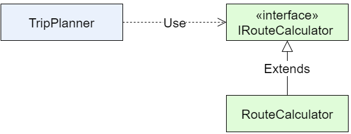
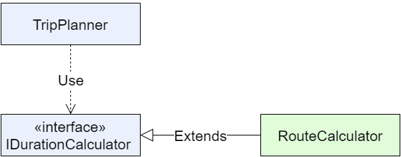

Dependency Inversion is one of the five principles of widely known and
acknowledged S.O.L.I.D. design guidelines. This principle is very powerful
and useful when applied consistently. But in my experience, it's actually
quite easy to misunderstand the idea, or at least to mentally simplify it
to somewhat less profound technique of Dependency Injection.

In this post I will try to give my understanding of the principle, and
the difference between *Inversion* and *Injection*.

Let's start with the Dependency Inversion principle definition. It was given
by Uncle Bob Martin, and consists of two parts.

Part 1: Abstractions
--------------------

> High-level modules should not depend on low-level modules.
> Both should depend on abstractions.

Ok, this is easy to understand. High-level modules are also high-importance
modules, they are about the business domain and are not specific about
technical details. Low-level modules are about wiring those high-level
functions to execution environment, tools and third parties.

Thus, the implementation of high level policy should not depend on
implementation of low level code, but rather on interfaces (or other
abstractions).


Let's take a look at an example. Our high-level business domain is about
planning and executing trips from geographical point A to point B. Our
low-level code talks to a service which knows how to calculate the time
required for a vehicle to go from A to B:


So the following code **violates** the first part of the Dependency Inversion:

``` csharp
namespace Mapping
{
    public class RouteCalculator
    {
        public TimeSpan CalculateDuration(
            double fromLat, double fromLng, double toLat, double toLng)
        {
            // Call a 3rd party web service
        }
    }
}

namespace Planning
{
    public class TripPlanner
    {
        public DateTime ExpectedArrival(Trip trip)
        {
            var calculator = new RouteCalculator();
            var duration = calculator.CalculateDuration(
                trip.Origin.Latitude,
                trip.Origin.Longitude,
                trip.Destination.Latitude,
                trip.Destination.Longitude);
            return trip.Start.Add(duration);
        }
    }
}
```

It's not compliant to the principle because the high-level code (`TripPlanner`)
explicitly depends on low-level service (`RouteCalculator`). Note that I've put
them to distinct namespaces to emphasize the required separation.

To improve on that, we might introduce an interface to decouple the
implementations:



In Trip Planner we accept the interface as constructor parameter, and we'll get the
specific implementation at run time:

``` csharp
namespace Mapping
{
    public class IRouteCalculator
    {
        TimeSpan CalculateDuration(
            double fromLat, double fromLng, double toLat, double toLng);
    }

    public class RouteCalculator : IRouteCalculator
    {
        // Same implementation as before...
    }
}

namespace Planning
{
    public class TripPlanner
    {
        private IRouteCalculator calculator;

        public TripPlanner(IRouteCalculator calculator)
        {
            this.calculator = calculator;
        }

        public DateTime ExpectedArrival(Trip trip)
        {
            var duration = this.calculator.CalculateDuration(
                trip.Origin.Latitude,
                trip.Origin.Longitude,
                trip.Destination.Latitude,
                trip.Destination.Longitude);
            return trip.Start.Add(duration);
        }
    }
}
```

This technique is called *dependency
injection* or, more specifically, *constructor injection*. This way
we can easily substitute the implementation later or inject a test
double while unit testing.

But that's just one part of the principle. Let's move on to part 2.

Part 2: Details
---------------

The second part of the principle says

> Abstractions should not depend upon details.
> Details should depend upon abstractions.

I find this wording unfortunate because it might be confusing. There are
some valid examples which explain it with base and derived classes.
But in our example we solved the part 1 with an interface. So now we are told that
the abstraction (interface) should not depend upon details (implementation).

That probably means that the interface should not leak any entities which
are specific to the given implementation, to make other implementation
equally possible.

While this is try, this second part of the principle may seem to be subordinate
to part one, reducing to an idea "design your interfaces well". So
many people tend to leave the part 2 out (
[example 1](https://scotch.io/bar-talk/s-o-l-i-d-the-first-five-principles-of-object-oriented-design#dependency-inversion-principle),
[example 2](http://www.codeproject.com/Articles/495019/Dependency-Inversion-Principle-and-the-Dependency)), focusing
solely on part 1 - the Dependency Injection.

Interface Ownership
-------------------

But Dependency Inversion is **not** just Dependency Injection. So, to revive
the part 2 I would add the following statement to make it clearer:

> **Abstractions should be owned by higher-level modules and implemented by
> lower-level modules.**

This rule is violated in our last example. The interface is defined together
with implementation, and is basically just extracted from it. It's **owned**
by the mapping namespace.

To improve the design, we can transfer the interface ownership to domain
level:



As you can see, I also renamed the interface. The name should reflect the way
how the domain experts would think of this abstraction. Here is the result:

``` csharp
namespace Planning
{
    public interface IDurationCalculator
    {
        TimeSpan CalculateDuration(Hub origin, Hub destination);
    }

    public class TripPlanner
    {
        private IDurationCalculator calculator;

        public TripPlanner(IDurationCalculator calculator)
        {
            this.calculator = calculator;
        }

        public DateTime ExpectedArrival(Trip trip)
        {
            var duration = this.calculator.CalculateDuration(
                trip.Origin, trip.Destination);
            return trip.Start.Add(duration);
        }
    }
}

namespace Mapping
{
    public class RouteCalculator : IDurationCalculator
    {
        public TimeSpan CalculateDuration(Hub origin, Hub destination)
        {
            // Extract latitude and longitude from Hubs
            // Call a 3rd party web service
        }
    }
}
```

Now, the interface is defined in `Planning` namespace, close to its *Client*,
not its *Implementation*. That's the dependency inversion in action. Even
more importantly, it's defined in terms of our domain - notice the use of
`Hub` in the interface instead of low-level `double`.

Why High Level Code Should Own Interfaces
-----------------------------------------

There are multiple benefits to this approach, here are the most important
advantages:

### Concise, readable high-level code

The high-level domain code has the highest value, so the ultimate goal
is to keep it as clean as possible. The interface ownership enables us to
design the most concise interfaces to achieve this goal. We avoid any kind
of adaptation of domain entities to whatever lower-level details.

### Better abstractions

The interfaces themselves get better as well. They are closer to business,
so abstractions get more ubiquitous and better understood by everyone.

They tend to live longer, just because they are born from the domain side,
not the infrastructure side.

### Dependencies in outer layers

Code organization tends to improve too. If an interface is defined in the
same module as the implementation, the domain module now has
to reference the infrastructure module just to use the interface.

With domain-level interface, the reference goes in the other direction, so
dependencies are pushed up to the outer layers of application.

This principle is the foundation of domain-centric architectures
[Clean architecture](https://blog.8thlight.com/uncle-bob/2012/08/13/the-clean-architecture.html),
[Ports and Adapters](http://alistair.cockburn.us/Hexagonal+architecture) and the likes.

### Less cross-domain dependencies

In large systems, the business domains should be split into smaller sub-domains, or
bounded contexts. Still, sub-domains are not totally isolated and must
cooperate to achieve the ultimate business goal.

It might be compelling to reference the interfaces of one sub-domain
from another sub-domain and then say that the dependency is minimal because
they are hidden behind abstractions.

But coupling with abstractions is still coupling. Instead, each domain should
operate its own abstractions at the high level, and then different abstractions
should be wired together on lower level with techniques like adapters, facades,
context mapping etc.

Conclusion
----------

Here is my working definition of Dependency Inversion principle:

> High-level modules should not depend on low-level modules.
> Both should depend on abstractions.

> Abstractions should not depend upon details.
> Details should depend upon abstractions.

> Abstractions should be owned by higher-level modules and implemented by
> lower-level modules.
