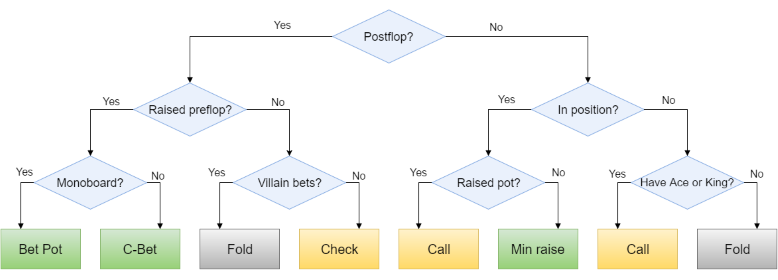
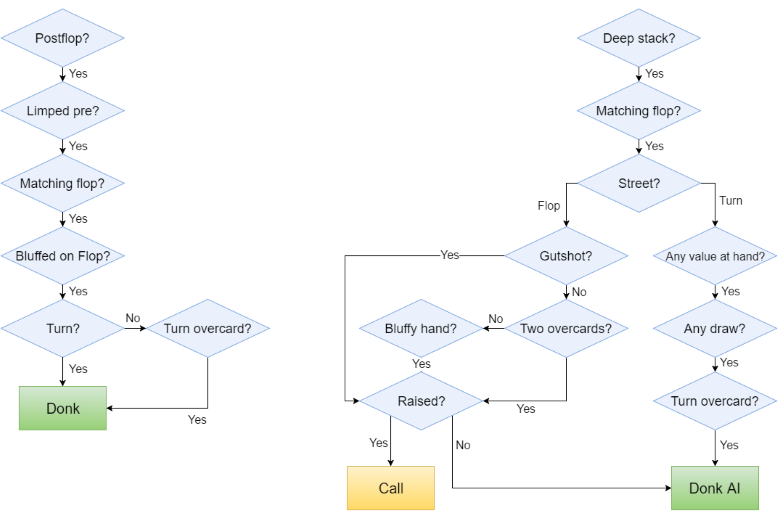

*This is the fifth part of **Building a Poker Bot** series where I describe my experience developing bot software
to play in online poker rooms. I'm building the bot with .NET framework and F# language which makes the task relatively
easy and very enjoyable. Here are the previous parts:*

- [*Building a Poker Bot: Card Recognition*](https://mikhail.io/2016/02/building-a-poker-bot-card-recognition/)
- [*Building a Poker Bot: String and Number Recognition*](https://mikhail.io/2016/02/building-a-poker-bot-string-recognition/)
- [*Building a Poker Bot: Mouse Movements*](https://mikhail.io/2016/03/building-a-poker-bot-mouse-movements/)
- [*Building a Poker Bot with Akka.NET Actors*](https://mikhail.io/2016/04/building-a-poker-bot-with-akka-net-actors/)

In this post I describe a simple pattern to structure the complex decision making
code using partial function application and fold operation applied to a list of functions.

Context
-------

Poker decisions are complex and depend on the multitude of parameters and attributes.
We can visualize the decision making process as a Decision Tree where leaf nodes are
decisions being made, and the branches are different conditions. Here is a simplistic
example of such a poker decision tree:



Now, if we need to implement a similar tree in code, the most straightforward way to
do that is to translate each condition to an `if` statement. This way, the nested
conditions will guide the application through the branches right to the point where
an appropriate decision can be returned.

This approach works for small cases, but in reality it does not scale particularly
well in terms of the tree size. Namely, the two problems are:

**Tree depth**. In many cases, you might need to pass ten or more conditions before
you find your way to the leaf. Obviously, ten levels of `if` statements are not
particularly readable and maintainable. We can try to split the sub-trees into
sub-functions, but that only gives a limited relief.

**Subtree correlation**. Some tree branches deep down the hiereachy might be correlated
to each other. Say, you pass 10 levels of conditions and make a bet on flop. Now,
on turn, you would probably take quite a different decision path, but the logic
would be based on similar 'thinking' in human terms. Ideally, we want to keep this
kind of related decisions together, while isolating them from the other unrelated
decision paths.

In fact, the decision tree should be generalized to the Decision *Graph* to allow
different decision branches to merge back at some point, e.g.

> If there is one Ace on flop, or an overcard came on turn or river
>
> and stacks pre-flop were 20+ BB, or 12+ BB in limped pot
>
> then bet 75% of the pot

There are multiple paths to the same decisions.

Solution
--------

**Break the decision graph down** vertically into smaller chunks. Each chunk should
represent multiple layers of conditions and lead to eventual decisions. All
conditions in sub-graph should be related to each other (high cohesion) and as
isolated from other sub-graphs as possible (low coupling).

Here are two examples of such sub-graphs:



Each sub-graph is very focused on very specific paths and ignores all the branches
which do not belong to this decision process. The idea is that those branches
will be handled by other sub-graphs.

**Represent each sub-graph as a function** with arbitrary signature which accepts
all the parameters that are required for this sub-graph. Do not accept any parameters
which are not related.

The last parameter of each function should be a
[Maybe](https://mikhail.io/2016/01/monads-explained-in-csharp/#maybe) of Decision,
so should be the function's return type.

**Produce a flat list** of all the sub-graph functions. Partially apply the parameters
to those functions to unify the signature of all of them.

Now, when making a decision, **left-fold the list of functions** with the data of
current poker hand. If a function returns `Some` value of decision, return it
as the decision produced from the graph.

Code sample
-----------

We define a number of functions, each one of which represents one piece of decision
logic. Then we put them all into the list:

``` fsharp
let rules = [
  overtakeLimpedPot overtakyHand snapshot value history;
  increaseTurnBetEQvsAI snapshot;
  allInTurnAfterCheckRaiseInLimpedPot snapshot history;
  checkCallPairedTurnAfterCallWithSecondPairOnFlop snapshot value.Made history;
  bluffyCheckRaiseFlopInLimpedPotFlop bluffyCheckRaiseFlopsLimp snapshot value history;
  bluffyOvertakingRiver bluffyOvertaking snapshot history
]
```

The type of this list is `(Decision option -> Decision option) list`.

Note how each individual function accepts different set of parameters. Current hand's
`snapshot` is used by all of them, while calculated hand `value` and previous
action `history` are used only by some of the functions.

Now, here is the definition of the facade decision making function:

``` fsharp
rules |> List.fold (fun opt rule -> rule opt) None
```

It calculates the decision by folding the list of rules and passing current decision
between them. `None` is the initial seed of the fold.

Conclusion
----------

Vertical slices are an efficient way to break down the complex decision making
into smaller cohesive manageable parts. Once you get the parts right, it's easy
to compose them by folding a flat list of partially applied functions into a
`Maybe` of decision result.