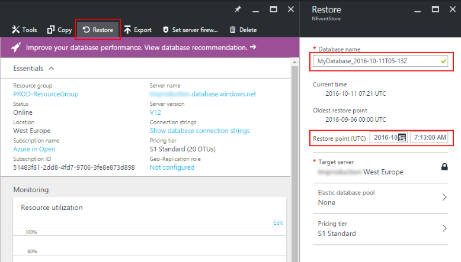
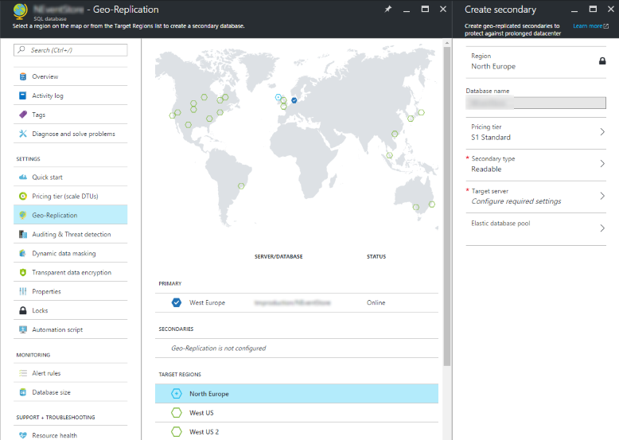
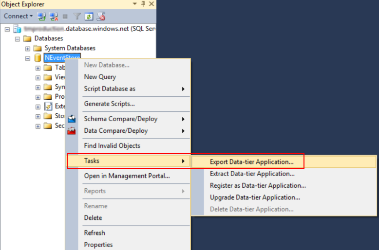
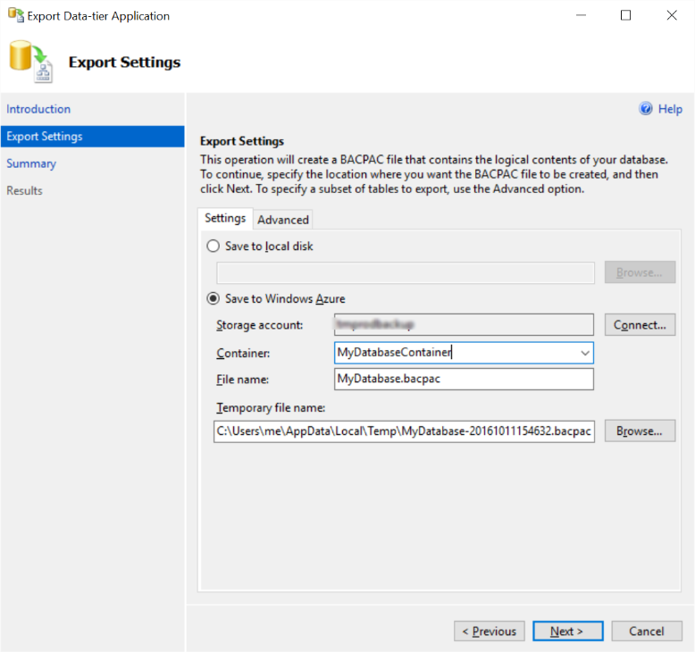
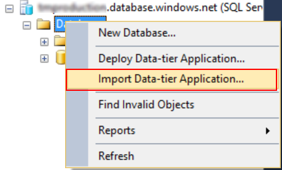

Azure SQL Database is a managed cloud database-as-a-service. It provides
application developers with SQL Server databases which are hosted in the
cloud and fully managed by Microsoft.

The service is very easy to start with. Several clicks in the portal and
you have a database running. Now you can copy the connection string to
your application config file, and boom - you have all up and running.
No installation, no license to buy - just pay the hourly fee.

Any production database is a very important asset, so we are used to
give it a good care in self-hosted scenario. A number of questions appear
when you try to apply those practices to the cloud offering:

- How do I make a backup of my database? Where should I store it?
- How do I move my database including schema and data from on-premise
to the cloud?
- How do I move it from the cloud to my local server?
- What is a point-in-time restore offered by Azure?
- Should I use geo-replication? What is geo-restore?

In this post I'll give the short answers to these questions and the links
for further reading.

What is Point-in-time Restore?
------------------------------

All your databases are always automatically backed-up by Azure. They take
full, differential and log backups in the background to guarantee you always
have your data safe.

These backups are retained for 7 days for Basic, 14 days for Standard and
35 days for Premium tier.

Within this period, you can choose any *minute* and restore your database
to that point in time. The restore always happens to a **new** database,
it does not overwrite your current database.

That's very handy to recover from "oops" operations when data was deleted
from one or more tables by a human or code error. In this case, you restore
a copy of the database, and then move the data missing without stopping
the original database.

If the restored database must replace the current one, be prepared to change
connection strings once the restore operation is done. Alternatively, you
can rename both databases to point applications to the new database without
any other configuration changes.

Depending on the database size, the restore may take long time, up to several
hours, 12 hours max guaranteed. So, point-in-time restore is very flexible
but not instant.

Further reading:
[Azure SQL Database Point in Time Restore](https://azure.microsoft.com/en-us/blog/azure-sql-database-point-in-time-restore/)

What about disaster recovery?
-----------------------------

The same Point-in-time Restore can be used for disaster recovery. The backups
are automatically replicated to other Azure regions, and can be restored
in *any* Azure region. This is called **Geo Restore**.

In case of failure of the primary region, you can immediately start restoring
the database in another region. Remember that the restore might still take
up to several hours depending on the database size.

Also, because the replication is done asynchronously, the geo-restore will
probably lead to some data loss. Usually it will be under 5 minutes of data,
but guarantee is 1 hour at max.

Further reading:
[Azure SQL Database Geo-Restore](https://azure.microsoft.com/en-us/blog/azure-sql-database-geo-restore/)

Can I reduce the downtime and data loss?
----------------------------------------

If you want to be prepared to the failure of the database's Azure region
and be able to fail over much faster, you can use **Active Geo Replication**.
Effectively, you are creating other (up to 5 in total) database(s) which
would be replicated from the primary database.

The replication happens asynchronously, which means that the latency
of the primary database does not increase. That also means that some data
may be lost when replica database is promoted to be the new primary.
Microsoft guarantees that the loss will be limited to 5 seconds worth of data.

The failover can be done any time, manually or by your script.

Having replica databases means that you pay for them too. The performance
level (and the fee) is configurable per database.

As a bonus, you can use secondary databases as read-only replicas. Just
remember that the data might be slightly stale.

Geo Replication is only available for Standard and Premium pricing tiers.

Further reading:
[Spotlight on SQL Database Active Geo-Replication](https://azure.microsoft.com/ru-ru/blog/spotlight-on-sql-database-active-geo-replication/),
[Overview: SQL Database Active Geo-Replication](https://azure.microsoft.com/en-us/documentation/articles/sql-database-geo-replication-overview/)

Do I still need to make manual backups?
---------------------------------------

Well, it's possible that you don't have to.

But there are at least two scenarios when you might still need to make
manual backups:

1. You need to keep a copy of your database for longer period than
Point-in-time restore allows (7 to 35 days depending on the service tier).

2. You need a copy of your Azure database to be restored on premise.

Let's look at manual backups.

How do I make a BAK file from my Azure Database?
------------------------------------------------

The `BAK` backup files are not directly supported by Azure SQL Databases.
Instead, there is a feature called `Export Data tier application`, which
creates a `BACPAC` file in Azure Storage account.

The easiest way to do that is to use SQL Server Management Studio, connect to
Azure SQL Database, then right-click and select `Tasks -> Export Data tier application`
in the menu.

You can export the file to the local storage name or Azure Storage account.

Export will take some time and will consume your database DTUs, so you shouldn't
do it too often.

Export can also be triggered from Azure Portal and PowerShell scripts.

How do I restore a copy of my cloud database to a local server?
---------------------------------------------------------------

Now, when you have a `BACPAC` file, it's really easy to restore it to any
SQL server instance. Right-click `Databases` node in SQL Server Management
Studio and select `Import Data-tier Application...`.

Then pick the location of the saved file.

How do I move my existing database to Azure SQL Database?
---------------------------------------------------------

The process is exactly the same as described above, just the other direction:

- Export Data-tier Application from your local SQL Server to Azure Storage
- Import Data-tier Application to a new Azure SQL Database

Summary
-------

Azure SQL Database is a production-ready fully managed service, which can
dramatically reduce the amount of manual administration compared to on-premise
setup. You can choose between several disaster recovery scenarios based on
your objectives and budget. Import and export of databases are available,
allowing operators to move databases between the cloud and self-hosted servers.