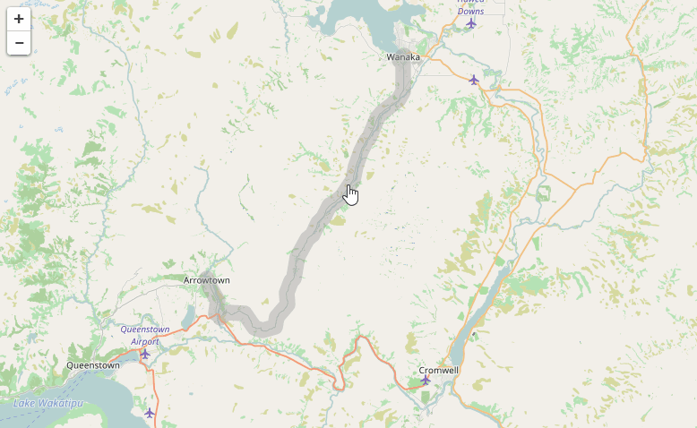

Yesterday I've published a simple [Leaflet](http://leafletjs.com/) plugin called
[leaflet-corridor](https://github.com/mikhailshilkov/leaflet-corridor).
The plugin defines a new Leaflet primitive `L.Corridor`.

When initialized with an array of geo points and width, it renders a polyline
with width fixed in meters, not in pixels. That means that line width changes whenever
zoom level changes.

The plugin is handy to denote geographic corridors: ranges of specified width around
a polyline. In our project we used it to show a predefined vehicle route from Origin to
Destination, with only limited allowed violation from this predefined route. Whenever
vehicle's position falls out of this corridor, the event of Out-of-corridor violation
is recorded and shown on the map.

Here are all the links for the corridor plugin:

- [Github repository](https://github.com/mikhailshilkov/leaflet-corridor) with source code, documentation and usage example
- [Demo page](https://mikhail.io/demos/leaflet-corridor/) to try it out
- [Stackoverflow question](http://stackoverflow.com/questions/26206636/is-there-any-method-to-draw-path-polyline-on-leaflet-with-constant-width-strok/40064379) which inspired me to open-source the implementation