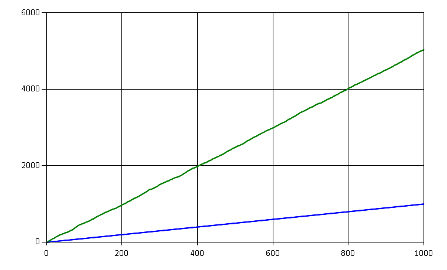
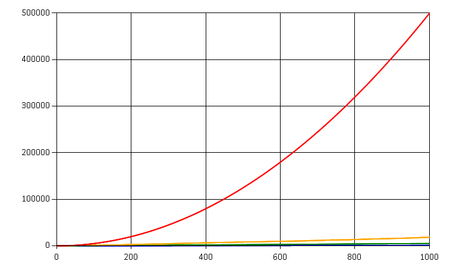

**Event Sourcing** is an approach, when an append-only store is used to record the full series of events that 
describe actions taken on a particular domain entity. This event store becomes the main source of truth 
to reconstruct the current state of the entity and its complete history.

In essence, that means that we store the log of all business events that occurred in the system, and then
we use them to make new decisions and produce new events. 

How Event Souring Works
-----------------------

Event Sourcing is usually used in combination with **Command-Query Responsibility Segregation**, when all writes 
to the event store are initiated by commands. 

The following picture illustrates the storage and command handling:

Every time a new command comes in (1), the command handler understands 
which entity is affected and retrieves all the previous events from the store (2).

The handler aggregates the events and derives the current state of the entity (3). If command is valid given that 
state, the command handler produces a new event or several events (4), and writes them back to the event store (5).

Disk Space Usage
----------------

It's quite obvious that Event Sourcing requires more storage space than traditional approach of only storing 
the current state. The storage size is proportional to the total amount of events in the system, 
i.e. it's `O(n)` or `O(e * l)` where `e` is the count of entities in the system and `l` is the average 
amount of events per entity.

Here is the chart of disk space usage in a simplified situation of events of equal size:

We saved 1000 events and consumed 1000 storage units. The disk space is cheap, so we are willing to take 
the trade-off of extra storage for the benefits that Event Sourcing provides.

Disk IO Usage
-------------

Let's look at how much IO operations we are going to perform over time. Let's say that reading or writing of
one event consumes one unit of IO capacity.

Every time a new event is received, we consume one write operation: it's still linear. The storage is append-only, 
so it makes sense that disk space and writes are essentially the same thing.

Reads are a different beast. Every time we receive a command, we need to perform `i` reads, where `i` 
is the amount of events so far for the entity. Let's have a look at several examples, each one is a
simulation of saving a thousand of new events.

In the **first scenario** we have a steady flow of incoming events. Events belong to different entities (aggregates) 
with **10** events per entity on average:

We can see that we do 5x more reads than writes. That is because for each event written we have to read 
all the previous events for the same entity, and on average there are 5 of them.

In the **second scenario** we receive the same amount of events in total. While most entities still have 
10 events on average, there is just one outlier entity which received **100** events, all in this time period.

Hey, the amount of reads almost doubled! The line also doesn't look linear anymore...

Let's look at the **third extreme scenario** when all 1000 events were generated by the **same entity**:

The amount of reads skyrockets to **100 times more** compared to the first scenario. It's clearly quadratic!
The amount of reads for a single entity is `O(l)` where `l` is the event count for that entity.

Real-Life Scenario
------------------

In many use cases it's unlikely that you get outlier entities which have orders of magnitude difference in amount 
of events per entity. E.g. if your entity is an order in a webshop, there's just a few events that humans can 
generate about it.

However, if the events are generated from telemetry data or IoT devices, or if the entities tend to live for very 
long time (like bank accounts), that's a good sign you should not ignore the potential problem. A handful of anomaly 
devices can bring the whole storage to its knees, if protection is not carefully designed.

If your domain has a chance to belong to the second group, you better get prepared.

Capacity Planning and Monitoring
--------------------------------

It's not enough to know just the total number of events in your store, nor is the incoming rate of new events
descriptive enough. 

Start with modeling your Event Store against real data. Put some monitoring in place to see the distribution of 
event density per entity. Average number is not descriptive enough, so you need to build percentiles and 
know the maximum too.

Monitor the amount of reads on your data store. Set the baseline based on the real data
pattern, not imaginary numbers.

Throttling / Sampling
---------------------

In IoT scenarios the easiest way out could be to discard events if they arrive too frequently from the same device, 
or use some sampling/aggregation at the ingress point. Only your business domain can define what kind of
data loss is acceptable, if any.

Snapshots
---------

Event Sourcing concept provides the solution for the reads problem in form of Snapshots. Once in every `x` events, 
you should produce a snapshot of the entity state. The next time an event comes in, you just read
the snapshot and the events which happened after the latest snapshot time (amount is less than `x`).

It might be tricky to come up with a good snapshot strategy in some cases, especially when the business domain
requires multiple projections to be built. 

The snapshot size might also grow over time, if entity keeps some internal event-based lists. But snapshots 
seem to be the only real solution when the amount of events gets out of control. Choose your Event Store 
technology with this consideration in mind.

Happy Event Sourcing!