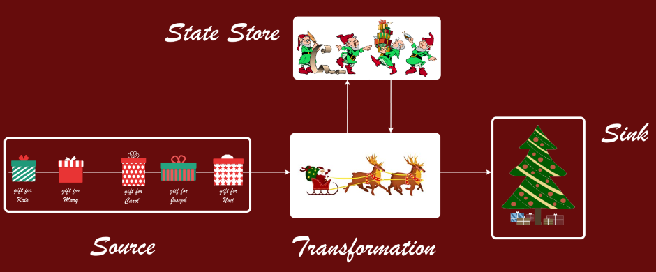
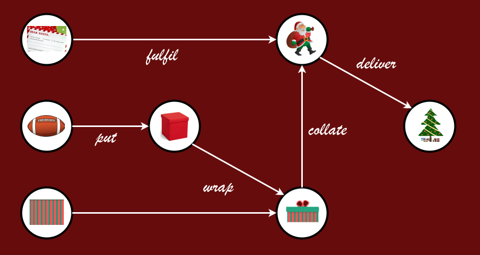
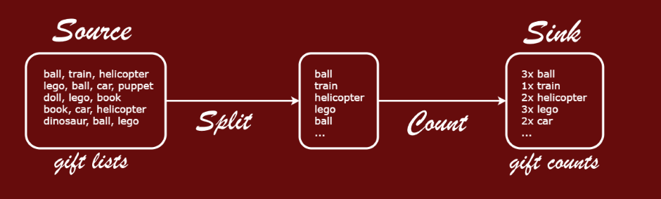

*The post was published for
[F# Advent Calendar 2016](https://sergeytihon.wordpress.com/2016/10/23/f-advent-calendar-in-english-2016/),
thus the examples are themed around the Christmas gifts.*

This article is my naive introduction to the data processing discipline called **Stream Processing**.

I describe stream processing from the developer perspective, using the
following (rather unusual) angle:
- F# as the primary language
- Concepts and principles are more important than frameworks and tools
- Start with modeling the domain problem and then solve just the problems
that your domain has

We begin the journey by introducing what stream processing is all about.

What's and Why's
----------------

There are several techniques to process data that are flowing into your
applications, and stream processing is one of them.

Stream processing is focused on the real-time processing of data
continuously, concurrently, and in a record-by-record fashion. Stream
processing is designed to analyze and act on live data flow, using
"continuous queries" expressed in user code. Data is structured
as a continuous stream of events over time:


In contrast to some other approaches to reason about application
structure, stream processing concepts are drawn around the data structures,
flows and transformations rather than services or remote calls.

Although the approach is nothing new, it gained much more traction
during the last years, especially in big data community. Products
like *Storm*, *Kafka*, *Flink*, *Samza* (all under *Apache Foundation*),
*Google Cloud Dataflow*, *Akka Streams* are popularizing the programming
model and bringing the tools to make it reliable and scalable.

These products are born from the need to run data processing in
massively distributed environments. They are all about scaling out
and solving or mitigating the issues of distributed systems which
are inherintly not reliable.

While this is a noble and mission-critical goal for internet-scale companies, most
applications do not require such massive performances and scale.

There is something to be said for the domain-driven approach, when
an application is built around the main asset and burden of enterprise
systems: the core business logic. It may happen that you don't need
a general purpose framework with the lowest processing latency. Instead
your choice of tools might lean towards the cleanest code possible, tailored
for your own needs, and maintainable over time.

Knowing the landscape can help you do the right trade-off.

The recent Stream Processing boom comes from *Apache* / *JVM* world.
Unfortunately, stream processing frameworks and underlying concepts
are mostly unfamiliar to *.NET* developers.

While *Azure Cloud* provides a managed service called *Azure Stream Analytics*,
the product is built around SQL-like language and is rather limited in
extensibility.

We will have a look at other options in .NET space in the further posts
of the series.


For now, I want to start filling the gap and introduce the basic concepts
with F#. As a bonus, we are not limited by particular tools and
implementations, but can start from the ground up.

Elements of a Stream
--------------------

As I already mentioned above, people are doing stream processing for long
time. In fact, if you receive events and then apply the transformation
logic structured around a single event at a time - you are already
doing stream processing.

Here is a simple picture which illustrates the elements of processing:



The data **Source** is responsible for injection of events
into the pipeline. They are the input intergration points, typically they can
be persistent message queues, logs or subscription feeds.

A sequence of events in the same Source is called **Stream** (thus Stream Processing).
Streams have **unbounded** nature, which means that the amount
of data points is not limited in size or time. There is no "end" of data: events
will potentially keep coming as long as the processing application is alive.

The high-level purpose of the **Transformation** is to extract
value from the events. That's where the business logic resides, and that's
where development effort goes to. Transformations can also be refered as Stages,
Flows, Tasks, Jobs and so on, depending on the context.

The most simple transformation like format conversion can be stateless.
However, other transformations will often use some kind of **State Store**,
as a means to
- Aggregate data from multiple events of the same stream
- Correlate events from several streams
- Enrich event data with external lookup data

Data **Sink** represents the output of the pipeline, the place where the transformed,
aggregated and enriched events end up at.

A Sink can be a database of any kind, which stores the processed data, ready
to be consumed by user queries and reports.

Another Sink can become a Source for another stream of events. This way
the series of transformations are sequenced together into **Processing Pipelines**
(or **Topologies**).

On the high-level, the pipelines can usually be represented as directed graphs,
with data streams in nodes and transformations in edges:



In real-world applications, the pipelines can have lots of interconnected
elements and flow branches. We will start with a simplistic example.

Gift Count Pipeline
-------------------

Word Count is the Hello World and TODO app of the data
processing world. Here are the reference implementations for
[Dataflow](https://cloud.google.com/dataflow/examples/wordcount-example),
[Flink](https://github.com/apache/flink/blob/master/flink-examples/flink-examples-batch/src/main/java/org/apache/flink/examples/java/wordcount/WordCount.java) and
[Storm](https://github.com/nathanmarz/storm-starter/blob/master/src/jvm/storm/starter/WordCountTopology.java).

To make it a bit more fun, we'll make a Gift Count pipeline out of it.
The following image summarizes our Gift Count topology:



The pipeline consists of one source, one sink and two transformations.
The input of the pipeline is the source of gift lists (each list is a comma
separated line of text).

The purpose of the processing is to tokenize gift lists into separate gifts,
and then count the occurances of each gift in the stream. The output
is written into a database sink, e.g. a key value store with gifts as keys and
amounts as values.

Note that while Split stage is stateless, the Count stage needs to keep some
internal state to be able to aggregate data over multiple entries.

Let's start thinking about the implementation. How do we model transformations
and pipelines in code?

Transformations
---------------

Here's how a transformation is typically represented in *Apache Storm*, the grand
daddy of Big Data Stream Processing systems (transformations are called
*Bolts* in Storm, and code is Java):

``` java
public class TokenizerBolt implements IRichBolt {
    public void execute(Tuple input) {
        String wishlist = input.getString(0);
        for(String gift: wishlist.split(", ")) {
            collector.emit(new Values(gift));
        }
        collector.ack(input);
    }
    // Other code is omitted
}
```

Tokenizer is a class which implements a predefined interface with `execute`
method in it. The method accepts a container class `Tuple` from where
we can extract real data using position-based indexing. Something like a
`DataRow` from ADO.NET. The method does not return anything, but instead
calls an effect-ful method `emit`, passing a tuple to the next transformation
in the pipeline.

Clearly, there is some room for improvement here. We don't want to put our important
domain logic into amorphous functions of type `Collector -> Tuple -> unit`. Here
is what we can do:

- Use strong typing to see what function does based on its signature
- Use pure functions to make them easy to test and reason about
- Use domain-specific types with F# records and ADTs

Our domain is very simple in Gift Count example. Still, we could describe `Gift`
type to restrict it to be lowercase, not empty etc. But for the sake of simplisity
I'll limit it to one liner:

``` fsharp
type Gift = string
```

Now, the type of the first transformation should be `string -> Gift list`. So,
our transformation is based on a function

``` fsharp
let tokenize (wishlist: string) =
  wishlist.ToLowerInvariant().Split(", ")
  |> List.ofArray
  |> List.map (fun x -> x.Trim())
  |> List.filter (fun x -> x.Length > 0)
```

The counting transformation is modeled in a similar way. The base function
is of type `Gift list -> (Gift * int) list` and is actually implemented as

``` fsharp
let count xs = List.countBy id xs
```

Instead of using a real database, we will just print the counts to console.
So the last optional step for our examples will be to print out the counts
one by one. Here is a helper function:

``` fsharp
let print (gift, count) = sprintf "%i %s" count gift
```

Now, we can tokenize and count the gifts in a single list. But how do we
aggregate data over time? Let's leave this to the pipelines.

Pipelines
---------

Let's have a look at a definition of a Storm pipeline (in Java):

``` java
TopologyBuilder builder = new TopologyBuilder();
builder.setSpout("line-reader", new LineReaderSpout());
builder.setBolt("gifts-spitter", new GiftSpitterBolt()).shuffleGrouping("line-reader");
builder.setBolt("gift-counter", new GiftCounterBolt()).shuffleGrouping("gifts-spitter");
```

There is a `Builder` class, which is capable to add Sources (`Spouts`) and Transformations
(`Bolts`) to the pipeline. But again, there's no type story here: the stages are linked
by name, and the types are just implementations of predefined interfaces.

Here is another example of the pipeline, now from *Google Dataflow SDK* (still Java):

``` java
Pipeline
    .create(options)
    .apply(TextIO.Read.from("..."))
    .apply(ParDo.named("ExtractGifts").of(new DoFn<String, String>() {
         public void processElement(ProcessContext c) { /* Implements tokenizer */ }
    }))
    .apply(Count.<String>perElement())
    .apply(MapElements.via(new SimpleFunction<KV<String, Long>, String>() {
         public String apply(KV<String, Long> element) { /* Formats results */ }
    }))
    .apply(TextIO.Write.to("..."));
```

I consider this to be more descriptive. There is a clear flow of operations chained
together. The types are visible and checked at compile time.

How would we like to see this pipeline in F#? Our motivation example is going to
be the same processing applied to a normal F# list of wishlists (strings). The following
code snippet counts the gifts in wishlists and prints the result:

``` fsharp
wishlists
|> List.collect tokenize
|> List.countBy id
|> List.map print
|> List.iter (Console.WriteLine)
```

My goal for the rest of the article will be to define a `Flow` module which would
enable me to write a Stream Processing pipeline in the same fashion. Here is the
target code:

``` fsharp
sourceOfWishlists
|> Flow.collect tokenize
|> Flow.countBy id
|> Flow.map print
|> Flow.connectTo sinkForCounts
```

So, how do we implement something like this? Let's start with clarifying how
Source and Sink can be defined.

Source and Sink
---------------

We declared the source of a stream to be unbounded, not limited in time
or event count.

However, the modern stream processing systems like *Flink* and *Dataflow*
(both with ideas from *Apache Beam*) are trying to sit on two chairs at the same time by declaring
that bounded data sources are just sub-case of unbounded streams. If your
goal is to process a fixed batch of data, you could represent it as
one-by-one sequence of events.

Big Data world has a well known approach when batch processing and real time
stream processing are done in parallel, with separate tools and separate code base.
The approach is called *Lambda Architecture*. Beam is declaring this approach outdated,
offering a way to reuse streaming code and capacity also for bounded data workloads.

To follow this modern path, we will declare our `Source` as following:

``` fsharp
type BoundedSource<'T> = unit -> 'T seq
type UnboundedSource<'T> = ('T -> unit) -> unit

type Source<'T> =
  | Bounded of BoundedSource<'T>
  | Unbounded of UnboundedSource<'T>
```

`Source` is a generic discriminated union with two cases. `Bounded` case represents
a side effect-ful function, which returns a sequence of elements when called.
The argument of `unit` is there to delay the processing: we need to declare
sources long before they start to emit values.

The `Unbounded` case is a bit harder to understand. It accepts an action to be
executed as the argument and returns nothing meaningful (`unit` again). You will
see a usage example later.

The `Sink` represents an action to happen at the end of pipeline. I've made it
a discriminated union too, but with just one case:

``` fsharp
type Sink<'T> = | Action of ('T -> unit)
```

Now, we should be able to simulate an empty processing pipeline: directly connect
a source to a sink. Let's start with bounded data:

``` fsharp
let copyPipeline source sink =
  match source, sink with
  | Bounded b, Action a -> b() |> Seq.iter a
  | _ -> failwith "Not supported yet"

let gifts = seq ["Ball"; "Train"; "Doll"]
let giftBoundedSource = (fun() -> gifts) |> Bounded

let consoleSink = (fun (s: string) -> Console.WriteLine s) |> Action

copyPipeline giftBoundedSource consoleSink
```

This code will print out all the gift names from the sequence. Now, let's extend it to
stream unbounded data. Before we can do that, let's introduce a helper class:

``` fsharp
type Triggered<'T>() =
  let subscribers = new List<'T -> unit>()
  member this.DoNext x =
    subscribers.ForEach(fun s -> s x)
  member this.Subscribe = subscribers.Add
```

An instance of such class keeps a mutable list of subscribers. Subscribers are
added by calling `Subscribe` method. Someone else can then call `DoNext` method,
and each subscriber will get an item every time.

Here's how we can use it for unbounded data processing:

``` fsharp
let copyPipeline source sink =
  match source, sink with
  | Bounded b, Action a -> b() |> Seq.iter a
  | Unbounded ub, Action a -> ub a

let consoleSource = new Triggered<string>()
let unboundedSource = consoleSource.Subscribe |> Unbounded
copyPipeline unboundedSource consoleSink

Seq.initInfinite (fun _ -> Console.ReadLine())
|> Seq.takeWhile ((<>) "q")
|> Seq.iter consoleSource.DoNext
```

This little program will echo whatever you enter into the console until you type
`q` to quit. That is an example of unbounded data: you can type as long as
you want, there is no hard limit.

Here's how it works:

1. `Triggered` source is created.
2. Unbounded source is declared by subscribing to the trigger.
3. Our dummy pipeline links the source to the action of writing to console.
4. Every time a new line is entered, `DoNext` method of the trigger is called
and the data flows to the sink.

Stop here and make sure you understand the example before going further.

Flow
----

Now it's time to implement the contracts for the flow that we defined
in Gift Count example. The contract consists of two parts. The first part
is a generic interface which defines all the operations that we need:

``` fsharp
type Runnable = unit -> unit

type IFlow<'a> =
  abstract member Map<'b> : ('a -> 'b) -> IFlow<'b>
  abstract member Collect<'b> : ('a -> 'b list) -> IFlow<'b>
  abstract member CountBy<'b when 'b: equality> : ('a -> 'b) -> IFlow<'b * int>
  abstract member To: Sink<'a> -> Runnable
```

Then we define a module which is just a wrapper around the interface to
enable F#-style API:

``` fsharp
module Flow =
  let map<'TI, 'TO> (f: 'TI -> 'TO) (flow: IFlow<'TI>) = flow.Map f
  let collect<'TI, 'TO> (f: 'TI -> 'TO list) (flow: IFlow<'TI>) = flow.Collect f
  let countBy<'T, 'TK when 'TK: equality> (f: 'T -> 'TK) (flow: IFlow<'T>) = flow.CountBy f
  let connectTo<'T> sink (flow: IFlow<'T>) = flow.To sink
  let run (r: Runnable) = r()
```

Then, we just need an implementation of `IFlow` and a factory method to create
an initial instance of flow given a data source.

Now I'd like to emphasize that there are multiple possible implementations
of `IFlow` depending on the required properties for the pipeline. They might make
use of different libraries or frameworks, or be a naive simple implementation like
the one below, suitable for modeling and testing.

In fact, one of my implementations doesn't run the pipeline, but instead uses reflection
to build a visual graph of processing stages, to be used for documentation and discussion
purposes.

We will have a look at more advanced implementations in the further articles, but
for now here is a naive version:

``` fsharp
module Runner =
  let private mapTransform map = function
    | Bounded bs -> bs >> Seq.map map |> Bounded
    | Unbounded us ->
      fun subscriber -> map >> subscriber |> us
      |> Unbounded

  let private collectTransform mapToMany = function
    | Bounded bs -> bs >> Seq.map mapToMany >> Seq.concat |> Bounded
    | Unbounded us ->
      fun subscriber -> mapToMany >> Seq.iter subscriber |> us
      |> Unbounded

  let private countByTransform<'a, 'b when 'b: equality> (getKey: 'a -> 'b) source =
    let state = new Dictionary<'b, int>()
    let addItem i =
      let key = getKey i
      let value = if state.ContainsKey key then state.[key] else 0
      let newValue = value + 1
      state.[key] <- newValue
      (key, newValue)

    match source with
    | Bounded bs -> bs >> Seq.countBy getKey |> Bounded
    | Unbounded us -> (fun s -> addItem >> s) >> us |> Unbounded

  let private stage source transform sink () =
    match transform source, sink with
    | Bounded bs, Action a -> bs() |> Seq.iter a
    | Unbounded us, Action a -> us a

  type private Flow<'a>(source: Source<'a>, connect: Sink<'a> -> Runnable) =
    member this.Apply<'b> t = new Flow<'b>(t source, stage source t) :> IFlow<'b>

    interface IFlow<'a> with
      member this.Map<'b> map = this.Apply<'b> (mapTransform map)

      member this.Collect<'b> map = this.Apply<'b> (collectTransform map)

      member this.CountBy<'b when 'b: equality>(getKey) =
        this.Apply<'b * int> (countByTransform<'a, 'b> getKey)

      member this.To(sink) = connect(sink)

  let from<'a> source =
    new Flow<'a>(source, stage source (mapTransform id)) :> IFlow<'a>
```

The implementation details are not that important at the moment (even though it's
just 37 lines of code), so I'll just proceed to the pipeline definition:

``` fsharp
unboundedSource                // e.g. same console source as before
|> Runner.from                 // create Runner implementation of IFlow
|> Flow.collect tokenize
|> Flow.countBy id
|> Flow.map print
|> Flow.connectTo consoleSink  // connect to the Sink
|> Flow.run                    // start listening for events
```

Here you can find
[the full code of the Gift Count example](https://github.com/mikhailshilkov/mikhailio-samples/blob/master/streamprocessing/GiftCount.fs).

Conclusion
----------

In this article, we started reasoning about low-latency processing
pipelines from the domain logic point of view. We
tried to reuse well known F# idioms like ADTs and HOFs
to show how stream processing is not much different from other types
of applications.

Although this post is quite long by now, we just scratched the surface
of the stream processing. Here are some focus areas for the
follow-ups:

- More complex pipeline topologies
- State management
- Concepts of time, windowing and out-of-order events
- Reliability, retries and guarantees
- Scaling out
- Using 3rd parties for all of that
- Documentation and formal analysis