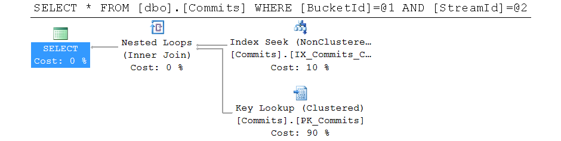
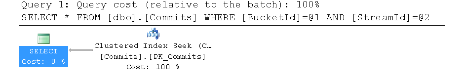

In [my previous post about Event Store read complexity](https://mikhail.io/2016/11/event-sourcing-and-io-complexity/)
I described how the growth of reads from the event database might be
quadratic in respect to amount of events per aggregate.

On the higher level, the conclusion was that the event sourced database should be optimized
for reads rather that writes, which is not always obvious from the definition
of the "append-only store".

NEventStore
-----------

In this post I want to look at
[NEventStore](https://github.com/NEventStore/NEventStore) on top of
[Azure SQL Database](https://azure.microsoft.com/en-us/services/sql-database/)
which is the combination we currently use for event sourcing in Azure-based
web application.

NEventStore library provides a C# abstraction over event store with multiple
providers for several database backends. We use the
[Persistence.SQL provider](https://github.com/NEventStore/NEventStore.Persistence.SQL).
When you initialize
it with a connection string to an empty database, the provider will go
on and create two tables with schema, indexes etc. The most important
table is `Commits` and it gets the following schema:

``` sql
CREATE TABLE dbo.Commits
(
  BucketId          varchar(40),
  StreamId          char(40),
  StreamRevision    int,
  Items             tinyint,
  CommitId          uniqueidentifier,
  CommitSequence    int,
  CheckpointNumber  bigint IDENTITY(1, 1),
  Payload           varbinary(max),
  CommitStamp       datetime2
)
GO
ALTER TABLE dbo.Commits
ADD CONSTRAINT PK_Commits
PRIMARY KEY CLUSTERED (CheckpointNumber)
```

I removed several columns, most indexes and constraints to make the script
more readable.

The primary key is based upon `CheckpointNumber` - an `IDENTITY` column, which means
the new events (commits) are appended to the end of the clustered index.
Clearly, this is good for `INSERT` performance.

There is a number of secondary non-clustered indexes that are optimized
for rich API of NEventStore library, e.g. dispatching events to observers,
searching for streams, time-based queries etc.

Our Use Case
------------

It turns out that we don't need those extended API provided by `NEventStore`.
Effectively, we only need two operations to be supported:

- Add a new event to a stream
- Read all events of a stream

Our experience of running production-like workloads showed that the read
operation performance suffers a lot when the size of a stream grows. Here
is a sample query plan for the read query with the default schema:



SQL Server uses non-clustered index to find all events of the given
steam, and then does key lookups, which might get very expensive for
large streams with hundreds or thousands of events.

Tuning for Reads
----------------

After seeing this, I decided to re-think the primary index of the
`Commits` table. Here is what I came down to:

``` sql
ALTER TABLE dbo.Commits
ADD CONSTRAINT PK_Commits
PRIMARY KEY CLUSTERED (BucketId, StreamId, CommitSequence)
```

Now, all the commits of one stream are physically located together in the
clustered index.

The change makes `INSERT`'s less efficient. It's not a simple append to the
end of the clustered index anymore.

But at this price, the reads just got much faster. Here is the plan for
the same query over the new schema:



Simple, beautiful and fast!


Our Results
-----------

The results look great for us. We are able to run our 50 GB Commits table
on a 100-DTU SQL Database instance, with typical load of 10 to 25 percent.
The reads are still taking the biggest chunk of the load, with writes
being far behind.

The mileage may vary, so be sure to test your NEventStore schema versus
your workload.

Further Improvements
--------------------

Here are some further steps that we might want to take to make `Commits`
table even faster:

- The table comes with 5 non-clustered indexes. One of them became our
clustered index. Two indexes are unique, so they might be useful for
duplicate prevention (e.g. in concurrency scenarios). The remaining two
are non-unique, so they can probably be safely deleted unless we start
using other queries that they are intended for.

- There are several columns which are not used in our implementation:
`StreamIdOriginal`, `Dispatched` and `Headers` to name a few. We could
replace the table with a view of the same name, and always return defaults
for those columns in any `SELECT`, ignoring the values in any `INSERT`.

But I expect these changes to have moderate impact on performance in contrast
to the primary key change discussed above.