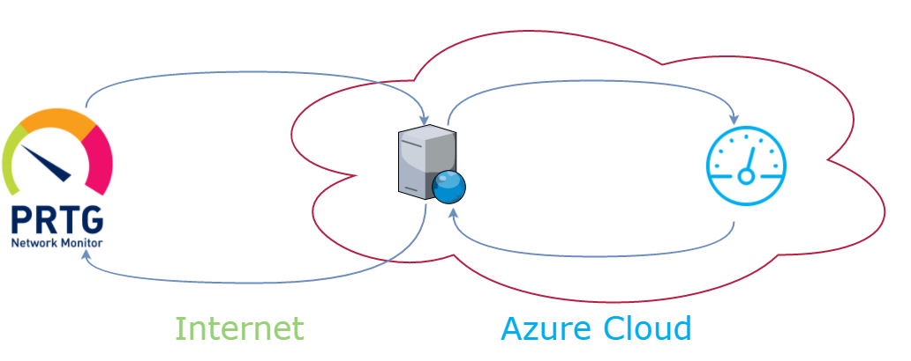
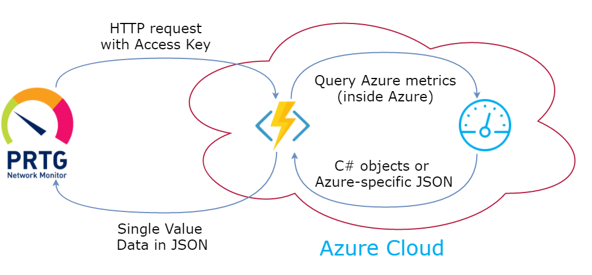
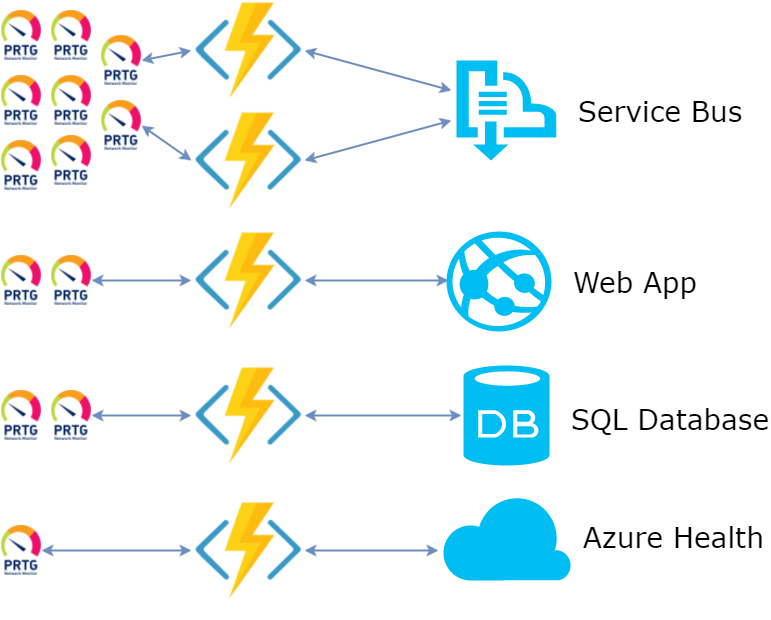

Azure Functions are the Function-as-a-Service offering from Microsoft Azure cloud.
Basically, an Azure Function is a piece of code which gets executed by Azure
every time an event of some kind happens. The environment manages deployment,
event triggers and scaling for you. This approach is often reffered as
Serverless.

In this post I will describe one use case for Azure Functions: we implemented
a number of functions as a proxy layer between our operations/monitoring
tool and Azure metric APIs.

Problem
-------

Automated monitoring and alerting are crucial in order to ensure 24x7 smooth
operations of our business-critical applications. We host applications both
on-premise and in Azure cloud, and we use a single set of tools for monitoring
across this hybrid environment.

Particularly, we use [PRTG Network Monitor](https://www.paessler.com/prtg)
to collect all kinds of metrics about the health of our systems and produce
both real-time alerts and historic trends.

A unit of monitoring in PRTG is called "sensor". Each sensor polls a specific
data source to retrieve the current value of a metric. The data source can
be a performance counter, a JSON value in HTTP response, a SQL query result
and so on.

The problem is that there is no PRTG sensor for Azure metrics out of the box.
It might be possible to implement a sensor with custom code, e.g. in PowerShell,
but it would be problematic in two ways (at least):

1. The custom code sensors are cumbersome to develop and maintain.
2. We would have to put sensitive information like Azure API keys and
connection strings to PRTG.

Solution Overview
-----------------

To overcome these problems we introduced an intermediate layer, as shown
on the following picture:



We use PRTG `HTTP XML/REST` sensor type. This sensor polls a given HTTP endpoint,
parses the response as JSON and finds a predefined field. This field is then
used as the sensor value. It takes 30 seconds to setup such sensor in PRTG.

The HTTP endpoint is hosted inside Azure. It provides a facade for metric
data access. All the sensitive information needed to access Azure metrics
API is stored inside Azure configuration itself. The implementation knows
which Azure API to use to get a specific metric, and it hides those
complications from the client code.

Azure Functions
---------------

We chose Azure Functions as the technology to implement and host such HTTP
facade.

The functions are very easy to create or modify. They are deployed independently
from any other code, so we can update them at any cadence. And no need to
provision any kind of servers anywhere - Azure will run the code for us.

Here is how the whole setup works:



1. Every X minutes (configured per sensor), PRTG makes an HTTP request
to a predefined URL. The request includes an Access Key as a query parameter
(the key is stored in sensor URL configuration). Each access key enables
access to just one endpoint and is easily revokable.

2. For each Metric type there is an Azure Function listening for
HTTP requests from PRTG. Azure authorizes requests that contain valid
access keys.

3. Based on query parameters of the request, Azure Function retrieves a proper
metric value from Azure management API. Depending on the metric type, this
is accomplished with Azure .NET SDK or by sending a raw HTTP request to
Azure REST API.

4. Azure Function parses the response from Azure API and converts it to
just the value which is requested by PRTG.

5. The function returns a simple JSON object as HTTP response body. PRTG
parses JSON, extracts the numeric value, and saves it into the sensor history.

At the time of writing, we have 13 sensors served by 5 Azure Functions:



I describe several functions below.

Service Bus Queue Size
----------------------

The easiest function to implement is the one which gets the amount of
messages in the backlog of a given Azure Service Bus queue. The
`function.json` file configures input and output HTTP bindings, including
two parameters to derive from the URL: `account` (namespace) and queue `name`:

``` json
{
  "bindings": [
    {
      "authLevel": "function",
      "name": "req",
      "type": "httpTrigger",
      "direction": "in",
      "route": "Queue/{account}/{name}"
    },
    {
      "name": "$return",
      "type": "http",
      "direction": "out"
    }
  ],
  "disabled": false
}
```

The C# implementation uses standard Service Bus API and a connection string
from App Service configuration to retrieve the required data. And then returns
a dynamic object, which will be converted to JSON by Function App runtime.

``` csharp
#r "Microsoft.ServiceBus"

using System.Net;
using Microsoft.ServiceBus;

public static object Run(HttpRequestMessage req, string account, string name)
{
    var connectionString = Environment.GetEnvironmentVariable("sb-" + account);
    var nsmgr = NamespaceManager.CreateFromConnectionString(connectionString);
    var queue = nsmgr.GetQueue(name);
    return new
    {
        messageCount = queue.MessageCountDetails.ActiveMessageCount,
        dlq = queue.MessageCountDetails.DeadLetterMessageCount
    };
}
```

And that is all the code required to start monitoring the queues!

Service Bus Queue Statistics
----------------------------

In addition to queue backlog and dead letter queue size, we wanted to see
some queue statistics like amount of incoming and outgoing messages per
period of time. The corresponding API exists, but it's not that straightforward,
so I described the whole approach in a separate post:
[Azure Service Bus Entity Metrics .NET APIs](https://mikhail.io/2017/03/azure-service-bus-entity-metrics-dotnet-apis/).

In my Azure Function I'm using the NuGet package that I mentioned in the post.
This is accomplished by adding a `project.json` file:

``` json
{
  "frameworks": {
    "net46":{
      "dependencies": {
        "MikhailIo.ServiceBusEntityMetrics": "0.1.2"
      }
    }
   }
}
```

The `function.json` file is similar to the previous one, but with one added
parameter called `metric`. I won't repeat the whole file here.

The Function implementation loads a certificate from the store, calls
metric API and returns the last metric value available:

``` csharp
using System.Linq;
using System.Security.Cryptography.X509Certificates;
using MikhailIo.ServiceBusEntityMetrics;

public static DataPoint Run(HttpRequestMessage req, string account, string name, string metric)
{
    var subscription = Environment.GetEnvironmentVariable("SubscriptionID");
    var thumbprint = Environment.GetEnvironmentVariable("WEBSITE_LOAD_CERTIFICATES");

    X509Store certStore = new X509Store(StoreName.My, StoreLocation.CurrentUser);
    certStore.Open(OpenFlags.ReadOnly);

    X509Certificate2Collection certCollection = certStore.Certificates.Find(
        X509FindType.FindByThumbprint,
        thumbprint,
        false);

    var client = new QueueStatistics(certCollection[0], subscription, account, name);
    var metrics = client.GetMetricSince(metric, DateTime.UtcNow.AddMinutes(-30));
    return metrics.LastOrDefault();
}
```

Don't forget to set `WEBSITE_LOAD_CERTIFICATES` setting to your certificate
thumbprint, otherwise Function App won't load it.

Web App Instance Count
----------------------

We are using Azure Web Jobs to run background data processing, e.g. for all
queue message handlers. The jobs are hosted in Web Apps, and have auto-scaling
enabled. When the load on the system grows, Azure spins up additional
instances to increase the overall throughput.

So, the next metric to be monitored is the amount of Web App instances running.

There is a REST endpoint to retrieve this information, but this time
authentication and authorization are implemented with Active Directory. I
created a helper class to wrap the authentication logic:

``` csharp
public static class RestClient
{
    public static async Task<T> Query<T>(string url)
    {
        var token = await GetAuthorizationHeader();
        var client = new HttpClient();
        client.DefaultRequestHeaders.Authorization = new AuthenticationHeaderValue("Bearer", token);

        var response = await client.GetAsync(url);
        var content = await response.Content.ReadAsStringAsync();
        return JsonConvert.DeserializeObject<T>(content);
    }

    private static async Task<string> GetAuthorizationHeader()
    {
        var activeDirectoryID = Environment.GetEnvironmentVariable("ActiveDirectoryID");
        var applicationID = Environment.GetEnvironmentVariable("ActiveDirectoryApplicationID");
        var secret = Environment.GetEnvironmentVariable("ActiveDirectorySecret");

        var context = new AuthenticationContext($"https://login.windows.net/{activeDirectoryID}");
        var credential = new ClientCredential(applicationID, secret);
        AuthenticationResult result =
            await context.AcquireTokenAsync("https://management.core.windows.net/", credential);
        return result.AccessToken;
    }
}
```

The function then uses this REST client to query Web App management API,
converts JSON to strongly typed C# objects and extracts the amount of
instances into HTTP response:

``` csharp
public class Instance
{
    public string id { get; set; }
    public string name { get; set; }
}

public class Response
{
    public Instance[] value { get; set; }
}

public static async Task<HttpResponseMessage> Run(HttpRequestMessage req)
{
    var subscription = Environment.GetEnvironmentVariable("SubscriptionID");
    var resourceGroup = Environment.GetEnvironmentVariable("ResourceGroup");
    var appService = Environment.GetEnvironmentVariable("AppService");

    var url = $"https://management.azure.com/subscriptions/{subscription}/resourceGroups/{resourceGroup}" +
              $"/providers/Microsoft.Web/sites/{appService}/instances?api-version=2015-08-01";
    var response = await RestClient.Query<Response>(url);

    return req.CreateResponse(HttpStatusCode.OK, new
    {
        instanceCount = response.value.Length
    });
}
```

Please follow [this walkthrough](https://docs.microsoft.com/en-us/azure/azure-resource-manager/resource-group-create-service-principal-portal#create-an-active-directory-application)
to setup your application in Active Directory, assign required permissions and
get the proper keys.

Azure Health
------------

Azure has a service which reports the health of different services at any
given moment, as acknowledged by Microsoft.

The handy part is that you can provide your subscription ID and then only
services used by that subscription will be reported.

The exact usage of health service may depend on your use case, but the
following example shows how to retrieve the basic counts of services per
reported status.


``` csharp
public class ResourceProperties
{
    public string availabilityState { get; set; }
    public string summary { get; set; }
    public string detailedStatus { get; set; }
    public string reasonType { get; set; }
    public string occuredTime { get; set; }
    public string reasonChronicity { get; set; }
    public string reportedTime { get; set; }
}
public class Resource
{
    public string id { get; set; }
    public ResourceProperties properties { get; set; }
}

public class Response
{
    public Resource[] value { get; set; }
}

public static async Task<HttpResponseMessage> Run(HttpRequestMessage req)
{
    var subscription = Environment.GetEnvironmentVariable("SubscriptionID");

    var url = $"https://management.azure.com/subscriptions/{subscription}/providers/Microsoft.ResourceHealth/availabilityStatuses?api-version=2015-01-01";
    var r = await RestClient.Query<Response>(url);
    var available = r.value
        .Where(v => v.properties.availabilityState == "Available")
        .Count();

    var unknown = r.value
        .Where(v => v.properties.availabilityState == "Unknown")
        .Count();

    var other = r.value.Length - available - unknown;

    return req.CreateResponse(HttpStatusCode.OK, new
    {
        available = available,
        unknown = unknown,
        other = other,
        details = r.value
    });
}
```

Users Online
------------

The last example I want to share is related to Application Insights data.
For instance, we inject a small tracking snippet on our front-end page
and then Application Insights track all the page views and other user
activity.

We use the amount of users currently online as another metric for the
monitoring solution. The Application Insights API is currently in
preview, but at least it is nicely described at
[dev.applicationinsights.io](https://dev.applicationinsights.io/). Be sure
to check out [API Explorer](https://dev.applicationinsights.io/apiexplorer/metrics) too.

The following sample function returns the amount of users online:

``` csharp
public class UsersCount
{
    public long unique { get; set; }
}

public class Value
{
    [JsonProperty("users/count")]
    public UsersCount UsersCount { get; set; }
}

public class Response
{
    public Value value { get; set; }
}

public static async Task<HttpResponseMessage> Run(HttpRequestMessage req)
{
    var appID = Environment.GetEnvironmentVariable("ApplicationInsightsID");
    var key = Environment.GetEnvironmentVariable("ApplicationInsightsKey");

    var client = new HttpClient();
    client.DefaultRequestHeaders.Add("x-api-key", key);
    var url = $"https://api.applicationinsights.io/beta/apps/{appID}/metrics/users/count";

    var response = await client.GetAsync(url);
    var content = await response.Content.ReadAsStringAsync();
    var r = JsonConvert.DeserializeObject<Response>(content);

    return req.CreateResponse(HttpStatusCode.OK, new
    {
        usersCount = r.value.UsersCount.unique
    });
}
```

Combine Several Metrics in One Sensor
-------------------------------------

Thanks to suggestion from Luciano Lingnau, we have migrated our PRTG
sensors to `HTTP Data Advanced`. This sensor type allows bundling several
related metrics into one sensor with multiple channels. PRTG is then
able to display all those channels on the single chart.

For instance, we use the following channels for Service Bus related
sensors:

- Active message count
- Age of the oldest message sitting inside the queue
- Dead letter message count
- Incoming messages per 5 minutes
- Outgoing messages per 5 minutes
- Scheduled message count

For each channel, we define units of measure, warning and error thresholds.

`HTTP Data Advanced` expects a URL which returns JSON of the predefined format.
Here is a sample C# code to create a `dynamic` object which is then converted
to the proper JSON:

``` csharp
return new
{
    prtg = new
    {
        result = new[]
        {
            new
            {
                channel = "ActiveMessageCount",
                value = messageCountDetails.ActiveMessageCount,
                unit = "Count",
                customunit = (string)null,
                limitmaxwarning = (int?)null,
                limitmode = 0
            },
            new
            {
                channel = "DeadLetterMessageCount",
                value = messageCountDetails.DeadLetterMessageCount,
                unit = "Count",
                customunit = (string)null,
                limitmaxwarning = (int?)0,
                limitmode = 1
            },
            new
            {
                channel = "OutgoingMessageCount",
                value = outgoing,
                unit = "custom",
                customunit = "#/5min",
                limitmaxwarning = (int?)null,
                limitmode = 0
            },
            new
            {
                channel = "IncommingMessageCount",
                value = incoming,
                unit = "custom",
                customunit = "#/5min",
                limitmaxwarning = (int?)null,
                limitmode = 0
            },
            new
            {
                channel = "ScheduledMessageCount",
                value = messageCountDetails.ScheduledMessageCount,
                unit = "Count",
                customunit = (string)null,
                limitmaxwarning = (int?)null,
                limitmode = 0
            },
            new
            {
                channel = "Age",
                value = age,
                unit = "TimeSeconds",
                customunit = (string)null,
                limitmaxwarning = (int?)null,
                limitmode = 0
            }
        }
    }
};

```

Conclusion
----------

It seems that monitoring metrics retrieval is an ideal scenario to start
using Azure Functions. The Functions are very easy to create and modify,
they abstract away the details of hosting Web API endpoints, and at the same
time give you the full power of C# (or F#) and Azure.

And because we only call those functions about 1 time per minute,
they are free to run!