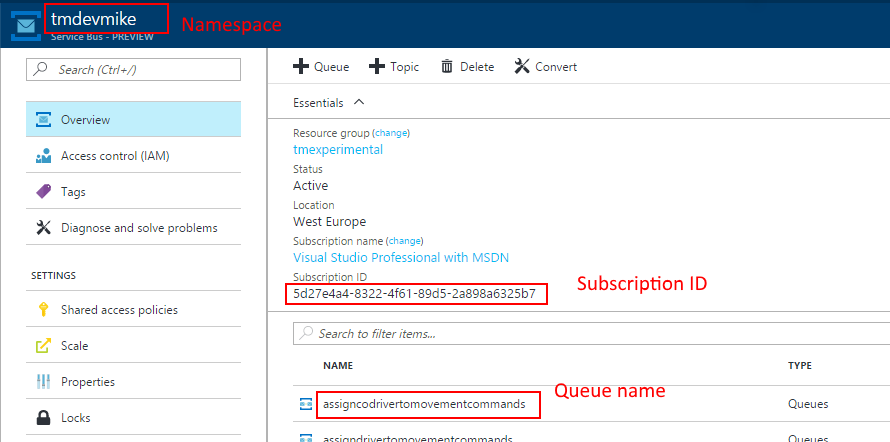

Azure Service Bus is a key component of many background processing applications hosted in Azure, so it definitely requires monitoring and alerting. My goal for our monitoring solution was to provide an API to retrieve the following parameters for each Service Bus queue/topic in our application:

- Message count (backlog)
- Dead letter queue count
- Amount of Incoming messages per time period
- Amount of Processed messages per time period

The first two are easily retrieved from `QueueDescription` object (see
[MSDN](https://msdn.microsoft.com/library/azure/hh780773.aspx)):

``` csharp
var nsmgr = NamespaceManager.CreateFromConnectionString(connectionString);
var queue = nsmgr.GetQueue(name);
var backlog = queue.MessageCountDetails.ActiveMessageCount;
var dlq = q.MessageCountDetails.DeadLetterMessageCount;
```

The other two metrics are not readily available from the .NET SDK though.
There are some extra metrics described in
[Service Bus Entity Metrics REST APIs](https://docs.microsoft.com/en-us/rest/api/servicebus/service-bus-entity-metrics-rest-apis)
but the docs are really brief, wague and lack any examples.

So the rest of this post will be a walkthrough of how to consume those
REST API from your .NET code.

Management Certificate
----------------------

The API authenticates the caller by its client certificate. This authentication
approach seems to be deprecated for Azure services, but for this particular
API it's still the way to go.

First, you need to obtain a certificate itself, which means:
- It's installed in certificate store on the machine where API call is made
- You have a `.cer` file for it

If you are calling API from your workstation, you may just
[Create a new self-signed certificate](https://docs.microsoft.com/en-us/azure/cloud-services/cloud-services-certs-create).

I am calling API from Azure Function App, so I reused the certificate that we already
uploaded to Azure for SSL support.

Once you have the certificate, you have to
[Upload it as a management certificate](https://docs.microsoft.com/en-us/azure/azure-api-management-certs)
to ["Classic" Azure portal](https://manage.windowsazure.com). Yes,
management certificates are not supported by the the new portal. If you don't
have access to the old portal, ask your system administrator to grant it.

Finally, here is a code sample to load the certificate in C# code:

``` csharp
X509Store store = new X509Store("My", StoreLocation.CurrentUser);
store.Open(OpenFlags.ReadOnly);
var cert = store.Certificates.Find(
    X509FindType.FindBySubjectName,
    "<certificate name of yours>",
    false)[0];
```

Request Headers
---------------

Here is a helper class which adds the specified certificate to each request
and sets the appropriate headers too:

``` csharp
internal class AzureManagementClient : WebClient
{
    private readonly X509Certificate2 certificate;

    public AzureManagementClient(X509Certificate2 certificate)
    {
        this.certificate = certificate;
    }

    protected override WebRequest GetWebRequest(Uri address)
    {
        var request = (HttpWebRequest)base.GetWebRequest(address);

        request.ClientCertificates.Add(this.certificate);
        request.Headers.Add("x-ms-version: 2013-10-01");
        request.Accept = "application/json";

        return request;
    }
}
```

This code is mostly copied from the very useful
[post of Brian Starr](https://cincycoder.wordpress.com/2015/11/18/azure-service-bus-entity-metrics-api/),
so thank you Brian.

Getting the List of Metrics
---------------------------

To get the list of available metrics you will need 3 string parameters:
- Azure subscription ID
- Service Bus namespace
- Queue name

The following picture shows all of them on Azure Portal screen:



Now, format the following request URL and query it using our azure client:

``` csharp
var client = new AzureManagementClient(cert);
var url = $"https://management.core.windows.net/{subscriptionId}" +
          $"/services/servicebus/namespaces/{serviceBusNamespace}" +
          $"/queues/{queueName}/Metrics";
var result = client.DownloadString(url);
```

If you did everything correctly, you will get the list of supported metrics
in JSON. Congratulations, that's a major accomplishment :)

And here is a quick way to convert JSON to C# array:

``` csharp
public class Metric
{
    public string Name { get; set; }
    public string Unit { get; set; }
    public string PrimaryAggregation { get; set; }
    public string DisplayName { get; set; }
}
```

``` csharp
var metrics = JsonConvert.DeserializeObject<Metric[]>(result);
```

Getting the Metric Values
-------------------------

Now, to get the metric values themselves, you will need some extra
parameters:

- Metric name (take a value of `Name` properties from `Metric` class above)
- Rollup period, or aggregation period: 5 minute, 1 hour, 1 day, or 1 week,
take the `Pxxx` code from [here](https://docs.microsoft.com/en-us/rest/api/servicebus/supported-rollups)
- Start date/time (UTC) of the data period to query

Here is the sample code:

``` csharp
var time = DateTime.UtcNow.AddHours(-1).ToString("s");

var client = new AzureManagementClient(cert);
var url = $"https://management.core.windows.net/{subscriptionId}" +
          $"/services/servicebus/namespaces/{serviceBusNamespace}" +
          $"/queues/{queueName}/Metrics/{metric}" +
          $"/Rollups/PT5M/Values?$filter=Timestamp%20ge%20datetime'{time}Z'";

var result = client.DownloadString(url);
```

I am using `incoming` metric to get the amount of enqueued messages per period
and `outgoing` metric to get the amount of dequeued messages.

The strongly typed version is simple:

``` csharp
public class DataPoint
{
    public string Timestamp { get; set; }
    public long Total { get; set; }
}
```

``` csharp
var data = JsonConvert.DeserializeObject<DataPoint[]>(result);
```

Working Example
---------------

I've authored a small library which wraps the HTTP request into strongly
typed .NET classes. You can see it in
[my github repository](https://github.com/mikhailshilkov/ServiceBusEntityMetrics)
or grab it from [NuGet](https://www.nuget.org/packages/MikhailIo.ServiceBusEntityMetrics/).