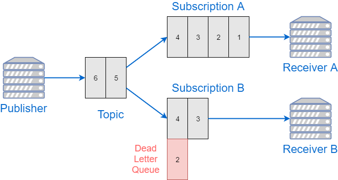
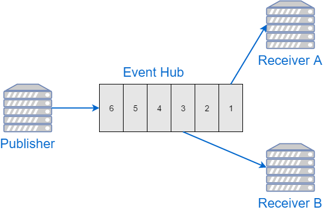

[Azure Event Hubs](https://azure.microsoft.com/en-us/services/event-hubs/) is
a log-based messaging system-as-a-service in Azure cloud. It's designed to be able to handle huge
amount of data, and naturally supports multiple consumers.

Event Hubs and Service Bus
--------------------------

While Event Hubs are formally part of Azure Service Bus family of products,
in fact its model is quite different.

"Traditional" Service Bus service is organized around queues (subscriptions
are just queues with the topic being the source of messages). Each consumer
can peek messages from the queue, do the required processing and then
complete the message to remove it from the queue, or abort the processing.
Abortion will leave the message at the queue, or will move it to the Dead Letter
Queue. Completion/abortion are granular per message; and the status of each
message is managed by the Service Bus broker.



Event Hubs service is different. Each Hub represnts a log of messages.
Event producer appends data to the end of the log, and consumers can read this log,
but they can't remove or change the status of events there.

Each event has an offset associated with it. And the only operation that is
supported for consumers is "give me some messages starting at the offset X".



While this approach might seem simplistic, it actually  makes consumers
more powerful:

- The messages do not disappear from the Hub after being processed for the
first time. So, if needed, the consumer can go back and re-process older
events again;

- Multiple consumers are always supported, out of the box. They just read
the same log, after all;

- Each consumer can go at its own pace, drop and resume processing whenever
needed, with no effect on other consumers.

There are some disadvantages too:

- Consumers have to manage their own state of the processing progress, i.e.
they have to save the offset of the last processed event;

- There is no way to mark any specific event as failed to be able to reprocess
it later. There's no notion of Dead Letter Queue either.

Event Processor Host
--------------------

To overcome the first complication, Microsoft provides the consumer API called
[EventProcessorHost](https://github.com/Microsoft/azure-docs/blob/master/articles/event-hubs/event-hubs-programming-guide.md).
This API has an implementation of consumers based on checkpointing. All you
need to do is to provide a callback to process a batch of events, and then call
`CheckpointAsync` method, which saves the current offset of the last message
into Azure Blob Storage. If the consumer restarts at any point in time, it will
read the last checkpoint to find the current offset, and will then continue
processing from that point on.

It works great for some scenarios, but the event delivery/processing guarantees
are relatively low in this case:

- Any failures are ignored: there's no retry or Dead Letter Queue

- There are no transactions between event hub checkpoints and the data sinks
that the processor works with (i.e. data stores where processed messages
end up at)

In this post I want to focus on a way to process events with higher consistency
requirements, in particular:

- Event Hub processor modifies data in a SQL Database, and such
processing is transactional per batch of messages

- Each event should be (successfully) processed exactly once

- If event processing failed, it should be marked as failed and kept
available to be reprocessed at later point in time

While end-to-end exactly-once processing would require changes of the
producers too, we will only focus on consumer side in this post.

Transactional Checkpoints in SQL
--------------------------------

If checkpoint information is stored in Azure Blobs, there is no obvious way to
implement distributed transactions between SQL Database and Azure Storage.

However, we can override the default checkpointing mechanism and
implement our own checkpoints based on a SQL table. This way each
checkpoint update can become part of a SQL transaction and be committed
or rolled back with normal guarantees provided by SQL Server.

Here is a table that I created to hold my checkpoints:

``` sql
CREATE TABLE EventHubCheckpoint (
  Topic varchar(100) NOT NULL,
  PartitionID varchar(100) NOT NULL,
  SequenceNumber bigint NOT NULL,
  Offset varchar(20) NOT NULL,
  CONSTRAINT PK_EventHubCheckpoint PRIMARY KEY CLUSTERED (Topic, PartitionID)
)
```

For each topic and partition of Event Hubs, we store two values: sequence
number and offset, which together uniquely identify the consumer position.

Conveniently, Event Host Processor provides an extensibility point to
override the default checkpoint manager with a custom one. For that we
need to implement `ICheckpointManager` interface to work with our SQL
table.

The implementation mainly consists of 3 methods: `CreateCheckpointIfNotExistsAsync`,
`GetCheckpointAsync` and `UpdateCheckpointAsync`. The names are pretty
much self-explanatory, and my Dapper-based implementation is quite trivial.
You can find the code [here](https://github.com/mikhailshilkov/mikhailio-samples/blob/master/eventhubs-sqlcheckpoints/SQLCheckpointManager.cs).

For now, I'm ignoring the related topic of lease management and corresponding
interface `ILeaseManager`. It's quite a subject on its own; for the sake
of simplicity I'll assume we have just one consumer process per partition,
which makes proper lease manager redundand.

Dead Letter Queue
-----------------

Now, we want to be able to mark some messages as failed and to
re-process them later. To make Dead Letters transactional, we need another
SQL table to hold the failed events:

``` sql
CREATE TABLE EventHubDeadLetter (
  Topic varchar(100) NOT NULL,
  PartitionID varchar(100) NOT NULL,
  SequenceNumber bigint NOT NULL,
  Offset varchar(20) NOT NULL,
  FailedAt datetime NOT NULL,
  Error nvarchar(max) NOT NULL,
  CONSTRAINT PK_EventHubDeadLetter PRIMARY KEY CLUSTERED (Topic, PartitionID)
)
```

This table looks very similar to `EventHubCheckpoint` that I
defined above. That is because they are effectively storing pointers to
events in a hub. Dead Letters have two additional columns to store error
timestamp and text.

There is no need to store the message content, because failed events still
sit in the event hub anyway. You could still log it for diagnostics purpose - just make an extra
`varbinary` column.

There's no notion of dead letters in Event Hubs SDK, so I defined my own
interface `IDeadLetterManager` with a single `AddFailedEvents` method:

``` csharp
public interface IDeadLetterManager
{
    Task AddFailedEvents(IEnumerable<DeadLetter<EventData>> deadLetters);
}

public class DeadLetter<T>
{
    public T Data { get; set; }
    public DateTime FailureTime { get; set; }
    public Exception Exception { get; set; }
}
```

Dapper-based implementation is trivial again, you can find the code
[here](https://github.com/mikhailshilkov/mikhailio-samples/blob/master/eventhubs-sqlcheckpoints/SQLDeadLetterManager.cs).

Putting It Together: Event Host
-------------------------------

My final solution is still using `EventHostProcessor`. I pass `SQLCheckpointManager`
into its constructor, and then I implement `IEventProcessor`'s
`ProcessEventsAsync` method in the following way:

1. Instantiate a list of items to store failed events
2. Start a SQL transaction
3. Loop through all the received events in the batch
4. Process each item inside a try-catch block
5. If exception happens, add the current event to the list of failed events
6. After all items are processed, save failed events to Dead Letter table
7. Update the checkpoint pointer
8. Commit the transaction

The code block that illustrates this workflow:

``` csharp
public async Task ProcessEventsAsync(
    PartitionContext context,
    IEnumerable<EventData> eventDatas)
{
    // 1. Instantiate a list of items to store failed events
    var failedItems = new List<DeadLetter<EventData>>();

    // 2. Start a SQL transaction
    using (var scope = new TransactionScope())
    {
        // 3. Loop through all the received events in the batch
        foreach (var eventData in eventDatas)
        {
            try
            {
                // 4. Process each item inside a try-catch block
                var item = this.Deserialize(eventData);
                await this.DoWork(item);
            }
            catch (Exception ex)
            {
                // 5. Add a failed event to the list
                failedItems.Add(new DeadLetter<EventData>(eventData, DateTime.UtcNow, ex));
            }
        }

        if (failedItems.Any())
        {
            // 6. Save failed items to Dead Letter table
            await this.dlq.AddFailedEvents(failedItems);
        }

        // 7. Update the checkpoint pointer
        await context.CheckpointAsync();

        // 8. Commit the transaction
        scope.Complete();
    }
}
```

Conclusion
----------

My implementation of Event Hubs consumer consists of 3 parts: checkpoint
manager that saves processing progress per partition into a SQL table;
dead letter manager that persists information about processing errors;
and an event host which uses both to provide transactional processing
of events.

The transaction scope is limited to SQL Server databases, but it might be
sufficient for many real world scenarios.