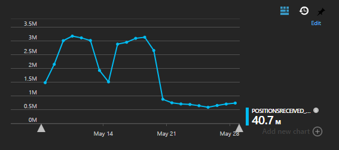
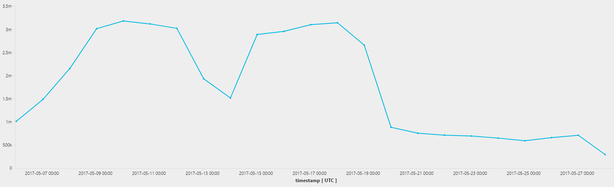
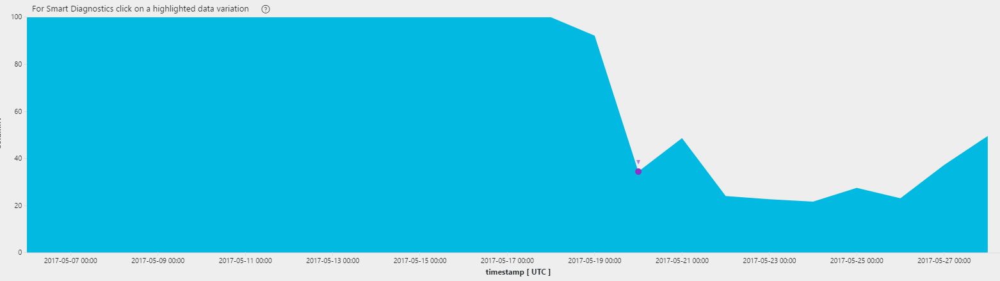
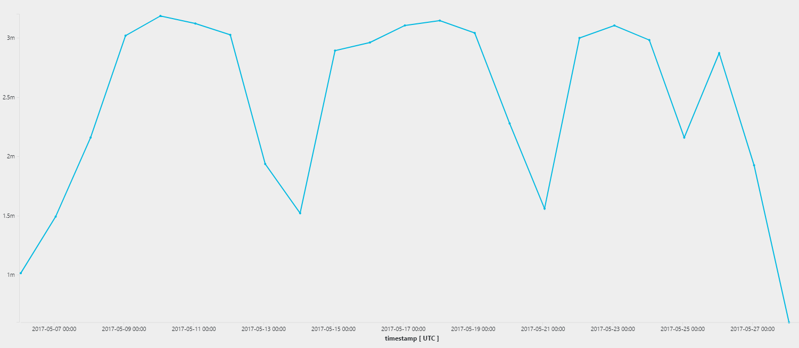

One of the ways we use Azure Application Insights is tracking custom
application-specific events. For instance, every time a data point from an
IoT device comes in, we log an AppInsights event. Then we are able to
aggregate the data and plot charts to derive trends and detect possible 
anomalies.

And recently we found such anomaly, which looked like this:



This is a chart from our Azure dashboard, which shows the total amount of
events of specific type received per day. 

The first two "hills" are two weeks, so we can clearly see that we get more
events on business days compared to weekends.

But then something happened on May 20: we started getting much less events,
and the hill pattern disappeared, days looks much more alike.

We haven't noticed any other problems in the system, but the trend looked
quite bothering. Are we loosing data?

I headed towards Analytics console of Application Insights to dig deeper.
Here is the query that reproduces the problem:

```
customEvents
| where name == "EventXReceived"
| where timestamp >= ago(22d)
| project PointCount = todouble(customMeasurements["EventXReceived_Count"]), timestamp
| summarize EventXReceived = sum(PointCount) by bin(timestamp, 1d)
| render timechart
```

and I got the same chart as before:



I checked the history of our source code repository and deployments and I
figured out that we upgraded the version of Application Insights SDK from 
version 2.1 to version 2.3.

My guess at this point was that Application Insights started sampling our
data instead of sending all events to the server. After reading 
[Sampling in Application Insights](https://docs.microsoft.com/en-us/azure/application-insights/app-insights-sampling)
article, I came up with the following query to see the sampling rate:

```
customEvents
| where name == "EventXReceived"
| where timestamp >= ago(22d)
| summarize 100/avg(itemCount) by bin(timestamp, 1d) 
| render areachart 
```

and the result is self-explanatory:



Clearly, the sampling rate dropped from 100% down to about 30% right when
the anomaly started. The sampling-adjusted query (note `itemCount` multiplication)

```
customEvents
| where name == "EventXReceived"
| where timestamp >= ago(22d)
| project PointCount = todouble(customMeasurements["EventXReceived_Count"]) * itemCount, timestamp
| summarize EventXReceived = sum(PointCount) by bin(timestamp, 1d)
| render timechart
```

puts us back to the point when results make sense:



The third week's Thursday was bank holiday in several European countries, so 
we got a drop there.

Should Azure dashboard items take sampling into account - to avoid
confusing people and to show more useful charts?