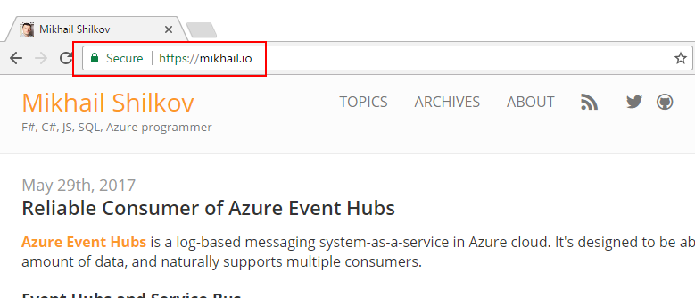
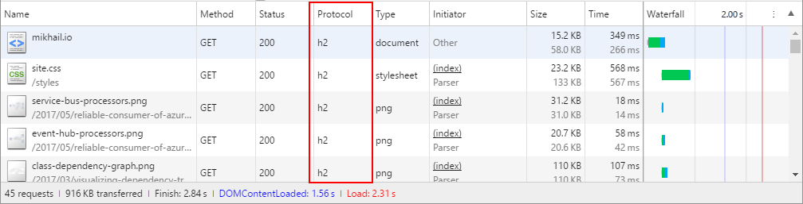

Starting today, this blog has switched to HTTPS secure protocol:

While there's not that much to secure on my blog, HTTPS is still considered to be a good practice for any site in 2017. One of the benefits that we can get from it is the usage of HTTP/2 protocol:

This should be beneficial to any reader which uses a modern browser!

Thanks to [CloudFlare](https://cloudflare.com) for providing me with free HTTPS and HTTP/2 support.