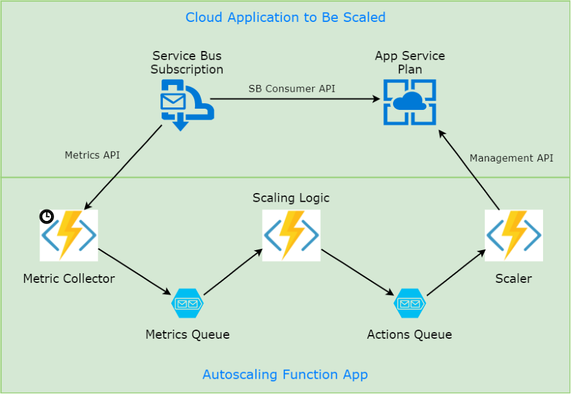
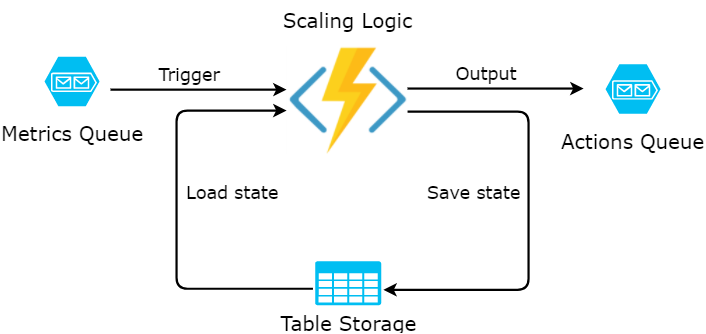

The power of cloud computing comes from its elasticity and ability to adapt to changing
load. Most Azure services can be scaled up or down manually: by human interaction in the
portal, or by running a command or a script.

Some services in Azure also support Autoscaling, i.e. they may change the resource 
allocation dynamically, based on predefined rules and current operational metrics.

Azure App Service is one example of such service: it supports 
[Scaling based on a pre-set metric](https://docs.microsoft.com/en-us/azure/monitoring-and-diagnostics/insights-how-to-scale#scaling-based-on-a-pre-set-metric).
This is a powerful option that enables website or webjobs to react on varying load,
e.g. based on CPU utilization.

At the same time, the flexibility of the built-in autoscaling is somewhat
limited:

- Only a handful of metrics is supported: for instance, Service Bus Queues 
are supported as metric source, while Service Bus Subscriptions are not;

- It's not possible to combine several metrics in one rule: e.g. scale down only if
several queues are empty at the same time, not just one of them;

- Thresholds are the same for any number of instances: I can't define
a scale down rule threshold to be 60% for 8 instances but 30% for 2 instances;

- The minimum time of reaction is limited to 5 minutes.

Other services, like SQL Database and Cosmos DB, don't have the built-in autoscaling
functionality at all.

This post starts the series of articles about custom implementation 
of autoscaling. The implementation will be based on Azure Functions as building 
blocks of scaling workflows.

Goal
----

To keep the task very specific for now, I want the following from my first 
custom autoscaling implementation:

- Be able to scale the amount of instances up and down in a given App Service 
Plan;

- Do so based on the given Service Bus Subscription backlog (amount of messages 
pending to be processed);

- Scale up, if the average backlog during any 10 minutes is above a threshold;

- Scale down, if the maximum backlog during any 10 minutes is below another 
(lower) threshold;

- After scaling up or down, take a cooldown period of 10 minutes;

- Have a log of scaling decisions and numbers behind;

- Scaling rules should be extensible to allow more complex calculation later 
on.

Architecture
------------

I decided that the scaling rules should be written in a general-purpose programming language
(C# for this post), instead of just picking from a limited list of configurations.

I chose Azure Functions as the mechanism to host and run this logic in Azure cloud. 

Here is a diagram of Functions that I ended up creating:



The components of my autoscaling app are:

- **Metric Collector** function is based on Timer trigger: it fires every minute and collects
the subscription backlog metric from a given Service Bus Subscription;

- Collector then sends this metric to the **Metrics** storage queue;

- **Scaling Logic** function pulls the metric from the queue. It maintains the 
metric values for 10 minutes, calculates average/maximum value, and if they hit 
thresholds - issues a command to scale App Service Plan up or down;

- The command is sent to **Actions** storage queue;

- **Scaler** function receives the commands from the queue and executes 
the re-scaling action on App Service Plan using Azure Management SDK.

The implementation of this workflow is discussed below. I am using Visual Studio 2017 Version 15.3 
Preview 4.0 to author pre-compiled Azure Functions with nice built-in tooling.

Metric Collector
----------------

First, let's define `MetricValue` class, which simply holds time and value:

``` csharp
public class MetricValue
{
    public MetricValue(DateTime time, int value)
    {
        this.Time = time;
        this.Value = value;
    }

    public DateTime Time { get; }

    public int Value { get; }
}
```

and `Metric` class which extends the value with resource name (e.g. App Service
Plan name) and measured parameter name:

``` csharp
public class Metric
{
    public Metric(string resourceName, string name, MetricValue value)
    {
        this.ResourceName = resourceName;
        this.Name = name;
        this.Value = value;
    }

    public string ResourceName { get; }

    public string Name { get; }

    public MetricValue Value { get; }
}
```

The function definition has two associated bindings: timer trigger (runs every
minute) and return binding to the storage queue:

``` csharp
[FunctionName("MetricCollector")]
[return: Queue("Metrics")]
public static Metric MetricCollector([TimerTrigger("0 */1 * * * *")] TimerInfo myTimer, TraceWriter log)
{
    var connectionString = Environment.GetEnvironmentVariable("ServiceBusConnection");
    var topic = Environment.GetEnvironmentVariable("Topic");
    var subscription = Environment.GetEnvironmentVariable("Subscription");

    var nsmgr = NamespaceManager.CreateFromConnectionString(connectionString);
    var subscriptionClient = nsmgr.GetSubscription(topic, subscription);
    var backlog = subscriptionClient.MessageCountDetails.ActiveMessageCount;

    log.Info($"Collector: Current metric value is {backlog}");

    var resource = Environment.GetEnvironmentVariable("ResourceToScale");
    var value = new MetricValue(DateTime.Now, (int)backlog);
    return new Metric(resource, $"{topic}-{subscription}-backlog", value);
}
```

The function executes the following steps:

- Reads configuration value for Service Bus parameters;
- Connects to Service Bus and retrieves `ActiveMessageCount` for the given 
subscription;
- Logs the value for tracing and debugging;
- Returns the metric value mentioning which resource it's intended for.

Scaling Logic
-------------

The core of autoscaling implementation resides in `ScalingLogic` function. 

The function defines 4 (oh my!) bindings:
- Queue trigger to react on messages from the collector;
- Output queue binding to send commands with action to execute;
- Combination of input and output bindings to the same row in Table Storage to 
keep the state in between function calls.

The bindings are illustrated on the following picture:



And here is the corresponding Function signature:

``` csharp
[FunctionName("ScalingLogic")]
[return: Queue("Actions")]
public static ScaleAction ScalingLogic(
    [QueueTrigger("Metrics")] Metric metric, 
    [Table("Scaling", "{ResourceName}", "{Name}")] ScalingStateEntity stateEntity, 
    [Table("Scaling", "{ResourceName}", "{Name}")] out ScalingStateEntity newStateEntity,
    TraceWriter log)
```

Table storage is partitioned per scalable resource, and state is stored per metric;
thus multiple resources and metrics are supported out of the box.

The function implementation is relatively complex, so I'll describe it in parts.

`ScaleAction` is a simple message class:

``` csharp
public enum ScaleActionType
{
    Up,
    Down
}

public class ScaleAction
{
    public ScaleAction(string resourceName, ScaleActionType type)
    {
        this.ResourceName = resourceName;
        this.Type = type;
    }

    public string ResourceName { get; }

    public ScaleActionType Type { get; }
}
```

Table Storage only allows primitive types for its columns, like strings. 
So I had to create a separate Table Storage entity class:

``` csharp
public class ScalingStateEntity : TableEntity
{
    public string SerializedState { get; set; }
}
```

which stores serialized state, from the state class itself:

``` csharp
public class ScalingState
{
    public List<MetricValue> History { get; } = new List<MetricValue>();

    public DateTime LastScalingActionTime { get; set; } = DateTime.MinValue;
}
```

Now let's look at the function body. It consists of four blocks. 

The first block retrieves the previous values of the metric and logs it too:

``` csharp
// 1. Deserialize state
var state = stateEntity?.SerializedState != null 
    ? JsonConvert.DeserializeObject<ScalingState>(stateEntity.SerializedState) 
    : new ScalingState();
var history = state.History;
log.Info($"Scaling logic: Received {metric.Name}, previous state is {string.Join(", ", history)}");
```

The second block adds the current metric value and removes all metrics which are
not in the target period of 10 minutes anymore:

``` csharp
// 2. Add current metric value, remove old values
history.Add(metric.Value);
history.RemoveAll(e => e.Time < metric.Value.Time.Substract(period));
```

Now, the actual logic finally kicks in and produces the scaling action if average
or maximum value is above or below respective thresholds. For my implementation I also
chose to apply this rule after 5th data point. Cooldown period is also respected:

``` csharp
// 3. Compare the aggregates to thresholds, produce scaling action if needed
ScaleAction action = null;
if (history.Count >= 5
    && DateTime.Now - state.LastScalingActionTime > cooldownPeriod)
{
    var average = (int)history.Average(e => e.Value);
    var maximum = (int)history.Max(e => e.Value);
    if (average > thresholdUp)
    {
        log.Info($"Scaling logic: Value {average} is too high, scaling {metric.ResourceName} up...");
        state.LastScalingActionTime = DateTime.Now;
        action = new ScaleAction(metric.ResourceName, ScaleActionType.Up);
    }
    else if (maximum < thresholdDown)
    {
        log.Info($"Scaling logic: Value {maximum} is low, scaling {metric.ResourceName} down...");
        state.LastScalingActionTime = DateTime.Now;
        action = new ScaleAction(metric.ResourceName, ScaleActionType.Down);
    }
}
```

Finally, the state is serialized back to table entity and action is returned: 

``` csharp
// 4. Serialize the state back and return the action
newStateEntity = stateEntity != null 
    ? stateEntity 
    : new ScalingStateEntity { PartitionKey = metric.ResourceName, RowKey = metric.Name };
newStateEntity.SerializedState = JsonConvert.SerializeObject(state);
return action;
```

Note, that if no scaling action is warranted, the function simply returns `null` and no message 
gets sent to the output queue.

Scaler
------

The last function of the workflow is called `Scaler`: it listens for scaling commands and executes them.
I am using Azure Management Fluent SDK to scale the App Service Plan capacity:

``` csharp
[FunctionName("Scaler")]
public static void Scaler([QueueTrigger("Actions")] ScaleAction action, TraceWriter log)
{
    var secrets = Environment.GetEnvironmentVariable("ServicePrincipal").Split(',');
    var credentials = SdkContext.AzureCredentialsFactory
        .FromServicePrincipal(secrets[0], secrets[1], secrets[2], AzureEnvironment.AzureGlobalCloud);
    var azure = Azure.Configure()
        .Authenticate(credentials)
        .WithDefaultSubscription();

    var plan = azure.AppServices
        .AppServicePlans
        .List()
        .First(p => p.Name.Contains(action.ResourceName));

    var newCapacity = action.Type == ScaleActionType.Down ? plan.Capacity - 1 : plan.Capacity + 1;
    log.Info($"Scaler: Switching {action.ResourceName} from {plan.Capacity} {action.Type} to {newCapacity}");

    plan.Update()
        .WithCapacity(newCapacity)
        .Apply();
}
```

The functionality is pretty straightforward. Here are some links where you can read more about 
[Authentication in Azure Management libraries](https://docs.microsoft.com/en-us/dotnet/azure/dotnet-sdk-azure-authenticate?view=azure-dotnet#a-namemgmt-authaazure-management-libraries-for-net-authentication) 
and [Managing Web App with Fluent SDK](https://github.com/Azure-Samples/app-service-dotnet-scale-web-apps).

Conclusion and Further Steps
----------------------------

This was quite a lot of code for a single blog post, but most of it was
fairly straightforward. You can find the full implemenation in 
[my github](https://github.com/mikhailshilkov/mikhailio-samples/blob/master/customautoscaling/servicebussubscription-to-appserviceplan/MetricCollector.cs).

Overall, I've established an application based on Azure Functions, which
watches the predefined metrics and scales the specified resource up and down
based on target metric values.

The current example works only for the combination of Service Bus Subscription
and App Service Plan, but it is clear how to extend it to more scenarios.

The flexibility of such autoscaling solution exceeds the built-in functionality
that is available in Azure Portal.

The most complex part of my Autoscaling application is the Scaling Logic
function. In the next article of the series, I will refactor it to use
[Durable Functions](https://azure.github.io/azure-functions-durable-extension/index.html) - 
the upcoming Orchestration framework for Function Apps.

Stay tuned, and happy scaling!