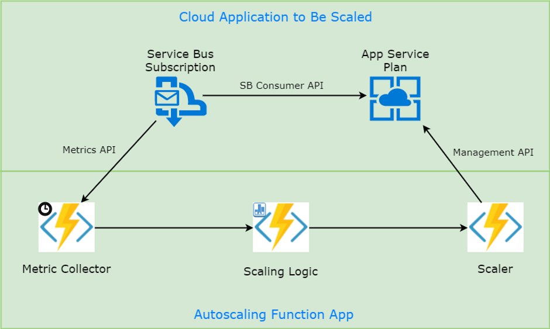

In my previous post 
[Custom Autoscaling of Azure App Service with a Function App](https://mikhail.io/2017/07/custom-auto-scaling-in-azure/)
I've created a Function App which watches a Service Bus Subscription
backlog and adjusts the scale of App Service based on the observed load.

It works fine but there are two minor issues that I would like to address
in this article:

- **Scaling Logic** function from that workflow needs to preserve state
between calls. I used Table Storage bindings for that, which proved to
be a bit verbose and low level: I needed to manage conversion to entity and 
JSON serialization myself;

- There is no feedback from **Scaler** function (which executes the change)
back to **Scaling Logic** function. Thus, if scaling operation is slow or
fails, there is no easy way to notify the logic about that.

Let's see how these issues can be solved with Azure Durable Functions.

Meet Durable Functions
----------------------

Microsoft has recently announced the preview of 
[Durable Functions](https://azure.github.io/azure-functions-durable-extension/):

> Durable Functions is an Azure Functions extension for building long-running, 
> stateful function orchestrations in code using C# in a serverless environment.

The library is built on top of [Durable Task Framework](https://github.com/Azure/durabletask)
and introduces several patterns for Function coordination and stateful
processing. Please go read the [documentation](https://azure.github.io/azure-functions-durable-extension/),
it's great and has some very useful examples.

I decided to give Durable Functions a try for my autoscaling workflow. Feel
free to refer to [the first part](https://mikhail.io/2017/07/custom-auto-scaling-in-azure/)
to understand my goals and the previous implementation.

Architecture
------------

The flow of metric collection, scaling logic and scaling action stays the
same. The state and cross-function communication aspects are now delegated
to Durable Functions, so the diagram becomes somewhat simpler:



The blue sign on **Scaling Logic** function denotes its statefulness.

Let's walk through the functions implementation to see how the workflow
plays out.

This time I'll start with **Scaler** function and then flow from right to left
to make the explanation more clear.

Scaler
------

**Scaler** function applies the scaling decisions to the Azure resource, App
Service Plan in my case. I've extracted App Service related code to a helper, 
to keep the function minimal and clean. You can see the full code in 
[my github repo](https://github.com/mikhailshilkov/mikhailio-samples/blob/master/customautoscaling/durable-functions/DurableScaling.cs).

**Scaler** function is triggered by Durable Function's `ActivityTrigger`. That
basically means that it's ready to be called from other functions. Here is
the code:

``` csharp
[FunctionName(nameof(Scaler))]
public static int Scaler([ActivityTrigger] DurableActivityContext context)
{
    var action = context.GetInput<ScaleAction>();

    var newCapacity = ScalingHelper.ChangeAppServiceInstanceCount(
        action.ResourceName,
        action.Type == ScaleActionType.Down ? -1 : +1);

    return newCapacity;
}
```

In order to receive an input value, I utilize `context.GetInput()` method.
I believe that the team is working on support of custom classes 
(`ScaleAction` in my case) directly as function parameters.

The function then executes the scale change and returns back the new capacity
of App Service Plan. Note that this is new: we were not able to return
values in the previous implementation.

Scaling Logic
-------------

**Scaling Logic** is using [Stateful Actor pattern](https://azure.github.io/azure-functions-durable-extension/articles/samples/counter.html).
One instance of such actor is created for each scalable resource (I only use
1 now). Here is the implementation (again, simplified for readability):

``` csharp
[FunctionName(nameof(ScalingLogic))]
public static async Task<ScalingState> ScalingLogic(
    [OrchestrationTrigger] DurableOrchestrationContext context, 
    TraceWriter log)
{
    var state = context.GetInput<ScalingState>();

    var metric = await context.WaitForExternalEvent<Metric>(nameof(Metric));

    UpdateHistory(state.History, metric.Value);
    ScaleAction action = CalculateScalingAction(state);

    if (action != null)
    {
        var result = await context.CallFunctionAsync<int>(nameof(Scaler), action);
        log.Info($"Scaling logic: Scaled to {result} instances.");
        state.LastScalingActionTime = context.CurrentUtcDateTime;
    }

    context.ContinueAsNew(state);
    return state;
}
```

Here is how it works:

- Function is bound to `OrchestrationTrigger`, yet another trigger type from
Durable Functions;

- It loads durable state from the received `context`;

- It then waits for an external event called Metric (to be sent by **Collector**
function, see the next section);

- When an event is received, the function updates its state and calculates
if a scaling action is warranted;

- If yes, it calls **Scaler** function and sends the scale action. It expects
an integer result, denoting the new amount of instances;

- It then calls `ContinueAsNew` method to start a new iteration of the actor
loop, providing the updated state.

One important note: the orchestrated function 
[has to be deterministic](https://azure.github.io/azure-functions-durable-extension/articles/topics/checkpointing-and-replay.html). 
That means, for example, that `DateTime.Now` is not allowed to be used. 
I use `context.CurrentUtcDateTime` instead for time-related calculations.

The implementation of this function solves both problems that I mentioned 
in the introduction. We do not manage state storage and serialization manually,
and we now have the ability to get feedback from **Scaler** function.

Metrics Collector
-----------------

I've extracted Service Bus related code to a helper to keep the code sample
minimal and clean. You can see the full code in 
[my github repo](https://github.com/mikhailshilkov/mikhailio-samples/blob/master/customautoscaling/durable-functions/DurableScaling.cs).

Here is the remaining implementation of **Metric Collector**:

``` csharp
[FunctionName(nameof(MetricCollector))]
public static async Task MetricCollector(
    [TimerTrigger("0 */1 * * * *")] TimerInfo myTimer,
    [OrchestrationClient] DurableOrchestrationClient client,
    TraceWriter log)
{
    var resource = Environment.GetEnvironmentVariable("ResourceToScale");

    var status = await client.GetStatusAsync(resource);
    if (status == null)
    {
        await client.StartNewAsync(nameof(ScalingLogic), resource, new ScalingState());
    }
    else
    {
        var metric = ServiceBusHelper.GetSubscriptionMetric(resource);
        log.Info($"Collector: Current metric value is {metric.Value.Value} at {DateTime.Now}");
        await client.RaiseEventAsync(resource, nameof(Metric), metric);
    }
}
```

It's still a timer-triggered "normal" (non-durable) function, but now it 
also has an additional binding to `OrchestrationClient`. This client is used 
to communicate metric data to the **Scaling Logic**.

With the current implementation, **Metric Collector** also has a second
responsibility: actor instance management. At every iteration, it queries
for the current status of corresponding actor. If that is `null`, Collector
creates a new instance with initial empty state.

To my liking, this aspect is a bit unfortunate, but it seems to be required
with the current implementation of Durable Functions framework. See 
[my related question on github](https://github.com/Azure/azure-functions-durable-extension/issues/21).

Conclusions
-----------

I adjusted the initial flow of autoscaling functions to use Durable Functions
library. It made the state management look more straightforward, and also
allowed direct communication between two functions in strongly-typed
request-response manner.

The resulting code is relatively clear and resembles the typical structure
of async-await code that C# developers are used to.

There are some downsides that I found about Durable Functions too:

- This is a very early preview, so there are some implementation issues.
A couple times I managed to put my functions into a state where they were stuck
and no calls could be made anymore. The only way I could get out of there is by
clearing some blobs in the Storage Account;

- The actor instance management story feels raw. The function, which needs to
send events to actors, has to manage their lifecycle and instance IDs. I would
need to add some more checks to make the code production ready, e.g. to 
restart actors if they end up in faulty state;

- There are some concurrency issues in function-to-function communication
to be resolved;

- Some discipline is required to keep Durable functions side-effect free
and deterministic. The multiple executions caused by awaits and replays are
counter-intuitive (at least for novice devs), and thus error-prone.

Having said that, I believe Durable Functions can be a very useful abstraction
to simplify some of the more advanced scenarios and workflows. I look
forward to further iterations of the library, and I will keep trying it out
for more scenarios.