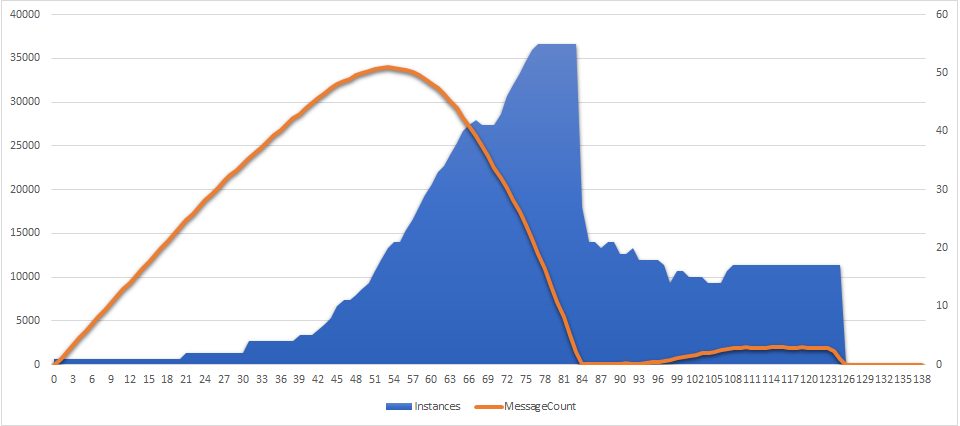
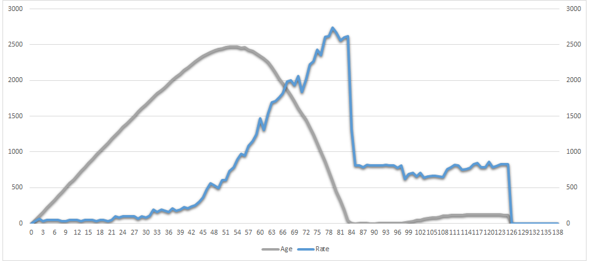
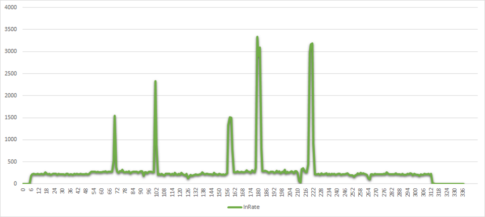
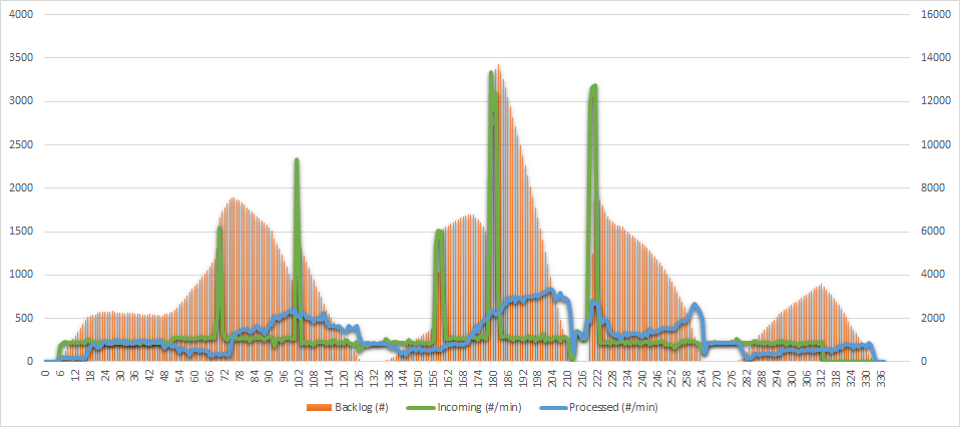

*Updated results are available at
[Azure Functions Get More Scalable and Elastic](https://mikhail.io/2017/12/azure-functions-get-more-scalable-and-elastic/).*

Automatic elastic scaling is a built-in feature of Serverless computing
paradigm. One doesn't have to provision servers anymore, they just need to
write code that will be provisioned on as many servers as needed based on the
actual load. That's the theory.

In particular, Azure Functions can be hosted on the Consumption plan:

> The Consumption plan automatically allocates compute power when your
> code is running, scales out as necessary to handle load, and then scales
> down when code is not running.

In this post I will run a simple stress test to get a feel of how such
automatic allocation works in practice and what kind of characteristics
we can rely on.

Setup
-----

Here are the parameters that I chose for my test of today:

- Azure Function written in C# and hosted on Consumption plan
- Triggered by Azure Storage Queue binding
- Workload is strictly CPU-bound, no I/O is executed

Specifically, each queue item represents one password that I need to hash.
Each function call performs 12-round [Bcrypt](https://en.wikipedia.org/wiki/Bcrypt)
hashing. Bcrypt is a slow algorithm recommended for
password hashing, because it makes potential hash collision attacks really
hard and costly.

My function is based on [Bcrypt.Net](https://github.com/BcryptNet/bcrypt.net)
implementation, and it's extremely simple:

``` csharp
public static void Run([QueueTrigger("bcrypt-password")] string password)
{
    BCrypt.Net.BCrypt.HashPassword(password, 12);
}
```

It turns out that a single execution of this function takes approximately
1 second on an instance of Consumption plan, and consumes 100% CPU during
that second.

Now, the challenge is simple. I send 100,000 passwords
to the queue and see how long it will take to hash them, and also how the
autoscaling will behave. I will run it two times, with different pace of
sending messages to the queue.

That sounds like a perfect job for a Function App on Consumption plan:
- Needs to scale based on load
- CPU intensive - easy to see how busy each server is
- Queue-based - easy to see the incoming vs outgoing rate

Let's see how it went.

Experiment 1: Steady Load
-------------------------

In my first run, I was sending messages at constant rate. 100,000 messages
were sent within 2 hours, without spikes or drops in the pace.

Sounds like an easy job for autoscaling facilities. But here is the actual
chart of data processing:



The horizontal axis is time in minutes since the first message came in.

The orange line shows the queue backlog - the amount of messages sitting in
the queue at a given moment.

The blue area represents the amount of instances (virtual servers) allocated
to the function by Azure runtime (see the numbers at the right side).

We can divide the whole process into 3 logical segments, approximately
40 minutes each:

**Laging behind**. Runtime starts with 0 instances, and immediately switches
to 1 when the first message comes in. However it's reluctant to add any more
servers for the next 20 (!) minutes. The scaling heuristic is probably based
on the past history for this queue/function, and it wasn't busy at all during
the hours before.

After 20 minutes, the runtime starts adding more instances: it goes up to 2,
then jumps to 4, then reaches 5 at minute 40. The CPU is constantly at
100% and the queue backlog grows linearly.

**Rapid scale up**. After minute 40, it looks like the runtime realizes
that it needs more power. Much more power! The growth speeds up real quick
and by minute 54 the backlog stops growing, even though the messages are still
coming in. But there are now 21 instances working, which is enough to
finally match and beat the rate of incoming messages.

The runtime doesn't stop growing though. CPU's are still at 100%, and the backlog
is still very high, so the scaling goes up and up. The amount of instances
reaches astonishing 55, at which point all the backlog is processed and
there are no messages in the queue.

**Searching for balance**. When queue is almost empty and CPU drops below
100% for the first time, the runtime decides to scale down. It does that quickly
and aggressively, switching from 55 to 21 instances in just 2 minutes.

From there it keeps slowly reducing the number of instances until the backlog
starts growing again. The runtime allows the backlog to grow a bit, but
then figures out a balanced number of servers (17) to keep the backlog flat
at around 2,000 messages.

It stays at 17 until the producer stops sending new messages. The backlog
goes to 0, and the amount of instances gradually drops to 0 within 10 minutes.

The second chart from the same experiment looks very similar, but it shows
different metrics:



The gray line is the delay in minutes since the currently processed message
got enqueued (message "age", in-queue latency). The blue line is the
total processing rate, measured in messages per minute.

Due to perfect scalability and stability of my function, both charts are almost
exactly the same. I've put it here so that you could see that the slowest
message spent more than 40 minutes sitting inside the queue.

Experiment 2: Spiky Load
-------------------------

With the second run, I tried to emulate a spiky load profile. I was sending
my 100,000 messages throughout 6 hours at lower pace than during the first
run. But sometimes the producer switched to fast mode and sent a bigger bunch
of messages in just several minutes. Here is the actual chart of incoming
message rate:



It's easy to imagine some service which has a usage pattern like that, when
spikes of the events happen from time to time, or in rush hours.

This is how the Function App managed to process the messages:



The green line still shows the amount of incoming messages per minute. The
blue line denotes how many messages were actually processed at that minute.
And the orange bars are queue backlogs - the amount of messages pending.

Here are several observations:

- Obviously, processing latency is way too far from real time. There is
constantly quite a significant backlog in the queue, and processing delay
reaches 20 minutes at peak.

- It took the runtime 2 hours to clean the backlog for the first time. Even
without any spikes during the first hour, the autoscaling algorithm needs
time to get up to speed.

- Function App runtime is able to scale up quite fast (look at the reaction
on the fourth spike), but it's not really willing to do that most of the time.

- The growth of the backlog after minute 280 is purely caused by wrong
decision of runtime. While the load is completely steady, the runtime
decided to shut down most workers after 20 minutes of empty backlog, and could
not recover for the next hour.

Conclusions
-----------

I tried to get a feeling about the ability of Azure Functions to scale
on demand, adapting to the workload. The function under test was purely CPU-bound,
and for that I can give two main conclusions:

- Function Apps are able to scale to high amount of instances running at the
same time, and to eventually process large parallel jobs (at least up to 55
instances).

- Significant processing delays are to be expected for heavy loads. Function
App runtime has quite some inertia, and the resulting processing latency can
easily go up to tens of minutes.

If you know how these results can be improved, or why they are less than
optimal, please leave a comment or contact me directly.

I look forward to conducting more tests in the future!