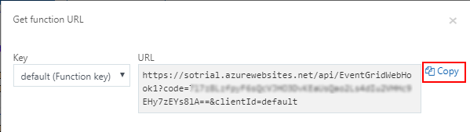
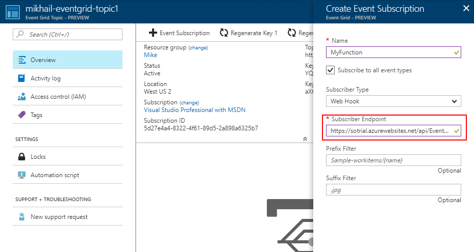

*Update: I missed the elephant in the room. There actually exists a specialized
trigger for Event Grid binding. In the portal, just select `Experimental`
in `Scenario` drop down while creating the function. In precompiled 
functions, reference `Microsoft.Azure.WebJobs.Extensions.EventGrid` NuGet
package.*

*The rest of the article describes my original approach to trigger an
Azure Function from [Azure Event Grid](https://azure.microsoft.com/en-us/services/event-grid/) 
with generic Web Hook trigger.*

Here are the steps to follow:

Create a Function with Webhook Trigger
--------------------------------------

I'm not aware of a specialized trigger type for Event Grid, so
I decided to use Generic Webhook trigger (which is essentially an
HTTP trigger).

I used the Azure Portal to generate a function, so here is the 
`function.json` that I got:

``` json
{
  "bindings": [
    {
      "type": "httpTrigger",
      "direction": "in",
      "webHookType": "genericJson",
      "name": "req"
    },
    {
      "type": "http",
      "direction": "out",
      "name": "res"
    }
  ],
  "disabled": false
}
```

For precompiled functions, just decorate it with `HttpTriggerAttribute` with
POST method:

``` csharp
public static Task<HttpResponseMessage> Run(
    [HttpTrigger(AuthorizationLevel.Function, "post")] HttpRequestMessage req)
```

Parse the Payload
-----------------

Events from Event Grid will arrive in a specific predefined JSON format.
Here is an example of events to expect:

``` json
[{
  "id": "0001",
  "eventType": "MyHelloWorld",
  "subject": "Hello World!",
  "eventTime": "2017-10-05T08:53:07",
  "data": {
    "hello": "world"
  },
  "topic": "/SUBSCRIPTIONS/GUID/RESOURCEGROUPS/NAME/PROVIDERS/MICROSOFT.EVENTGRID/TOPICS/MY-EVENTGRID-TOPIC1"
}]
```

To be able to parse those data more easily, I defined a C# class to deserialize
JSON to:

``` csharp
public class GridEvent
{
    public string Id { get; set; }
    public string EventType { get; set; }
    public string Subject { get; set; }
    public DateTime EventTime { get; set; }
    public Dictionary<string, string> Data { get; set; }
    public string Topic { get; set; }
}
```

Now, the function can read the events (note, that they are sent in arrays)
from the body of POST request:

``` csharp
public static async Task<HttpResponseMessage> Run(HttpRequestMessage req, TraceWriter log)
{
    string jsonContent = await req.Content.ReadAsStringAsync();
    var events = JsonConvert.DeserializeObject<GridEvent[]>(jsonContent);

    // do something with events

    return req.CreateResponse(HttpStatusCode.OK);
}
```

Validate the Endpoint
---------------------

To prevent you from sending events to endpoints that you don't own, Event
Grid requires each subsriber to validate itself. For this purpose, Event
Grid will send events of the special type `SubscriptionValidation`. 

The validation request will contain a code, which we need to echo back in
200-OK HTTP response. 

Here is a small piece of code to do just that:

``` csharp
if (req.Headers.GetValues("Aeg-Event-Type").FirstOrDefault() == "SubscriptionValidation")
{
    var code = events[0].Data["validationCode"];
    return req.CreateResponse(HttpStatusCode.OK,
        new { validationResponse = code });
}
```

The function is ready!

Create a Custom Event Grid Topic
--------------------------------

To test it out, go to the portal and create a custom Event Grid topic.
Then click on Add Event Subscription button, give it a name and copy paste
the function URL (including key) to Subscriber Endpoint field:





Creating a subscription will immediately trigger a validation request to
your function, so you should see one invocation in the logs.

Send Custom Events
------------------

Now, go to your favorite HTTP client (curl, Postman, etc) and send a sample
event to check how the whole setup works:

``` http
POST /api/events HTTP/1.1
Host: <your-eventgrid-topic>.westus2-1.eventgrid.azure.net
aeg-sas-key: <key>
Content-Type: application/json

[{
  "id": "001",
  "eventType": "MyHelloWorld",
  "subject": "Hello World!",
  "eventTime": "2017-10-05T08:53:07",
  "data": {
    "hello": "world"
  }
}]
```

Obviously, adjust the endpoint and key based on the data from the portal.

You should get a 200-OK back and then see your event in Azure Function 
invocation logs.

Have fun!