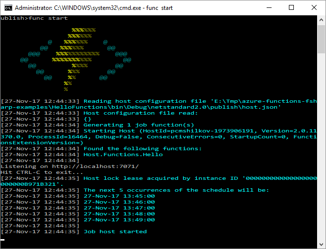
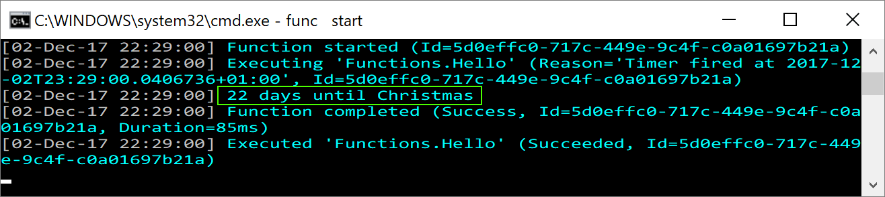
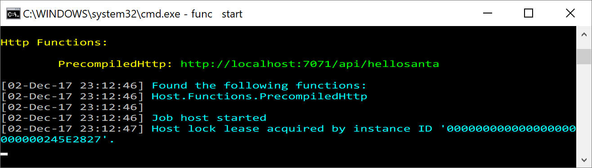

*This post is giving a start to
[F# Advent Calendar in English 2017](https://sergeytihon.com/2017/10/22/f-advent-calendar-in-english-2017/).
Please follow the calendar for all the great posts to come.*

Azure Functions is a "serverless" cloud offering from Microsoft. It
allows you to run your custom code as response to events in the cloud.
Functions are very easy to
start with; and you only pay per execution - with free allowance sufficient
for any proof-of-concept, hobby project or even low-usage production loads.
And when you need more, Azure will scale your project up automatically.

F# is one of the officially supported languages for Azure Functions.
Originally, F# support started with F# Script files (authored directly
in Azure portal or copied from local editor), so you can find many articles
online to get started, e.g.
[Creating an Azure Function in F# from the ground up](http://brandewinder.com/2017/02/11/fsharp-azure-function-from-the-ground-up-part-1/) and
[Part 2](http://brandewinder.com/2017/03/06/fsharp-azure-function-from-the-ground-up-part-2/)
by Mathias Brandewinder.

However, I find script-based model a bit limited. In today's article I
will focus on creating Azure Functions as precompiled .NET libraries.
Along the way, I'll use cross-platform tools like .NET Core and VS Code,
and I'll show how to integrate Functions with some popular tools
like Suave and Paket.

Create a Project
----------------

You can follow this walkthrough on Windows or Mac, just make sure that
you have `.NET Core 2` and `Node.js 8.x` with `npm` installed. My editor of
choice is Visual Studio Code with Ionide plugin.

I'll show you how to create a new F# Function App from scratch. If you want to
jump to runnable project, you can get it from
[my github](https://github.com/mikhailshilkov/azure-functions-fsharp-examples/tree/master/6-precompiled-timer).

We start with creating a new F# library project for .NET Standard 2. Run
in your command line:

``` sh
dotnet new classlib --language F# --name HelloFunctions
```

This command creates a folder with two files: `HelloFunctions.fsproj` project
file and `Library.fs` source code file.

Now, add a reference to Azure Functions NuGet package:

``` sh
dotnet add package Microsoft.NET.Sdk.Functions
```

Define a Function
-----------------

Open `Library.fs` code file and change it to the following code:

``` fsharp
namespace HelloFunctions

open System
open Microsoft.Azure.WebJobs
open Microsoft.Azure.WebJobs.Host

module Say =
  let private daysUntil (d: DateTime) =
    (d - DateTime.Now).TotalDays |> int

  let hello (timer: TimerInfo, log: TraceWriter) =
    let christmas = new DateTime(2017, 12, 25)

    daysUntil christmas
    |> sprintf "%d days until Christmas"
    |> log.Info
```

We defined a function `hello` which should be triggered by Functions runtime
based on time intervals. Every time the function is called, we log how many
days we still need to wait before Christmas 2017.

To convert this simple F# function to an Azure Function, create a folder called
`Hello` (or choose any other name) next to the project file and add
`function.json` file in there:

``` json
{
  "bindings": [
    {
      "name": "timer",
      "type": "timerTrigger",
      "schedule": "0 * * * * *"
    }
  ],
  "scriptFile": "../bin/HelloFunctions.dll",
  "entryPoint": "HelloFunctions.Say.hello"
}
```

We defined that:

- Our function is triggered by timer
- It runs every minute at 0 seconds
- The entry point is our `hello` function in the compiled assembly

Prepare Local Runtime
---------------------

There are a couple more configuration files needed to be able to
run the Function App locally. `host.json` defines hosting parameters; empty
file will do for now:

``` json
{
}
```

Most triggers need to connect to a Storage Account. For examples, timer
trigger uses it to hold leases to define which running instance will
actually execute the action every minute. Copy a connection string to your
Storage Account (local Storage emulator is fine too) and put it into
`local.settings.json` file:

``` json
{
  "IsEncrypted": false,
  "Values": {
    "AzureWebJobsStorage": "...your connection string..."
  }
}
```

Note that this file is only used for local development and is not published
to Azure by default.

Finally, we need to modify `fsproj` file to make the build tool copy those
files into `bin` folder. Add the following section in there:

``` xml
<ItemGroup>
  <Content Include="Hello\function.json">
    <CopyToOutputDirectory>PreserveNewest</CopyToOutputDirectory>
  </Content>
  <Content Include="host.json">
    <CopyToOutputDirectory>PreserveNewest</CopyToOutputDirectory>
  </Content>
  <Content Include="local.settings.json">
    <CopyToOutputDirectory>PreserveNewest</CopyToOutputDirectory>
  </Content>
</ItemGroup>
```

Run App Locally
---------------

The first step is to build and publish our Function App with `dotnet`
commands:

``` sh
dotnet build
dotnet publish
```

The first line produces the dll file and the second line copies it
and all of its dependencies to `publish` folder.

The nice thing about Azure Functions is that you can easily run them
locally on a development machine. Execute the following command to
install the runtime and all the required libraries:

``` sh
npm install -g azure-functions-core-tools@core
```

This will add a `func` CLI to your system which is the tool to
use for all Function related operations.

Navigate to `bin\Debug\netstandard2.0\publish` folder and run `func start`
from there. You should see that your app is now running, and your timer
function is scheduled for execution:



Once the next minute comes, the timer will trigger and you will see
messages in the log:



Integrate into VS Code
----------------------

You are free to use full Visual Studio or any editor to develop Function
Apps in F#. I've been mostly using VS Code for this purpose, and I believe
it's quite popular among F# community.

If you use VS Code, be sure to setup the tasks that you can use from within
the editor. I usually have at least 3 tasks: "build" (`dotnet build`),
"publish" (`dotnet publish`) and "run" (`func start --script-root bin\\debug\\netstandard2.0\\publish`),
with shortcuts configured to all of them.

You can find an example of `tasks.json` file
[here](https://github.com/mikhailshilkov/azure-functions-fsharp-examples/blob/master/6-precompiled-timer/.vscode/tasks.json).

Also, check out [Azure Functions Extension](https://marketplace.visualstudio.com/items?itemName=ms-azuretools.vscode-azurefunctions).

Deploy to Azure
---------------

You can deploy the exact same application binaries to Azure. Start by
creating an empty Function App in the portal, or via Azure CLI (`func` CLI
does not support that).

Then run the following command to deploy your precompiled function to
this app:

``` sh
func azure functionapp publish <FunctionAppName>
```

At the first run, it will verify your Azure credentials.

In real-life production scenarios your workflow is probably going to be
similar to this:

- Change Function App code
- Run it locally to test the change
- Push the code changes to the source control repository
- Have your CI/CD pipeline build it, run the tests and then push
  the binaries to Azure Functions environment

HTTP Trigger
------------

Timer-triggered functions are useful, but that's just one limited use case.
Several other event types can trigger Azure Functions, and for all of them
you can create precompiled functions and run them locally.

The most ubiquotous trigger for any serverless app is probably HTTP. So,
for the rest of the article I will focus on several approaches to
implement HTTP functions. Nonetheless, the same techique can be applied to
other triggers too.

F# code for the simplest HTTP Function can look like this:

``` fsharp
namespace PrecompiledApp

open Microsoft.AspNetCore.Mvc
open Microsoft.AspNetCore.Http
open Microsoft.Azure.WebJobs.Host

module PrecompiledHttp =

  let run(req: HttpRequest, log: TraceWriter) =
    log.Info("F# HTTP trigger function processed a request.")
    ContentResult(Content = "HO HO HO Merry Christmas", ContentType = "text/html")
```

You can find a full example of HTTP Function App
[here](https://github.com/mikhailshilkov/azure-functions-fsharp-examples/tree/master/5-precompiled).

This code is using ASP.NET Core classes for request and response. It's still
just an F# function, so we need to bind it to a trigger in `function.json`:

``` json
{
  "bindings": [
    {
      "type": "httpTrigger",
      "methods": ["get"],
      "authLevel": "anonymous",
      "name": "req",
      "route": "hellosanta"
    }
  ],
  "scriptFile": "../bin/PrecompiledApp.dll",
  "entryPoint": "PrecompiledApp.PrecompiledHttp.run"
}
```

If you run the app, the function will be hosted at localhost



And a request to `http://localhost:7071/api/hellosanta` will get responded
with our "HO HO HO" message.

This function is of "Hello World" level, but the fact that it's inside a
normal F# library gives you lots of power.

Let's see at some examples of how to use it.

Suave Function
--------------

What can we do to enhance developer experience? We can use our
favourite F# libraries.

[Suave](http://suave.io/) is one of the most popular libraries to
implement Web API's with. And we can use it in Azure Functions too!

Let's first make a small twist to HTTP trigger definition in `function.json`:

``` json
"bindings": [
  {
    "type": "httpTrigger",
    "methods": ["get"],
    "authLevel": "anonymous",
    "name": "req",
    "route": "{*anything}"
  }
],
```

Binding now defines a wildcard route to redirect all requests
to this function. That's because we want Suave to take care of routing
for us.

The definition of such routing will look familiar to all Suave users:

``` fsharp
module App =
  open Suave
  open Suave.Successful
  open Suave.Operators
  open Suave.Filters

  let app =
    GET >=> choose
      [ path "/api/what" >=> OK "Every time we love, every time we give, it's Christmas."
        path "/api/when" >=> OK "Christmas isn't a season. It's a feeling."
        path "/api/how" >=> OK "For it is in giving that we receive." ]
```

Azure Function is just a one-liner wiring Suave app into the pipeline:

``` fsharp
module Http =
  open Suave.Azure.Functions.Context

  let run req =
    req |> runWebPart App.app  |> Async.StartAsTask
```

The heavy lifting is done by `runWebPart` function, which is a utility
function defined in the same application. You can see the full code
of this wiring in [my repo](https://github.com/mikhailshilkov/azure-functions-fsharp-examples/tree/master/7-suave).

Run the application and request the URL `http://localhost:7071/api/what`
to see the function in action.

This example is very simple, but you can do lots of powerful stuff with Suave!
Most probably, you shouldn't go over the root and try to fit whole
mulpti-resource REST API into a single Azure Function. But it might still
make sense to keep related HTTP calls together, and Suave can help to keep
it cleaner.

Managing Dependencies with Paket
--------------------------------

Once your Function App becomes bigger and you start using multiple F#
projects, it makes sense to switch to [Paket](https://fsprojects.github.io/Paket/)
package manager.

It is totally possible to use Paket with Azure Functions. There isn't much
specific to Azure Functions, really. Here is an example of `paket.dependecies`
file

```
source https://www.nuget.org/api/v2

framework: >= netstandard2.0
nuget FSharp.Core
nuget Microsoft.NET.Sdk.Functions
nuget Microsoft.AspNetCore.Mvc.Core
```

that I used in [example](https://github.com/mikhailshilkov/azure-functions-fsharp-examples/tree/master/8-paket)
which demonstrates Paket + Functions combination.

Attribute-Based Functions
-------------------------

Up until now, we were writing `function.json` files manually for each
function. This is not very tedious, but it is error prone. Microsoft offers an alternative
programming model where these files are auto-generated by Functions SDK.

This programming model is based on attributes, which are similar to WebJobs
SDK attributes. With this approach, there's no `function.json` file in
the project. Instead, the function declaration is decorated with attributes:

``` fsharp
[<FunctionName("AttributeBased")>]
let run([<HttpTrigger>] req: HttpRequest, log: TraceWriter)
```

The same development flow still works. Once you run `dotnet build`, a new
`function.json` file will be generated and placed into `bin` folder. Functions
runtime will be able to use it to run the function as usual.

Note that the generated file looks a bit different from the manual
equivalent:

1. It manifests itself with

    ``` json
    "generatedBy": "Microsoft.NET.Sdk.Functions.Generator-1.0.6",
    "configurationSource": "attributes",
    ```

2. In case you use input and output bindings, you won't be able to see them
in the generated file. Only trigger will be visible in `json`. Don't worry,
input and output bindings will still work.

You can find an example of HTTP function with attributes
[here](https://github.com/mikhailshilkov/azure-functions-fsharp-examples/tree/master/9-attributes).

There are pro's and con's in this model. Obviously, not having to write
JSON files manually is beneficial. Some people find the binding attributes
really ugly though, especially when you have 3 or 4 bindings and each has
multiple parameters.

My preference is to use attributes, but don't mix attribute decoration
with real code. I.e. keep the Function's body to a simple 1-liner, and
delegate the call to a properly defined F# function with the actual
domain logic.

Wrapping Up
-----------

Lots of F# users value the language for how quickly one can be productive
with it: based on concise syntax, powerful libraries and tools like FSI.

In my opinion, Azure Functions fit nicely into the picture. It takes just
several minutes before you can run your first Function App on developer
machine, and then seamlessly transfer it into the cloud.

I've prepared a github repository where you can find more
[Examples of Azure Functions implemented in F#](https://github.com/mikhailshilkov/azure-functions-fsharp-examples).

Merry Serverless Functional Christmas!