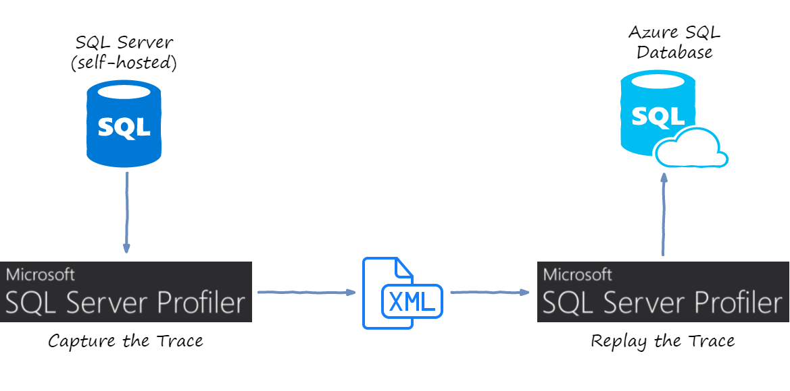
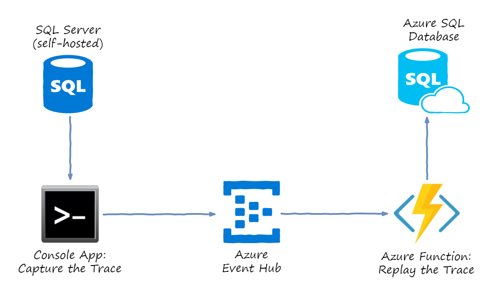
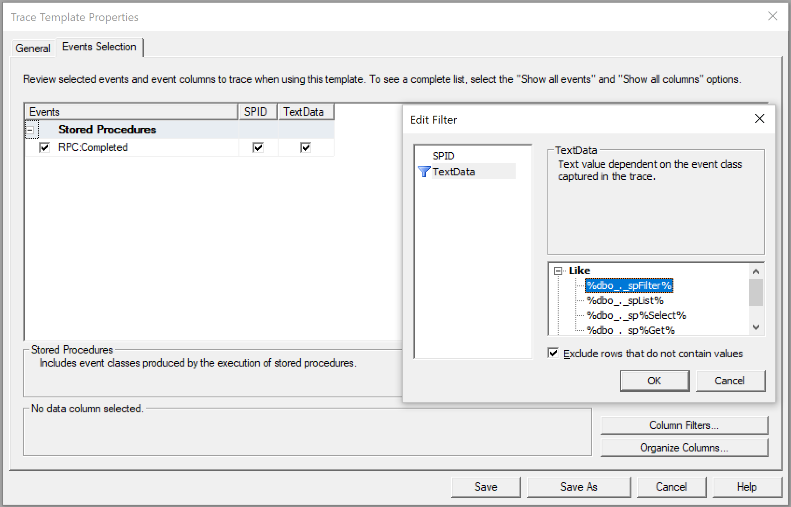

Azure SQL Database is a managed service that provides low-maintenance SQL Server instances in the cloud.
You don't have to run and update VMs, or even take backups and setup failover clusters.
Microsoft will do administration for you, you just pay an hourly fee.

So, let's say you decide this value proposition is a good reason to migrate
away from your existing self-hosted SQL Server database running in production and replace
it with Azure SQL Database.

You do the functional testing and eventually everything works like charm. The next set of questions 
is going to be related to Database performance level:

- Which tier / how many DTU's should I provision?
- How much will it cost?
- Will it be able to handle my current production load?

DTUs
----

Even if you collect all the specs of the hardware behind your existing SQL Server, you can't
directly use that knowledge to choose the right Azure SQL Database size.

The sizes are measured in Database Transaction Units (DTUs). These are abstract units
of measure which don't necessarily mean much on their own. Within a given tier
(Standard / Premium), doubling the DTU amount will double the max throughput.

That doesn't really help to plan for workload migrations.

There are some ways to estimate the DTU requirements by measuring metrics like CPU
and IOPS on your existing server. Have a look at [DTU Calculator](http://dtucalculator.azurewebsites.net/):
it consists of a data collector and an online converter from metric values to DTUs.

While useful as a first approximation, I'm reluctant to provision Azure SQL Database 
size solely based on such estimates.

My answer to the problem is: Measure It!

Synthetic Tests
---------------

Go get a backup of your existing production database and Export / Import it into
Azure SQL Database. Pick the size based on your gut feel, run a load test, evaluate
the results, adjust the size, repeat.

If you know your workload really well, you can create a synthetic test:

- Create a script or scenario which resembles the real production load
- Run it for a given period of time
- Measure the DTU's consumed

Unfortunately, I'm yet to see a non-trivial database where I could manually create
such script and be reasonably sure that it reflects the reality. Most of the time
the load is consumer-driven, changes over time and heavily depends on exact query
parameter values.

Which brings me to the need of replaying *the actual production workload* on Azure
SQL Database.

Trace and Replay
----------------

SQL Server comes with a marvelous suite of tools refined over years of its existence.
It includes the tools to capture and replay the queries, so I started with those.

SQL Server Profiler has a trace template called `TSQL_Replay`:

> This template records information required to replay the trace. Use this template
> to perform iterative turning, such as benchmark testing.

This sounded like what I needed, so I ran the profiler with this template to save
a short trace.

Afterwards, it is possible to use the same SQL Server Profiler to replay the trace against
another target database. So the process looks like this:



Unfortunately, this didn't go very well:

- Azure SQL Database is not supported by the tooling. The replay kind of runs, but
it throws lots of errors like reading from non-existent system tables, trying to
switch between databases and so on 

- Related or not to the previous item, but replay went terribly slow. It
seemed to slow down exponentially over time

- The trace file itself was of huge size. Because the template tries to record pretty
much everything, tracing 5 minutes on production produced 10 GB of XML

- Replay was not real-time: you first record, then you replay. This might not be a big
issue for many databases, but some of our queries have time parameter, and results would
change if I replay the trace 1 hour later

Just to give you a rough idea, our production database-under-study is handling about
1000 RPC calls per second (mostly stored procedures).

Custom Trace & Replay
---------------------

Since off-the-shelf solution didn't work for me, I decided to come up with my own
custom tool chain. Here is the idea:



There are two custom steps that I implemented:

1. Run a console app which would host a custom trace server. The trace server
receives SQL commands and sends them to Azure Event Hubs in batches

2. Create an Azure Function application triggered by the Event Hub. Each function
call gets one SQL command to execute and runs it against Azure SQL database that
we are trying to load-test

This setup worked remarkably well for me: I got the real-time replay of SQL commands
from production SQL Server to Azure SQL Database.

The rest of the article describes my setup so that you could reproduce it for your
workload.

Azure SQL Database
------------------

Ideally, you want your copy of the database to be as fresh as possible, so that the 
query plans and results match.

Some ideas to accomplish this are given in 
[SQL Server database migration to SQL Database in the cloud](https://docs.microsoft.com/en-us/azure/sql-database/sql-database-cloud-migrate).

Premium RS tier is great for testing, because it is much cheaper than Premium
tier, while it provides the same level of performance.

Event Hubs
----------

I used Azure Event Hubs as messaging middleware between Trace Server and Replay 
Function App.

I started with Azure Storage Queues, but the server wasn't able to send messages
fast enough, mostly due to lack of batching.

Event Hubs match naturally my choice of Azure Functions: Functions have a built-in
trigger with dynamic scaling out of the box.

So, I just created a new Event Hub via the portal, with 32 partitions allocated.

Trace Definition File
---------------------

In order to run a custom Trace Server, you still need a trace definition file.
The built-in template `TSQL_Replay` mentioned above could work, but
it's subscribed to way too many events and columns.

Instead, I produced my own trace template with minimal selection.
To do that, open SQL Server Profiler, then navigate to `File -> Templates -> New Template`,
give it a name and then on `Events Selection` tab exclude everything except
exactly the commands that you want to replay.

We use stored procedures for pretty much everything, so my selection looked
just like this:



For the first few runs, I advise you to restrict the trace even further. Click
`Column Filters` button, select `TextData` there and set **Like** filter
to a single stored procedure, e.g. matching the pattern `%spProductList%`.

This way you can debug your whole replay chain without immediately overloading
any part of it with huge stream of commands.

Once done, save the `tdf` file to disk. An example of such trace definition file
can be found in [my github](https://github.com/mikhailshilkov/sql-trace-replay/tree/master/TDF).

Trace Server
------------

My trace server is a simple C# console application.

Create a new console app and reference a NuGet package `Microsoft.SqlServer.SqlManagementObjects`.
Mine is of version `140.17218.0` (latest as of today).

Unfortunately, this NuGet package is not fully self-contained. In order to run
a profiling session, you have to install SQL Server Profiler tool on the machine
where you want to run the trace server.

Chances are that you already have it there, but be sure to update to the matching
version: mine works with `17.4 / 14.0.17213.0` but refused to work with older 
versions.

Now we can implement our trace server as a console application. The main
method looks like this:

``` csharp
static void Main(string[] args) // args: <db server name> <db name> <trace file>
{
    // 1. Run trace server
    var connectionInfo = new SqlConnectionInfo(args[0])
    {
        DatabaseName = args[1],
        UseIntegratedSecurity = true
    };
    var trace = new TraceServer();
    trace.InitializeAsReader(connectionInfo, args[2]);

    // 2. Continuously read traces and send them to event hubs
    var tokenSource = new CancellationTokenSource();
    var readerTask = Task.Factory.StartNew(() => ReadTrace(trace, tokenSource.Token), tokenSource.Token);
    var senderTask = Task.Factory.StartNew(() => SendToEventHubs(tokenSource.Token), tokenSource.Token);

    // 3. Stop the trace
    Console.WriteLine("Press any key to stop...");
    Console.ReadKey();
    tokenSource.Cancel();
    Task.WaitAll(readerTask, senderTask);
}
```

The first block initializes SQL connection using command line arguments and integrated
security, and then starts the Trace Server.

Because of the large volume, I made trace reader and event sender to work on separate
threads. They talk to each other via a concurrent queue:

``` csharp
private static readonly ConcurrentQueue<string> eventQueue = new ConcurrentQueue<string>();
```

Finally, when operator presses any key, the cancellation is requested and the reader and
sender get shut down.

Trace Reader task is a loop crunching though trace data and sending the SQL statements
(with some exclusions) to the concurrent in-memory queue:

``` csharp
private static void ReadTrace(TraceServer trace, CancellationToken token)
{ 
    while (trace.Read() && !token.IsCancellationRequested)
    {
        var eventClass = trace["EventClass"].ToString();
        if (string.Compare(eventClass, "RPC:Completed") == 0)
        {
            var textData = trace["TextData"].ToString();
            if (!textData.Contains("sp_reset_connection")
                && !textData.Contains("sp_trace")
                && !textData.Contains("sqlagent"))
            {
                eventQueue.Enqueue(textData);
            }
        }
    }

    trace.Stop();
    trace.Close();
}
```

Event Sender is dequeueing SQL commands from in-memory queue to collect batches of
events. As soon as a batch fills up, it gets dispatched to Event Hub:

``` csharp
private static void SendToEventHubs(CancellationToken token)
{
    var client = EventHubClient.CreateFromConnectionString(EventHubsConnectionString);
    var batch = client.CreateBatch();
    while (!token.IsCancellationRequested)
    {
        if (!eventQueue.TryDequeue(out string sql))
        {
            Thread.Sleep(10);
            continue;
        }

        var eventData = new EventData(Encoding.UTF8.GetBytes(sql));
        if (!batch.TryAdd(eventData) && batch.Count > 0)
        {
            client.SendAsync(batch.ToEnumerable())
                .ContinueWith(OnAsyncMethodFailed, token, TaskContinuationOptions.OnlyOnFaulted, TaskScheduler.Default);
            batch = client.CreateBatch();
            batch.TryAdd(eventData);
        }
    }
}
```

If your trace doesn't produce so many messages, you will probably want to periodically send out the batches
even before they get full, just to keep that process closer to real time.

Note that sender does not await `SendAsync` call. Instead, we only subscribe to failures via `OnAsyncMethodFailed`
callback to print it to console:

``` csharp
private static void OnMyAsyncMethodFailed(Task task)
{
    Console.WriteLine(task.Exception?.ToString() ?? "null error");
}
```

And that concludes the implementation of the Trace Server. SQL commands now go to Event Hub, to be picked
up by Trace Replay.

Trace Replay Function App
-------------------------

To replay those traces against the target Azure SQL Database, I could make another console
application which would contain `EventProcessorHost` to receive and process SQL commands.

However, under high load a single machine might not be able to keep up with executing all
those commands in real time.

Instead, I decided to distribute such Replay App over multiple machines. To deploy a 
DDoS network, if you will :)

And I don't have to build, find, configure and synchronize all those servers myself, since we
are living in the world of serverless.

[Azure Functions](https://azure.microsoft.com/en-us/services/functions/) are the perfect tool for this job. Once you start the trace server,
Function App will start scaling up based on the amount of events in Event Hub, and will
expand until it catches up with the workload.

But as long as you don't run the trace server, it won't consume any servers and won't cost you
a dime. 

Here is the implementation of Trace Replay Azure Function:

``` csharp
public static class Replay
{
    [FunctionName("Replay")]
    public static void Run(
        [EventHubTrigger("sqltrace", Connection = "EventHubsConn")] string sql,
        TraceWriter log)
    {
        var commandName = sql
            .Split(null)
            .SkipWhile(r => r != "exec" && r != "sp_executesql")
            .FirstOrDefault(r => !r.Contains("exec")) ?? "<empty>";

        var stopwatch = new Stopwatch();
        stopwatch.Start();

        try
        {
            using (var sqlConnection = new SqlConnection(AzureSqlConnectionString))
            using (var cmd = new SqlCommand())
            {
                sqlConnection.Open();

                cmd.CommandText = sql;
                cmd.CommandType = CommandType.Text;

                cmd.Connection = sqlConnection;

                int count = 0;
                using (var reader = cmd.ExecuteReader())
                {
                    while (reader.Read())
                    {
                        count++;
                    }
                }

                log.Info($"Processed {commandName} in {stopwatch.ElapsedMilliseconds} ms with {count} rows");
            }
        }
        catch (Exception ex)
        {
            log.Error($"Error in {commandName} in {stopwatch.ElapsedMilliseconds} {ex.Message}");
            throw;
        }
    }
}
```

It's super simple: the function gets a SQL statement, executes it with `SqlCommand` class and
logs the result with timing and returned row count. And that's everything required to start
bombarding my Azure SQL Database.

Evaluating Results
------------------

The purpose of this whole exercise was to evaluate whether a provisioned DTU level
is enough to stand the load comparable to existing production.

So, after I ran the test, I could browse through the DTU usage chart in Azure portal to
get overall usage statistics.

I've also spent quite some time analyzing the usage breakdown as reported by `sp_BlitzCache`
from [Responder Kit](https://github.com/BrentOzarULTD/SQL-Server-First-Responder-Kit). 
Please note that it's not officially supported for Azure SQL Database, but it seems to work 
reasonably well.

Be sure to re-run your experiments multiple times, at different days and time intervals.

The full code sample can be found in [my github](https://github.com/mikhailshilkov/sql-trace-replay/tree/master/TDF).

I hope Azure SQL Database will perform to your expectations and within your budget. But
hope is not a good strategy, so go ahead and try it out!

Happy DDoS-ing!