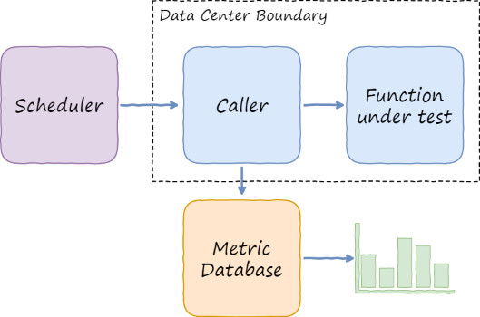
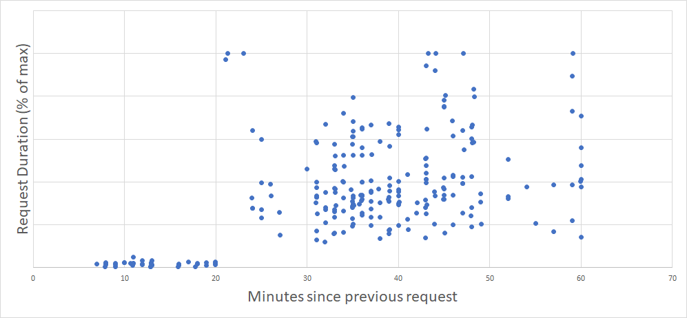
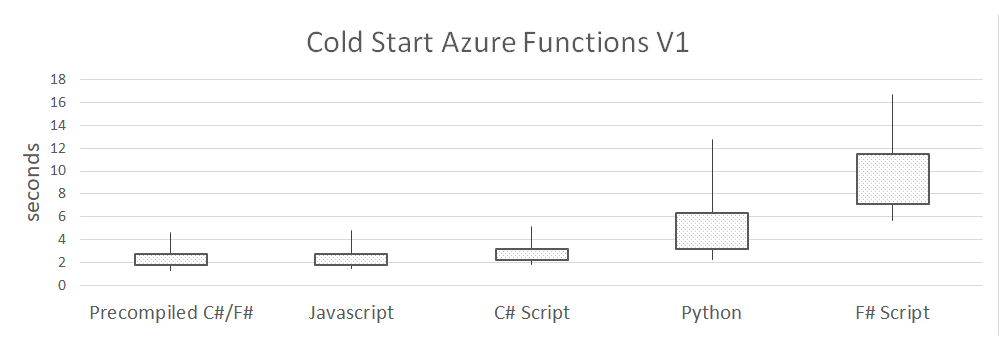
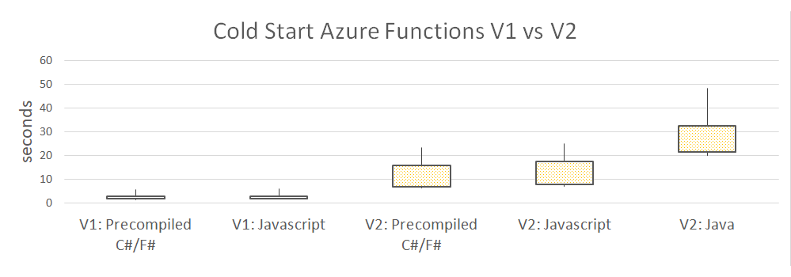
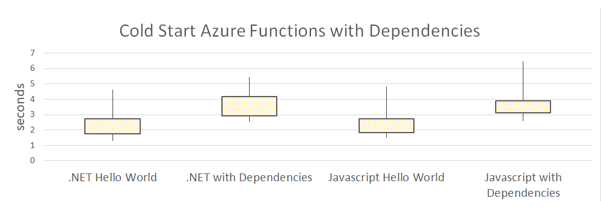

Auto-provisioning and auto-scalability are the killer features of Function-as-a-Service
cloud offerings, and Azure Functions in particular.

One drawback of such dynamic provisioning is a phenomenon called "Cold Start". Basically,
applications that haven't been used for a while take longer to startup and to handle the
first request.

The problem is nicely described in
[Understanding Serverless Cold Start](https://blogs.msdn.microsoft.com/appserviceteam/2018/02/07/understanding-serverless-cold-start/),
so I won't repeat it here. I'll just copy a picture from that article:

Based on the 4 actions which happen during a cold start, we may guess that the following factors
might affect the cold start duration:

- Language / execution runtime
- Azure Functions runtime version
- Application size including dependencies

I ran several sample functions and tried to analyze the impact of these factors on cold start time.

Methodology
-----------

All tests were run against HTTP Functions, because that's where cold start matters the most.

All the functions were just returning "Hello, World" taking the "World" value from the query string.
Some functions were also loading extra dependencies, see below.

I did not rely on execution time reported by Azure. Instead, I measured end-to-end duration from
client perspective. All calls were made from within the same Azure region, so network latency should
have minimal impact:

When Does Cold Start Happen?
----------------------------

Obviously, cold start happens when the very first request comes in. After that request is processed,
the instance is kept alive in case subsequent requests arrive. But for how long?

The following chart gives the answer. It shows values of normalized request durations across
different languages and runtime versions (Y axis) depending on the time since the previous
request in minutes (X axis):

Clearly, an idle instance lives for 20 minutes and then gets recycled. All requests after 20 minutes
threshold hit another cold start.

How Do Languages Compare?
-------------------------

I'll start with version 1 of Functions runtime, which is the production-ready GA version as of today.

I've written Hello World HTTP function in all GA languages: C#, F# and Javascript, and I added Python
for comparison. C#/F# were executed both in the form of script, and as a precompiled .NET assembly.

The following chart shows some intuition about the cold start duration per language. The languages
are ordered based on mean response time, from lowest to highest. 65% of request
durations are inside the vertical bar (1-sigma interval) and 95% are inside the vertical line (2-sigma):

Somewhat surprisingly, precompiled .NET is exactly on par with Javascript. Javascript "Hello World"
is really lightweight, so I expected it to win, but I was wrong.

C# Script is slower but somewhat comparable. F# Script presented a really negative surprise though: it's much
slower. It's even slower than experimental Python support where no performance optimization would
be expected at all!

Functions Runtime: V1 vs V2
---------------------------

Version 2 of Functions runtime is currently in preview and not suitable for production load. That
probably means they haven't done too much performance optimization, especially from cold start
standpoint.

Can we see this on the chart? We sure can:

V2 is massively slower. The fastest cold starts are around 6 seconds, but the slowest can come
up to 40-50 seconds.

Javascript is again on-par with precompiled .NET.

Java is noticeably slower, even though the
deployment package is just 33kB, so I assume I didn't overblow it.

Does Size Matter?
-----------------

OK, enough of Hello World. A real-life function might be more heavy, mainly because it would
depend on other third-party libraries.

To simulate such scenario, I've measured cold starts for a .NET function with references to
Entity Framework, Automapper, Polly and Serilog.

For Javascript I did the same, but referenced Bluebird, lodash and AWS SDK.

Here are the results:

As expected, the dependencies slow the loading down. You should keep your Functions lean,
otherwise you will pay in seconds for every cold start.

An important note for Javascript developers: the above numbers are for Functions deployed
after [`Funcpack`](https://github.com/Azure/azure-functions-pack) preprocessor. The package
contained the single `js` file with Webpack-ed dependency tree. Without that, the mean
cold start time of the same function is 20 seconds!

Conclusions
-----------

Here are some lessons learned from all the experiments above:

- Be prepared for 1-3 seconds cold starts even for the smallest Functions
- Stay on V1 of runtime until V2 goes GA unless you don't care about perf
- .NET precompiled and Javascript Functions have roughly same cold start time
- Minimize the amount of dependencies, only bring what's needed

Do you see anything weird or unexpected in my results? Do you need me to dig deeper on other aspects?
Please leave a comment below or ping me on twitter, and let's sort it all out.

There is a follow-up post available:
[Cold Starts Beyond First Request in Azure Functions](https://mikhail.io/2018/05/azure-functions-cold-starts-beyond-first-load/)