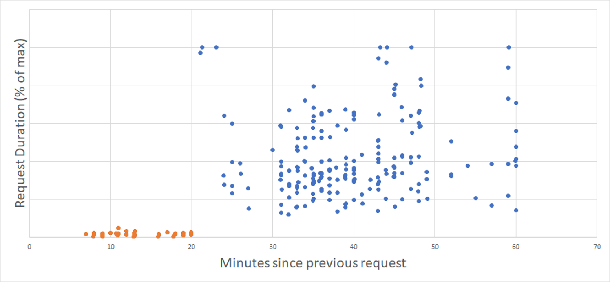
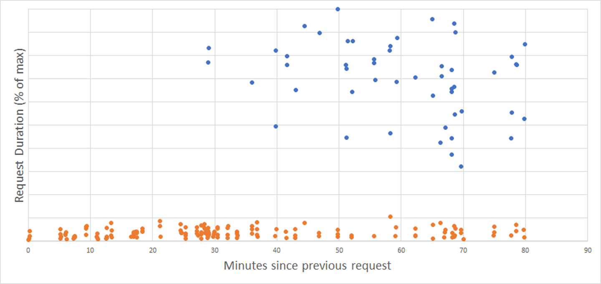
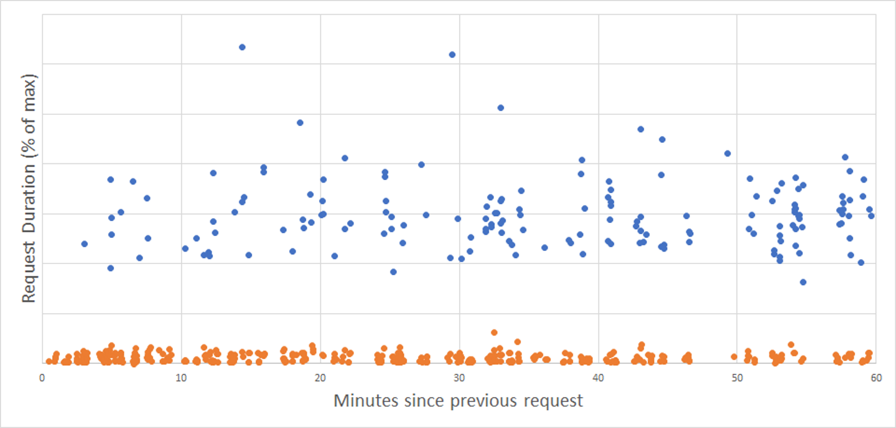
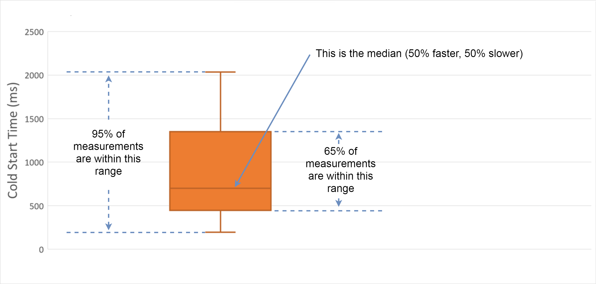
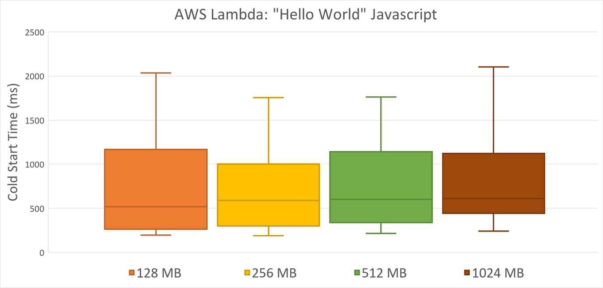
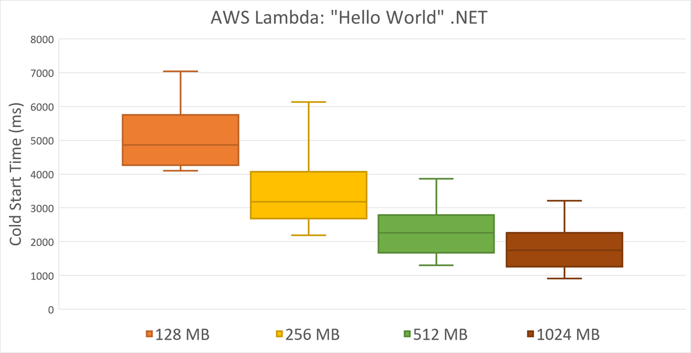
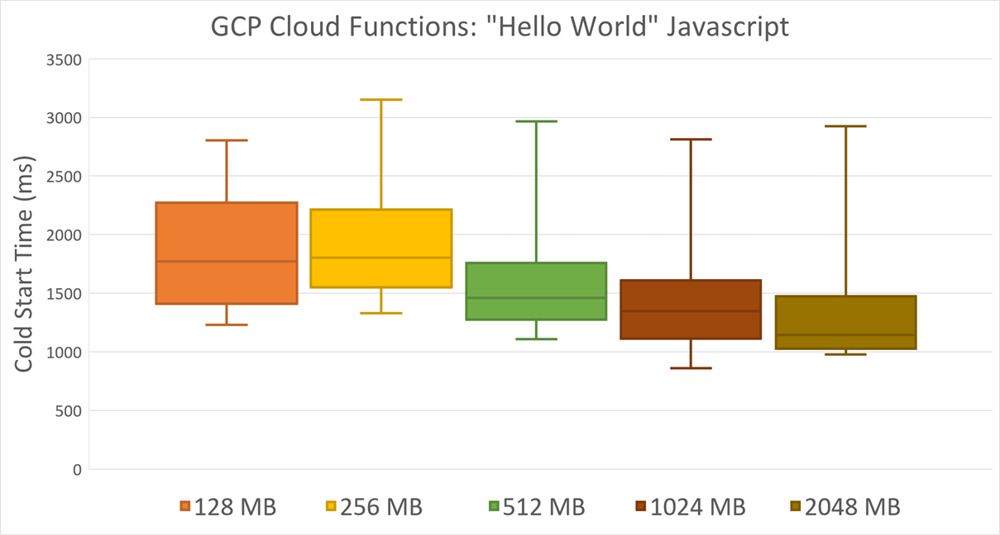
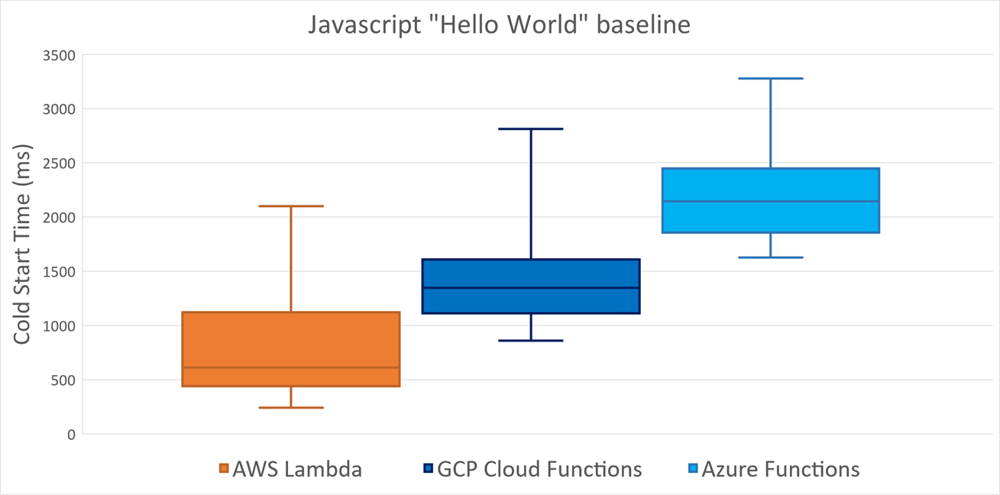
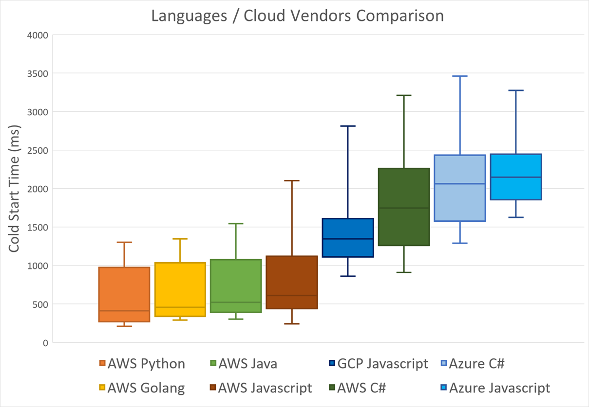
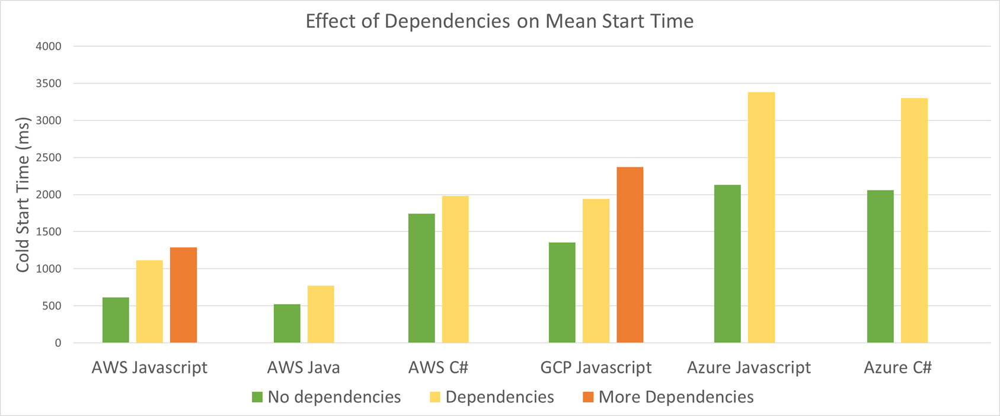

Serverless cloud services are hot. Except when they are not :)

AWS Lambda, Azure Functions, Google Cloud Functions are all similar in their attempt
to enable rapid development of cloud-native serverless applications.

Auto-provisioning and auto-scalability are the killer features of those Function-as-a-Service
cloud offerings. No management required, cloud providers will deliver infrastructure for the user
based on the actual incoming load.

One drawback of such dynamic provisioning is a phenomenon called "cold start". Basically,
applications that haven't been used for a while take longer to startup and to handle the
first request.

Cloud providers keep a bunch of generic unspecialized workers in stock. Whenever a serverless
application needs to scale up, be it from 0 to 1 instances, or from N to N+1 likewise, the runtime
will pick one of the spare workers and will configure it to serve the named application:

This procedure takes time, so the latency of the application event handling increases. To avoid
doing this for every event, the specialized worker will be kept intact for some period of time.
When another event comes in, this worker will stand available to process it as soon as possible.
This is a "warm start":

The problem of cold start latency was described multiple times, here are the notable links:
- [Understanding Serverless Cold Start](https://blogs.msdn.microsoft.com/appserviceteam/2018/02/07/understanding-serverless-cold-start/)
- [Everything you need to know about cold starts in AWS Lambda](https://hackernoon.com/cold-starts-in-aws-lambda-f9e3432adbf0)
- [Keeping Functions Warm](https://serverless.com/blog/keep-your-lambdas-warm/)
- [I'm afraid you're thinking about AWS Lambda cold starts all wrong](https://theburningmonk.com/2018/01/im-afraid-youre-thinking-about-aws-lambda-cold-starts-all-wrong/)

The goal of my article today is to explore how cold starts compare:

- Across Big-3 cloud providers (Amazon, Microsoft, Google)
- For different languages and runtimes
- For smaller vs larger applications (including dependencies)
- How often cold starts happen
- What can be done to optimize the cold starts

Let's see how I did that and what the outcome was.

*DISCLAIMER. Performance testing is hard. I might be missing some important factors and parameters that
influence the outcome. My interpretation might be wrong. The results might change over time. If you happen
to know a way to improve my tests, please let me know and I will re-run them and re-publish the results.*

Methodology
-----------

All tests were run against HTTP Functions because that's where cold start matters the most.

All the functions were returning a simple JSON reporting their current instance ID, language etc.
Some functions were also loading extra dependencies, see below.

I did not rely on execution time reported by a cloud provider. Instead, I measured end-to-end duration from
the client perspective. This means that durations of HTTP gateway (e.g. API Gateway in case of AWS) are included
into the total duration. However, all calls were made from within the same region, so network latency should
have minimal impact:

Important note: I ran all my tests on GA (generally available) versions of services/languages, so e.g.
Azure tests were done with version 1 of Functions runtime (.NET Framework), and GCP tests were only made for
Javascript runtime.

When Does Cold Start Happen?
----------------------------

Obviously, cold start happens when the very first request comes in. After that request is processed,
the instance is kept alive in case subsequent requests arrive. But for how long?

The answer differs between cloud providers.

To help you read the charts in this section, I've marked cold starts with blue color dots, and warm starts
with orange color dots.

### Azure

Here is the chart for Azure. It shows the values of normalized request durations across
different languages and runtime versions (Y-axis) depending on the time since the previous
request in minutes (X-axis):

Clearly, an idle instance lives for 20 minutes and then gets recycled. All requests after 20 minutes
threshold hit another cold start.

### AWS

AWS is more tricky. Here is the same kind of chart, relative durations vs time since the last request,
measured for AWS Lambda:

There's no clear threshold here... For this sample, no cold starts happened within 28 minutes after the previous
invocation. Afterward, the frequency of cold starts slowly rises. But even after 1 hour of inactivity, there's still a
good chance that your instance is alive and ready to take requests.

This doesn't match the official information that AWS Lambdas stay alive for just 5 minutes after the last
invocation. I reached out to Chris Munns, and he confirmed:

<blockquote class="twitter-tweet" data-conversation="none" data-lang="en">

So what you are seeing is very much possible as the team plays with certain knobs/levers for execution environment lifecycle.
let me know if you have concerns about it, but it should be just fine
&mdash; chrismunns (@chrismunns)
<a href="https://twitter.com/chrismunns/status/1021452964630851585?ref_src=twsrc%5Etfw">July 23, 2018</a>
</blockquote>

A couple learning points here:

- AWS is working on improving cold start experience (and probably Azure/GCP do too)
- My results might not be reliably reproducible in your application since it's affected by recent adjustments

### GCP

Google Cloud Functions left me completely puzzled. Here is the same chart for GCP cold starts (again,
orange dots are warm and blue ones are cold):

This looks totally random to me. A cold start can happen in 3 minutes after the previous request, or an instance
can be kept alive for the whole hour. The probability of a cold start doesn't seem to depend on the interval,
at least just by looking at this chart.

Any ideas about what's going on are welcome!

### Parallel requests

Cold starts happen not only when the first instance of an application is provisioned. The same issue will happen whenever
all the provisioned instances are busy handling incoming events, and yet another event comes in (at scale out).

As far as I'm aware, this behavior is common to all 3 providers, so I haven't prepared any comparison charts
for N+1 cold starts. Yet, be aware of them!

Reading Candle Charts
---------------------

In the following sections, you will see charts that represent statistical distribution of cold start time as
measured during my experiments. I repeated experiments multiple times and then grouped the metric values, e.g.
by the cloud provider or by language.

Each group will be represented by a "candle" on the chart. This is how you should read each candle:

Memory Allocation
-----------------

AWS Lambda and Google Cloud Functions have a setting to define the memory size that gets allocated to a single
instance of a function. A user can select a value from 128MB to 2GB and above at creation time.

More importantly, the virtual CPU cycles get allocated proportionally to this provisioned memory size. This means
that an instance of 512 MB will have twice as much CPU speed as an instance of 256MB.

Does this affect the cold start time?

I've run a series of tests to compare cold start latency across the board of memory/CPU sizes. The results are
somewhat mixed.

AWS Lambda Javascript doesn't seem to have significant differences. This probably means that not so much CPU load
is required to start a Node.js "Hello World" application:

AWS Lambda .NET Core runtime does depend on memory size though. Cold start time drops dramatically with every increase
in allocated memory and CPU:

GCP Cloud Functions expose a similar effect even for Javascript runtime:

In contrast to Amazon and Google, Microsoft doesn't ask to select a memory limit. Azure will charge Functions based
on the actual memory usage. More importantly, it will always dedicate a full vCore for a given Function execution.

It's not exactly apples-to-apples, but I chose to fix the memory allocations of AWS Lambda and GCF to 1024 MB.
This feels the closest to Azure's vCore capacity, although I haven't tried a formal CPU performance comparison.

Given that, let's see how the 3 cloud providers compare in cold start time.

Javascript Baseline
-------------------

Node.js is the only runtime supported in production by Google Cloud Functions right now. Javascript is also
probably by far the most popular language for serverless applications across the board.

Thus, it makes sense to compare the 3 cloud providers on how they perform in Javascript. The
base test measures the cold starts of "Hello World" type of functions. Functions have no
dependencies, so deployment package is really small.

Here are the numbers for cold starts:

AWS is clearly doing the best job here. GCP takes the second place, and Azure is the slowest. The rivals are
sort of close though, seemingly playing in the same league so the exact disposition might change over time.

How Do Languages Compare?
-------------------------

I've written Hello World HTTP function in all supported languages of the cloud platforms:

- AWS: Javascript, Python, Java, Go and C# (.NET Core)
- Azure: Javascript and C# (precompiled .NET assembly)
- GCP: Javascript

Azure kind of supports much more languages, including Python and Java, but they are still considered
experimental / preview, so the cold starts are not fully optimized. See
[my previous article](https://mikhail.io/2018/04/azure-functions-cold-starts-in-numbers/) for exact numbers.

Same applies to Python on GCP.

The following chart shows some intuition about the cold start duration per language. The languages
are ordered based on mean response time, from lowest to highest:

AWS provides the richest selection of runtimes, and 4 out of 5 are faster than the other two cloud providers.
C# / .NET seems to be the least optimized (Amazon, why is that?).

Does Size Matter?
-----------------

OK, enough of Hello World. A real-life function might be more heavy, mainly because it would
depend on other third-party libraries.

To simulate such scenario, I've measured cold starts for functions with extra dependencies:

- Javascript referencing 3 NPM packages - 5MB zipped
- Javascript referencing 38 NPM packages - 35 MB zipped
- C# function referencing 5 NuGet packages - 2 MB zipped
- Java function referencing 5 Maven packages - 15 MB zipped

Here are the results:

As expected, the dependencies slow the loading down. You should keep your Functions lean,
otherwise, you will pay in seconds for every cold start.

However, the increase in cold start seems quite low, especially for precompiled languages.

A very cool feature of GCP Cloud Functions is that you don't have to include NPM packages into
the deployment archive. You just add `package.json` file and the runtime will restore them for you.
This makes the deployment artifact ridiculously small, but doesn't seem to slow down the cold
starts either. Obviously, Google pre-restores the packages in advance, before the actual request
comes in.

Avoiding Cold Starts
--------------------

The overall impression is that cold start delays aren't that high, so most applications can tolerate
them just fine.

If that's not the case, some tricks can be implemented to keep function instances warm.
The approach is universal for all 3 providers: once in X minutes, make an artificial call to
the function to prevent it from expiring.

Implementation details will differ since the expiration policies are different, as we explored
above.

For applications with higher load profile, you might want to fire several parallel "warming"
requests in order to make sure that enough instances are kept in warm stock.

For further reading, have a look at my
[Cold Starts Beyond First Request in Azure Functions](https://mikhail.io/2018/05/azure-functions-cold-starts-beyond-first-load/)
and [AWS Lambda Warmer as Pulumi Component](https://mikhail.io/2018/08/aws-lambda-warmer-as-pulumi-component/).

Conclusions
-----------

Here are some lessons learned from all the experiments above:

- Be prepared for 1-3 seconds cold starts even for the smallest Functions
- Different languages and runtimes have roughly comparable cold start time within the same platform
- Minimize the number of dependencies, only bring what's needed
- AWS keeps cold starts below 1 second most of the time, which is pretty amazing
- All cloud providers are aware of the problem and are actively optimizing the cold start experience
- It's likely that in middle term these optimizations will make cold starts a non-issue for the
vast majority of applications

Do you see anything weird or unexpected in my results? Do you need me to dig deeper into other aspects?
Please leave a comment below or ping me on [twitter](https://twitter.com/MikhailShilkov), and let's
sort it all out.

Stay tuned for more serverless perf goodness!