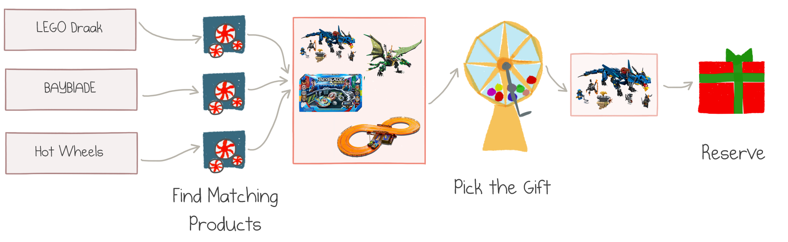
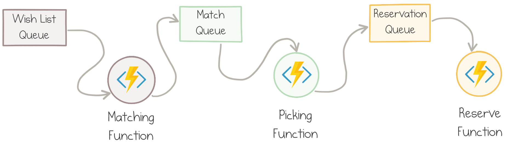
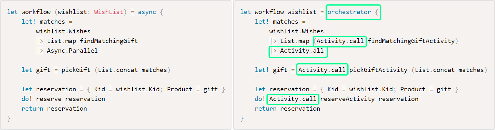

*The post is a part of 
[F# Advent Calendar 2018](https://sergeytihon.com/2018/10/22/f-advent-calendar-in-english-2018/).
It's Christmas time!*

This summer I was hired by the office of Santa Claus. Santa is not just a fairy tale
character on his own&mdash;he leads a large organization that supplies gifts and happiness to millions of 
children around the globe. Like any large organization, Santa's office employs an impressive number of 
IT systems. 

As part of its IT modernization
effort, North Pole HQ restructured the whole supply chain of Christmas gifts. Many legacy components were moved from
a self-managed data center at the North Pole&mdash;although the cooling is quite cheap there&mdash;to 
Azure cloud. Azure was an easy sell since Santa's techy elves use Office 365, SharePoint and
the .NET development stack.

One of the goals of the redesign was to leverage managed cloud services and serverless architecture
wherever possible. Santa has no spare elves to keep reinventing IT wheels.

Wish Fulfillment Service
------------------------

My assignment was to redesign the **Wish Fulfillment** service. The service receives
wish lists from clients (they call children "clients"):


<center class="img-caption">Christmas Card with a Wish List &copy; my son Tim</center>

Luckily, the list is already parsed by some other service, and also contains the metadata about
the kid's background (age, gender, and so on) and preferences.

For each item in the list, our service calls the **Matching** service, which uses machine learning,
Azure Cognitive services, and a bit of magic to determine the actual products (they call gifts "products")
that best fit the client's expressed desire and profile. For instance, my son's wish for "LEGO Draak" matches
to "LEGO NINJAGO Masters of Spinjitzu Firstbourne Red Dragon". You get the point.

There might be several matches for each desired item, and each result has an estimate of how
likely it is to fulfill the original request and make the child happy.

All the matching products are combined and sent over to the **Gift Picking** service. Gift Picking selects one
of the options based on its price, demand, confidence level, and the Naughty-or-Nice score of the client.

The last step of the workflow is to **Reserve** the selected gift in the warehouse and shipping system
called "Santa's Archive of Products", also referred to as SAP.

Here is the whole flow in one picture:



<center class="img-caption">Gift Fulfillment Workflow</center>

How should we implement this service?

Original Design
---------------

The Wish Fulfillment service should run in the cloud and integrate with other services. It
should be able to process millions of requests in December and stay very cheap to run during the
rest of the year. We decided to leverage serverless architecture with 
[Azure Functions](https://docs.microsoft.com/en-us/azure/azure-functions/functions-overview) on the 
[Consumption Plan](https://azure.microsoft.com/en-us/pricing/details/functions/). Serverless
Functions are:

- **Fully Managed**: the cloud provider provisions resources, scales them based on the load, takes
care of uptime and reliability;

- **Event-Driven**: for each serverless Function you have to define a specific trigger&mdash;the 
event type which causes it to run, be it an HTTP endpoint or a queue message;

- **Changed per Execution**: it costs nothing to run the application if there is no usage,
and the cost of busy applications is proportional to the actual resource utilization.

Here is the diagram of the original design:



<center class="img-caption">Workflow Design with Azure Functions and Storage Queues</center>

We used Azure Storage Queues to keep the whole flow asynchronous and more resilient to failures
and load fluctuation.

This design would mostly work, but we found a couple of problems with it:

- The Functions were manually wired via storage queues and corresponding bindings. The workflow
was spread over infrastructure definition and thus was hard to grasp.

- We had to pass all items of each wish list into a single invocation of Matching Function,
otherwise combining the matching results from multiple queue messages would be tricky. 

- Although not in scope for the initial release, there were plans to add manual elf 
intervention for poorly matched items. This feature would require a change in the flow design:
it's not trivial to fit long-running processes into the pipeline.

To improve on these points, we decided to try 
[Durable Functions](https://docs.microsoft.com/azure/azure-functions/durable/durable-functions-overview)&mdash;a library 
that brings workflow orchestration to Azure Functions. It introduces several tools to define stateful,
potentially long-running operations, and handles a lot of the mechanics of reliable communication 
and state management behind the scenes.

If you want to know more about what Durable Functions are and why they might be a good idea,
I invite you to read my article 
[Making Sense of Azure Durable Functions](https://mikhail.io/2018/12/making-sense-of-azure-durable-functions/)
(20 minutes read).

For the rest of this post, I will walk you through the implementation of the Wish Fulfillment workflow
with Azure Durable Functions.

Domain Model
------------

A good design starts with a decent domain model. Luckily, the project was built with F#&mdash;the language with
the richest domain modeling capabilities in the .NET ecosystem.

### Types

Our service is invoked with a wish list as the input parameter, so let's start with the type `WishList`:

``` fsharp
type WishList = 
{
    Kid: Customer
    Wishes: string list
}
```

It contains information about the author of the list and recognized "order" items. `Customer` is a custom type;
for now, it's not important what's in it.

For each wish we want to produce a list of possible matches:

``` fsharp
type Match = 
{
    Product: Product
    Confidence: Probability
}
```

The product is a specific gift option from Santa's catalog, and the confidence is a number 
from `0.0` to `1.0` of how strong the match is.

The end goal of our service is to produce a `Reservation`:

``` fsharp
type Reservation = 
{
    Kid: Customer
    Product: Product
}
```

It represents the exact product selection for the specific kid.

### Functions

The Wish Fulfillment service needs to perform three actions, which can be
modeled with three strongly-typed asynchronous functions.

*Note: I use lowercase "function" for F# functions and capitalize "Function" for Azure Functions
throughout the article to minimize confusion.*

The **first action** finds matches for each wish:

``` fsharp
// string -> Async<Match list>
let findMatchingGift (wish: string) = async {
    // Call a custom machine learning model
    // The real implementation uses the Customer profile to adjust decisions by age, etc.
    // but we'll keep the model simple for now.
}
```

The first line of all my function snippets shows the function type. In this case, it's a mapping 
from the text of the child's wish (`string`) to a list of matches (`Match list`).

The **second action** takes the *combined* list of all matches of all wishes and picks one. Its
real implementation is Santa's secret sauce, but my model just picks the one with the highest
confidence level:

``` fsharp
// Match list -> Product
let pickGift (candidates: Match list) =
    candidates
    |> List.sortByDescending (fun x -> x.Confidence)
    |> List.head
    |> (fun x -> x.Product)
```

Given the picked `gift`, the reservation is merely `{ Kid = wishlist.Kid; Product = gift }`,
not worthy of a separate action.

The **third action** registers a reservation in the SAP system:

``` fsharp
// Reservation -> Async<unit>
let reserve (reservation: Reservation) = async {
    // Call Santa's Archive of Products
}
```

### Workflow

The fulfillment service combines the three actions into one workflow:

``` fsharp
// WishList -> Async<Reservation>
let workflow (wishlist: WishList) = async {

    // 1. Find matches for each wish 
    let! matches = 
        wishlist.Wishes
        |> List.map findMatchingGift
        |> Async.Parallel

    // 2. Pick one product from the combined list of matches
    let gift = pickGift (List.concat matches)
    
    // 3. Register and return the reservation
    let reservation = { Kid = wishlist.Kid; Product = gift }
    do! reserve reservation
    return reservation
}
```

The workflow implementation is a nice and concise summary of the actual domain flow.

Note that the Matching service is called multiple times in parallel, and then
the results are easily combined by virtue of the `Async.Parallel` F# function.

So how do we translate the domain model to the actual implementation on top of
serverless Durable Functions?

Classic Durable Functions API
-----------------------------

C# was the first target language for Durable Functions; Javascript is now fully supported too.

F# wasn't initially declared as officially supported, but since F# runs on top of the same .NET runtime
as C#, it has always worked. I have a blog post about
[Azure Durable Functions in F#](https://mikhail.io/2018/02/azure-durable-functions-in-fsharp/) and
have added [F# samples](https://github.com/Azure/azure-functions-durable-extension/tree/master/samples/fsharp)
to the official repository.

Here are two examples from that old F# code of mine (they have nothing to do with our 
gift fulfillment domain):

``` fsharp
// 1. Simple sequencing of activities
let Run([<OrchestrationTrigger>] context: DurableOrchestrationContext) = task {
  let! hello1 = context.CallActivityAsync<string>("E1_SayHello", "Tokyo")
  let! hello2 = context.CallActivityAsync<string>("E1_SayHello", "Seattle")
  let! hello3 = context.CallActivityAsync<string>("E1_SayHello", "London")
  return [hello1; hello2; hello3]
}     

// 2. Parallel calls snippet
let tasks = Array.map (fun f -> context.CallActivityAsync<int64>("E2_CopyFileToBlob", f)) files
let! results = Task.WhenAll tasks
```

This code works and does its job, but doesn't look like idiomatic F# code:

- No strong typing: Activity Functions are called by name and with types manually specified
- Functions are not curried, so partial application is hard
- The need to pass the `context` object around for any Durable operation

Although not shown here, the other samples read input parameters, handle errors, and enforce
timeouts&mdash;all look too C#-y.

Better Durable Functions
------------------------

Instead of following the sub-optimal route, we implemented the service with a more F#-idiomatic API.
I'll show the code first, and then I'll explain its foundation.

The implementation consists of three parts:

- **Activity** Functions&mdash;one per action from the domain model
- **Orchestrator** Function defines the workflow
- **[Azure Functions bindings](https://docs.microsoft.com/en-us/azure/azure-functions/functions-triggers-bindings)** 
to instruct how to run the application in the cloud

### Activity Functions

Each Activity Function defines one step of the workflow: Matching, Picking, and Reserving. We
simply reference the F# functions of those actions in one-line definitions:

``` fsharp
let findMatchingGiftActivity = Activity.defineAsync "FindMatchingGift" findMatchingGift
let pickGiftActivity = Activity.define "PickGift" pickGift
let reserveActivity = Activity.defineAsync "Reserve" reserve
```

Each activity is defined by a name and a function.

### Orchestrator

The Orchestrator calls Activity Functions to produce the desired outcome of the service. The code
uses a custom computation expression:

``` fsharp
let workflow wishlist = orchestrator {
    let! matches = 
        wishlist.Wishes
        |> List.map (Activity.call findMatchingGiftActivity)
        |> Activity.all

    let! gift = Activity.call pickGiftActivity (List.concat matches)
    
    let reservation = { Kid = wishlist.Kid; Product = gift }
    do! Activity.call reserveActivity reservation
    return reservation
}
```

Notice how closely it matches the workflow definition from our domain model:



<center class="img-caption">Async function vs. Durable Orchestrator</center>

The only differences are:

- `orchestrator` computation expression is used instead of `async` because multi-threading is
not allowed in Orchestrators
- `Activity.call` replaces of direct invocations of functions
- `Activity.all` substitutes `Async.Parallel`

### Hosting layer

An Azure Function trigger needs to be defined to host any piece of code as a cloud Function. This can
be done manually in `function.json`, or via trigger generation from .NET attributes. In my case
I added the following four definitions:

``` fsharp
[<FunctionName("FindMatchingGift")>]
let FindMatchingGift([<ActivityTrigger>] wish) = 
    Activity.run findMatchingGiftActivity wish

[<FunctionName("PickGift")>]
let PickGift([<ActivityTrigger>] matches) = 
    Activity.run pickGiftActivity matches

[<FunctionName("Reserve")>]
let Reserve([<ActivityTrigger>] wish) = 
    Activity.run reserveActivity wish

[<FunctionName("WishlistFulfillment")>]
let Workflow ([<OrchestrationTrigger>] context: DurableOrchestrationContext) =
    Orchestrator.run (workflow, context)
```

The definitions are very mechanical and, again, strongly typed (apart from Functions' names).

### Ship It!

These are all the bits required to get our Durable Wish Fulfillment service up and running.
From this point, we can leverage all the existing tooling of Azure Functions:

- Visual Studio and Visual Studio Code for development and debugging
- [Azure Functions Core Tools](https://github.com/Azure/azure-functions-core-tools) to run
the application locally and deploy it to Azure
- The latest version of the Core Tools has dedicated commands to 
[manage instances of Durable Functions](https://docs.microsoft.com/en-us/azure/azure-functions/durable/durable-functions-instance-management)

There is a learning curve in the process of adopting the serverless architecture. However, a small
project like ours is a great way to do the learning. It sets Santa's IT department on the road
to success, and children will get better gifts more reliably!

DurableFunctions.FSharp
-----------------------

The above code was implemented with the library 
[DurableFunctions.FSharp](https://github.com/mikhailshilkov/DurableFunctions.FSharp). I created
this library as a thin F#-friendly wrapper around Durable Functions.

Frankly speaking, the whole purpose of this article is to introduce the library and make you curious
enough to give it a try. DurableFunctions.FSharp has several pieces in the toolbox:

- `OrchestratorBuilder` and `orchestrator` computation expression which encapsulates proper 
usage of `Task`-based API of `DurableOrchestrationContext`

- `Activity` generic type to define activities as first-class values

- `Activity` module with helper functions to call activities

- Adapters for Azure Functions definition for `Async` and `Orchestrator`

- API of the original Durable Extensions is still available, so you can fall back to them if needed

In my opinion, F# is a great language to develop serverless Functions. The simplicity of working with functions,
immutability by default, strong type system, focus on data pipelines are all useful in the world of
event-driven cloud applications.

Azure Durable Functions brings higher-level abstractions to compose workflows out of simple building
blocks. The goal of DurableFunctions.FSharp is to make such composition natural and enjoyable for F#
developers.

[Getting Started](https://github.com/mikhailshilkov/DurableFunctions.FSharp#getting-started) 
is as easy as creating a new .NET Core project and referencing a NuGet package. 

I'd love to get as much feedback as possible! Leave comments below, create issues
on the [GitHub repository](https://github.com/mikhailshilkov/DurableFunctions.FSharp), or open a PR. 
This would be super awesome!

Happy coding, and Merry Christmas!

Acknowledgments
---------------

Many thanks to [Katy Shimizu](https://twitter.com/kashimizMSFT), [Devon Burriss](https://twitter.com/DevonBurriss),
[Dave Lowe](https://twitter.com/iwasdavid), [Chris Gillum](https://twitter.com/cgillum)
for reviewing the draft of this article and their valuable contributions and suggestions.
