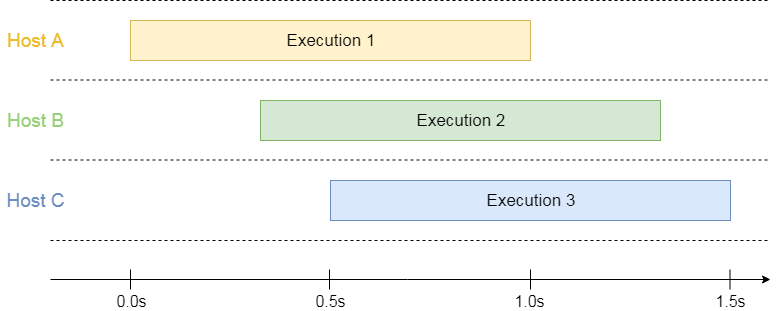
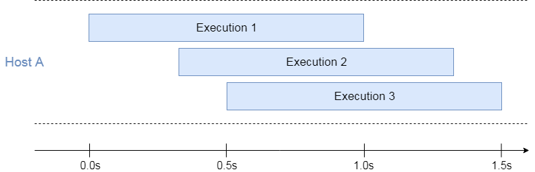

Serverless vendors have different approaches when it comes to sharing or isolating resources between multiple executions of the same cloud function. In this article, I'll explore the execution concurrency  models of three FaaS offerings and the associated trade-offs.

## AWS Lambda

AWS Lambda executions are always completely isolated from each other. Simple enough, right?
 
A function execution maps 1:1 to a function instance. Each execution runs on a separate host, i.e. a dedicated container with its own instance of the runtime. All the resources of this host (CPU, RAM, scratch disk space) are dedicated solely to this execution.

AWS Lambda will spin up as many hosts as needed to process all concurrent requests:



<figcaption>3 overlapping executions running on 3 isolated hosts</figcaption>

This model has a benefit of predictability: the resource manager allocates the same amount of resources to each execution. Therefore, the variability between executions will be low (with the cold start being a remarkable exception). 
 
Resource allocation has to be pre-configured by selecting the memory limit. CPU cycles are allocated proportionally to RAM. Performance variation might increase for smaller instance sizes: 128 MB instances are empirically known to be less consistent.

In terms of pricing, the executions are independent. The bill consists of two parts: a fixed fee per execution and a variable charge for execution duration, measured in GB-seconds: 

```
<allocated instance size in GB> * <duration of execution rounded up to 100ms>
```
 
In the example above, if each execution has 1 GB of allocated RAM and runs for 1 second, the total bill will be 3 GB-seconds.

This model works, but definitely better for some workloads than others.

## I/O Bound Workloads

Typically enterprise workloads are not very demanding neither to CPU (not much computation other than serialization and conversions), nor to RAM (mostly runtime and libraries since functions are stateless). Many functions end up calling other resources synchronously: managed cloud services, databases, web APIs. This means, the execution duration will be determined by the response time of those resources.

AWS charges for the full execution time, even if 90% of the time  was spent waiting for an external response. In this case, the resources dedicated to the execution are basically wasted.

Ben Kehoe argued for [the need for asynchronous FaaS call chains in serverless systems](https://read.acloud.guru/the-need-for-asynchronous-rpc-architecture-in-serverless-systems-ff168f1c8785) almost 2 years ago but unfortunately, the situation is still the same.

## Resource Pooling

In the ideal world of greenfield projects, serverless functions would only be purely transforming inputs to outputs or would make external calls that respond fast and don't require keeping any state in between the requests.

However, in the real world, you're often required to access traditional SQL databases like Postgres or SQL Server. Database connection protocols were not designed for hundreds of stateless short-lived single-execution instances. Connections are expensive to establish. There is a limit of how many of them the database can handle.

A good example of these issues are great posts by Jeremy Daly: 

- [How To: Reuse Database Connections in AWS Lambda](https://www.jeremydaly.com/reuse-database-connections-aws-lambda/)
- [How To: Manage RDS Connections from AWS Lambda Serverless Functions](https://www.jeremydaly.com/manage-rds-connections-aws-lambda/)
- [Serverless MySQL](https://github.com/jeremydaly/serverless-mysql).

A smaller scale version of the same problem is applicable to HTTP based communication: reuse of DNS lookups, TCP connections, etc.

Obviously, it would help if multiple executions of a function shared the pool of database and TCP connections. 

## Azure Functions

Azure Functions tried to address this issue by separating the notion of executions and instances. In the Azure world, an instance is a host with dedicated resources (both CPU and RAM are fixed and not currently configurable). Each instance is then capable of running multiple executions at the same time and reusing the resources for all of them.

If we apply the Azure model to the example of 3 overlapping executions we discussed in the AWS section, we can quickly see how they differ:



<figcaption>3 overlapping executions running on a single host</figcaption>

In this case, the executions share the common pool of resources. 

The potential efficiency is also reflected in the reduced bill: you're charged for merged window of the parallel invocations. If 1 GB of memory is consumed (regardless if 1, 2 or 3 executions are active), then the total bill for 3 executions will be 1.5 GB-seconds, where 1.5s is the time between the start of the first execution and the end of the last execution. 

In the example above, sharing resources is beneficial to both the cloud provider and the end customer. However, it might be problematic in the case of CPU-bound workloads, see [Bcrypt/Azure example in How Serverless Providers Scale Queue Processing](https://blog.binaris.com/from-0-to-1000-instances/#azure-2).

Another benefit of concurrent executions is the potential for reuse of SQL connection pools and HTTP clients. For instance, an Azure Function implemented in C# shares the same .NET process for concurrent executions. Therefore, any static objects are reused automatically.

## Configuring Concurrency in Azure Functions

We have now established a clear trade-off between resource allocation efficiency and performance guarantees. Now that we understand the basics of concurrent executions, you might be wondering how Azure Functions decide how many executions to put into a single instance.

The truth is, here there isn’t one clear answer. It’s a combination of decisions made by the [Scale Controller](https://blog.binaris.com/from-0-to-1000-instances/#azure) and configuration knobs. It also depends on the type of the event triggering the execution.

For Azure Functions that are triggered by queue messages, there are settings `batchSize` and `newBatchThreshold`. The maximum number of concurrent executions is then derived from the simple equation `batchSize + newBatchThreshold`.

Cosmos DB and Event Hubs triggers invoke one function execution per batch of items. Each batch is tied to one partition in the event source. The concurrency is then determined at runtime by the Scale Controller based on factors such as the number of partitions and the metrics reported from existing instances.

HTTP Functions are the marriage of these two approaches. There is a setting `maxConcurrentRequests` which can be used to limit the concurrency explicitly. Its default setting is `200` concurrent requests which is quite generous. In practice, it’s not likely to reach that level of execution concurrency unless they are idle for minutes. The Scale Controller will run new instances of the function, which might improve the response time but will incur a higher bill.

## Binaris

Binaris has support for both modes: AWS Lambda-esque exclusive invocations or concurrent invocations similar to Azure Functions. The user decides which one to use by changing a simple setting in the `binaris.yml` file:

``` yaml
functions:
  NewCreate:
    file: function.js
    entrypoint: handler
    executionModel: concurrent
    runtime: node8
```

When `executionModel` is set to `exclusive`, the Binaris runtime limits the concurrency of each "function unit" (container) to one.

The value `concurrent` will enable the shared execution model which allows for re-entrant invocations on the same function unit. The current model allows for up to 10 concurrent invocations within a single unit. All re-entrant invocations share the same memory, disk space, and available vCPU.

TODO: Does Binaris always fill existing units up to full capacity of 10 before adding another unit?

Binaris charges a flat rate for each millisecond of running time. The rate does not depend on whether a single execution is running or if there are multiple executions running on the same instance.

TODO: What is the memory limit now? I suspect you charge for the full RAM limit, not the effective use of it? Given the picture with 3 invocations above, will the billing work similar to Azure?

TODO: What benefits (other than simplicity of config) over Azure can I mention here?

## Conclusion

Sharing compute resources between concurrent executions of serverless functions can be beneficial for I/O-bound workloads. During the periods of time where some executions are idle waiting for a response from the network, other executions may continue to use the allocated resources. This shareability also applies to assets like database connections and libraries loaded into the instances memory.

The shared execution model allows for more efficient use of hardware resources which in turn leads to a lower bill.

However, concurrency can also  lead to resource contention for CPU-intensive workloads, which might negatively affect the performance of serverless functions. Thus, until cloud providers come up with a perfect method of optimizing concurrency at runtime, it's important to give the function owner a simple way to configure the concurrency mode. Given a transparent and simple knob, they can make a judgment call between concurrency and isolation.