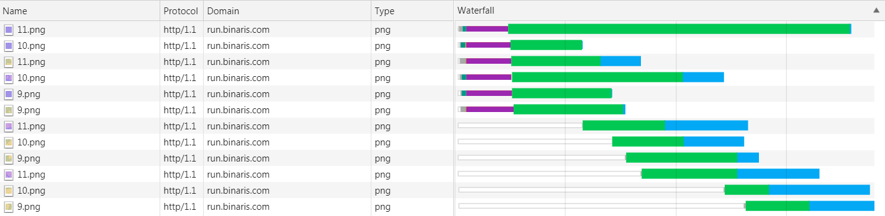

In my previous article [Visualizing Cold Starts](/2019/03/visualizing-cold-starts/) I demonstrated the visual impact of [serverless cold starts](/serverless/coldstarts/) on map loading time. When an application serving the map tiles is cold, a user experiences a noticeable delay before they can see the selected map view. 

I compared such effect among AWS Lambda, Google Cloud Functions, and Azure Functions. The duration of the perceptible delay varied between cloud providers in the range from **1.5** to **8** seconds.

Is this unfortunate effect inherent to all Function-as-a-Service offerings? Is there no way to avoid the cold starts altogether? Not necessarily.

## Binaris

[Binaris](https://www.binaris.com/) is a new player in the market of serverless functions. Binaris focuses on developer productivity and high performance to enable any application to be built on top of cloud functions.

One of the clear benefits and differentiators from other providers is the absence of cold starts in Binaris functions:



I decided to re-run my map visualization on top of Binaris functions to illustrate the difference:



The initial map loads after re-deployment of the cloud function, so it would cause a cold start for other providers. There's no noticeable delay for the Binaris function though: all map tiles are loaded after 0.4 seconds, similar to subsequent runs.

In case the warm-up happens during the deployment, I re-ran the experiment after several hours of inactivity but got the same result.

Note, that the map tiles are stored in AWS S3 in the same region where the Binaris function runs (US East). The client was hosted on a VM in Azure's US East region.

## How does Binaris handle parallel requests?

The map control fires 12 requests in parallel. Similar to my initial [Visualizing Cold Starts](/2019/03/visualizing-cold-starts/) article, I modified the function to color-code each tile based on the function instance ID and to print that ID on the image. This way, it's easy to see how parallel requests spread over the instances.

As explained in [Serverless Concurrency Models](https://blog.binaris.com/todoifitspublishedbefore/), Binaris functions can run in two concurrency modes: concurrent or exclusive.

### Concurrent Mode

When a cloud function is configured to run in the concurrent mode, the same instance, the *function unit*, can handle up to 10 requests at the same time. For I/O-bound functions, this can lead to more efficient resource utilization and lower price.

Just a single instance may handle the color-coded map in the concurrent mode:

<figcaption><h4>The same function unit served all 12 requests concurrently</h4></figcaption>

The maximum concurrency level is currently 10, so some of the tiles on the picture above must have been processed sequentially. Indeed, sometimes it happens that two instances return the tiles for the same view:

<figcaption><h4>Two function units served 12 parallel requests</h4></figcaption>

How is the exclusive mode different?

### Exclusive Mode

When a cloud function is set to run in the exclusive mode, each instance takes a single request at a time. Therefore, multiple instances are needed to process any concurrent requests.

As expected, the map gets more colorful for functions in the exclusive mode:

<figcaption><h4>Four function units served 12 parallel requests</h4></figcaption>

However, the number of instances doesn't get close to the number of tiles: 12 tiles are usually served by 3-5 function units. I suspect this is partially explained by the fact that Binaris functions use HTTP/1.1 protocol, and the browser would only open a limited number of connections to the same host:

<figcaption><h4>12 requests are cascaded by Chrome because they connect to the same host</h4></figcaption>

A switch to HTTP/2 would shave some extra latency off the overall map loading time.

## Conclusions

The cold start issue is getting less significant for all cloud providers over time. Binaris may actually be ahead of others in this race.

My simple test does not necessarily prove the complete absence of cold starts in Binaris functions, but it looks optimistic. I look forward to the world where developers would be able to build any application, including user-facing latency-sensitive ones, out of small managed serverless functions.