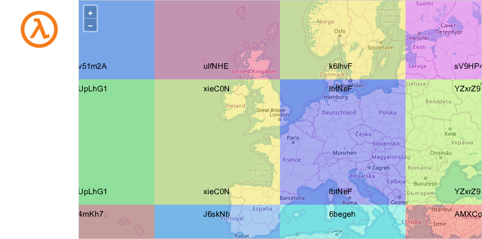
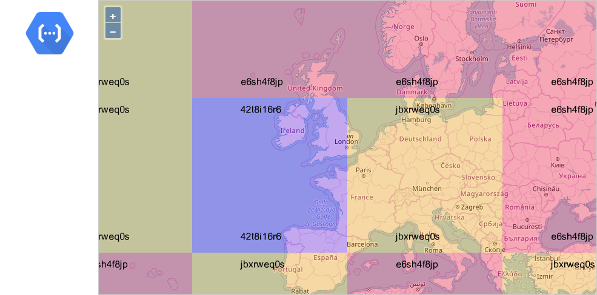
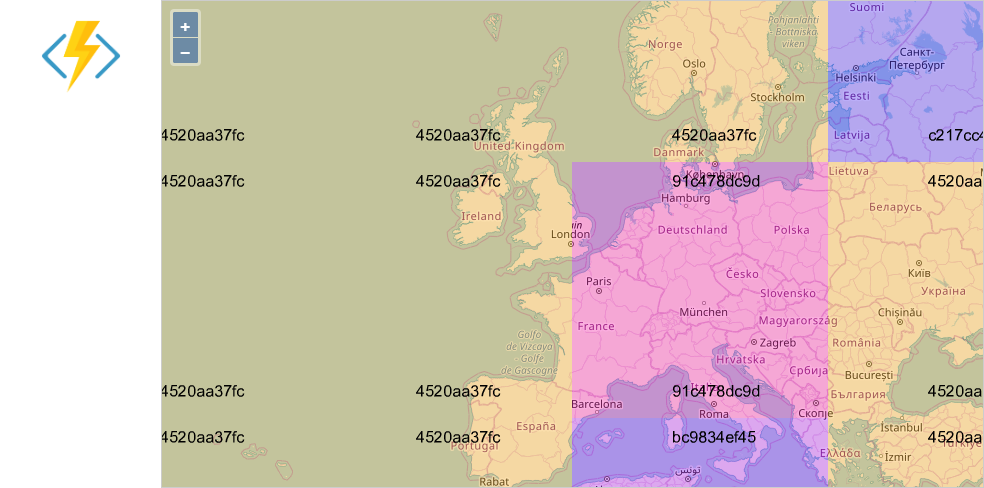

I [wrote a lot](/serverless/coldstarts/) about cold starts of serverless functions. The articles are full of charts and numbers which are hopefully useful but might be hard to internalize. I decided to come up with a way to represent colds starts visually.

I created HTTP functions that serve geographic maps (map credit [Open Street Map](https://www.openstreetmap.org)). The map is a combination of small square tiles; each tile is 256 by 256 pixels. My selected map view consists of 12 tiles, so 12 requests are made to the serverless function to load a single view.

During each experiment, I load the map and then zoom-in three times. The very first view hits  the function in a cold state. Subsequently, the zoomed views are loaded from the warm function. There is a timer next to the map which shows the total time elapsed since the beginning until the last tile arrives.

## Cold Starts Visualized

All functions are implemented in Node.js and run in the geographically closest region to me (West Europe).

The functions load map tiles from the cloud storage (AWS S3, Google Cloud Storage, and Azure Blob Storage). So the duration is increased by loading SDK at startup and the storage read latency.

### AWS Lambda

The following GIF movie is a recording of the experiment against an AWS Lambda:



The cold view took 1.9 seconds to load, while the warm views were between 200 and 600 milliseconds. The distinction is fairly visible but not extremely annoying: the first load feels like a small network glitch.

### Google Cloud Functions

This GIF shows the experiment against a Google Cloud Function:



Loading the initial view took an extra second compared to AWS. It's not a dealbreaker, but the delay of 3 seconds is often quoted as psychologically important.

The tiles seem to appear more gradually; read more on that below.

### Azure Functions

Here is another movie, this time for an Azure Function:



As expected from my previously published measurements, Azure Functions take significantly longer to start. A user has enough time to start wondering whether the map is broken.

I expect better results from Functions implemented in C#, but that would not be an apples-to-apples comparison.

## How do providers handle parallel requests?

The map control fires 12 requests in parallel. All functions talk HTTP/2, so the old limit on the number of connections does not apply. Let's compare how those parallel requests are processed.

### AWS Lambda

Each instance of AWS Lambda can handle a single request at a time. So, instead of hitting just one cold start, we hit 12 cold starts in parallel. To illustrate this, I’ve modified the function to color-code each tile based on the Lambda instance ID and to print that ID on the image:

<figcaption><h4>AWS Lambda provisioned 12 instances to serve 12 requests in parallel</h4></figcaption>

Effectively, the measured durations represent the roundtrip time for *the slowest out of 12 parallel requests*. It's not the average or median duration of the cold start.

### Google Cloud Functions

Google uses the same one-execution-per-instance model, so I expected GCP Cloud Functions to behave precisely the same as AWS Lambda. However, I was wrong:

<figcaption><h4>Google Cloud Function provisioned 3 instances to serve 12 parallel requests</h4></figcaption>

Only three instances were created, and two of them handled multiple requests. It looks like GCP serializes the incoming requests and spreads them through a limited set of instances.

### Azure Functions

Azure Functions have a different design: each instance of a function can handle multiple parallel requests at the same time. Thus, in theory, all 12 tiles could be served by the first instance created after the cold start.

In practice, multiple instances are created. The picture looks very similar to GCP:

<figcaption><h4>Azure Function provisioned 4 instances to serve 12 parallel requests</h4></figcaption>

There were four active instances, but the same one handled 9 out of 12 requests. This behavior seems to be quite consistent between multiple runs.

## Conclusion

I hope that these visualizations are useful to get a better feel of the cold starts in serverless functions.

However, they are just examples. Don't treat the numbers as exact statistics for a given cloud provider. If you are curious, you can learn more in [Serverless Cold Starts](/serverless/coldstarts/) series of articles.