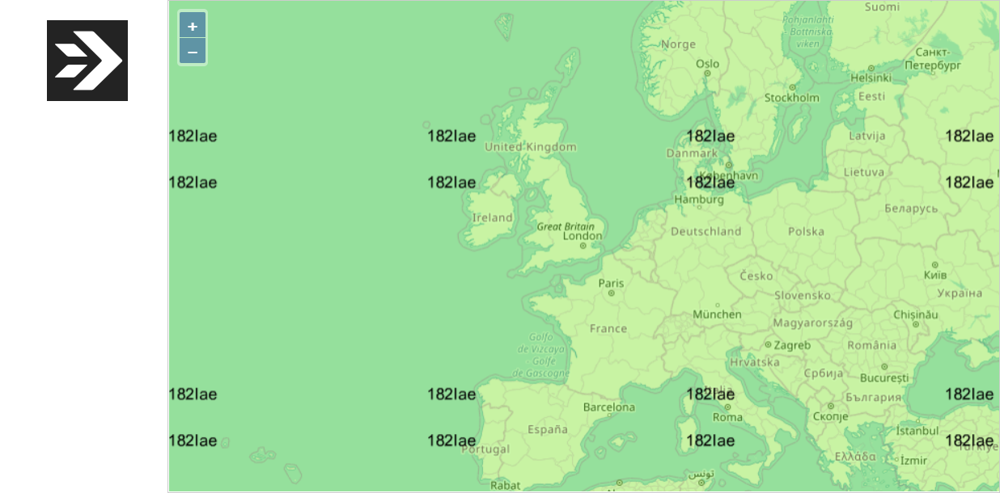
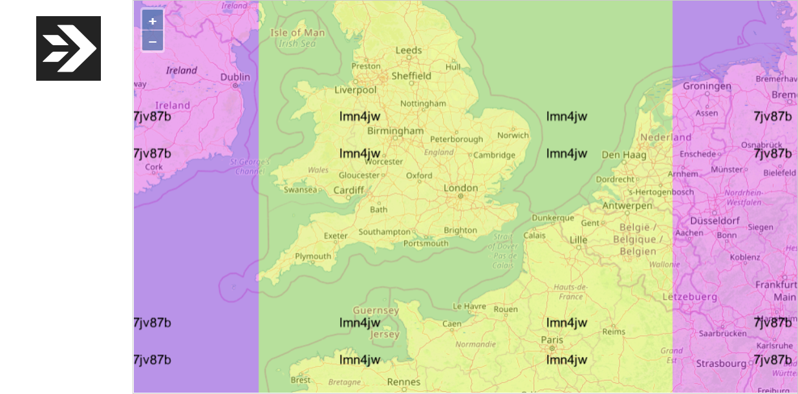

In my previous article, [Visualizing Cold Starts](/2019/03/visualizing-cold-starts/), I visually demonstrated the impact of [serverless cold starts](/serverless/coldstarts/) on map loading time. When the serverless function serving the map tiles is cold, users experience a noticeable delay before they can see the selected map view.

I then ran the map loading test on  AWS Lambda, Google Cloud Functions, and Azure Functions. The duration of the perceptible delay varied between cloud providers, ranging from 1.5 to 8 seconds.
 
Is this effect unfortunately inherent to all Function-as-a-Service offerings? Or is it possible to avoid cold starts altogether?

## Binaris

[Binaris](https://www.binaris.com/) is a new player in the serverless functions market. Binaris removes performance barriers to improve developer productivity and enable any application to be built on top of cloud functions.
 
One of the clear benefits and differentiators from other providers is the absence of cold starts in Binaris functions:



In light of this, I decided to rerun my map visualization using Binaris functions to illustrate the difference:



The initial map loads immediately after redeployment of the Binaris function, so it would cause a cold start for other providers. There’s no noticeable delay for the Binaris function: All map tiles are loaded after 0.4 seconds, similar to the loading times on subsequent zoom levels during the same test.
 
In case the warm-up happens during the deployment, I reran the experiment after several hours of inactivity. The idle function would have been "frozen" by other cloud providers,  but I got no cold start for my Binaris function.
 
Note that the map tiles are stored in AWS S3. For fairness, the S3 resides in the same region where the Binaris function runs (us-east-1). The client ran on a VM in Azure’s US East region.

## How does Binaris handle parallel requests?

The map control fires 12 parallel requests. Similar to the technique used in my initial [Visualizing Cold Starts](/2019/03/visualizing-cold-starts/) article, I modified the function to color-code each tile based on the function’s instance ID and to overlay that ID on the image. This way, it’s easy to see how parallel requests were spread over the instances.

As explained in [Serverless Concurrency Models](/2019/03/concurrency-and-isolation-in-serverless-functions/), Binaris functions can run in two concurrency modes: concurrent or exclusive.

### Concurrent Mode

When a Binaris function is configured to run in the concurrent mode, the same instance (a.k.a. *function unit*) can handle up to 10 requests at the same time. For I/O-bound functions, this can lead to more efficient resource utilization and lower cost.

When running in concurrent mode, a single instance may handle the entire color-coded map:

<figcaption><h4>The same function unit served all 12 requests concurrently</h4></figcaption>

The maximum concurrency level is currently 10, so some of the tiles in the picture above must have been processed sequentially. Indeed, sometimes it happens that two instances return the tiles for the same view:

<figcaption><h4>Two function units served 12 parallel requests</h4></figcaption>

How is the exclusive mode different?

### Exclusive Mode

When a Binaris function is set to run in the exclusive mode, each instance handles a single request at a time. Therefore, multiple instances are needed to process concurrent requests.
 
As expected, the map gets more colorful for functions in the exclusive mode:

<figcaption><h4>Four function units served 12 parallel requests</h4></figcaption>

However, the number of instances doesn’t get close to the number of tiles: 12 tiles are usually served by 3-5 function units. I suspect this is partially explained by the fact that Binaris functions use HTTP/1.1 protocol, and the browser would only open a limited number of connections to the same host:

<figcaption><h4>12 requests are cascaded by Chrome because they connect to the same host</h4></figcaption>

A switch to HTTP/2 would shave some extra latency off the overall map loading time.

## Conclusions

The cold start issue is getting less significant for all cloud providers over time. Binaris may be ahead of others in this race.
 
My simple test does not necessarily prove the complete absence of cold starts in Binaris functions, but it looks optimistic. I look forward to a world where developers would be able to build applications, including user-facing latency-sensitive ones, out of composable managed serverless functions.