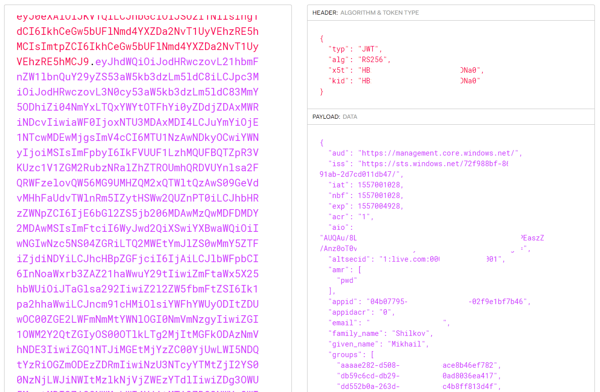
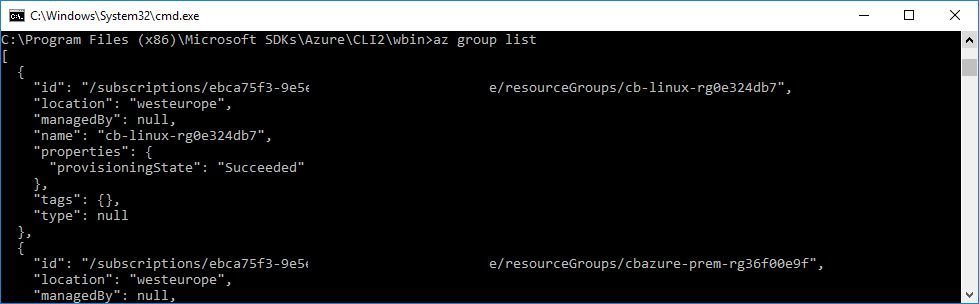

Azure has several tools available to create and manage cloud resources. The Azure command-line interface (CLI) is probably the second most-used tool after the web portal. The CLI runs on any platform and covers a wide variety of actions. Here is a command to create a new Virtual Machine:

```
az vm create --resource-group Sample --name VM1 --image UbuntuLTS --generate-ssh-keys
```

If you use Azure for your day-to-day job or hobby projects, it's quite likely that you already have the Azure CLI installed on your computer.

## Azure login

The very first command that you run after installing the CLI on your development machine is going to be

```
az login
```

There are several sign-in flows, but most typically the CLI opens the default browser asking you to log in there. The login operation has a unique session identifier. Once you sign in with this session ID, the CLI receives a notification on its back channel. The notification contains a JWT access token.

From this point on, the access token is used by most other CLI commands to access Azure Management REST API. API uses OAuth protocol where the access token is passed in the `Authorization` HTTP header.

## Storing tokens on the local disk

However, there is one problem. The CLI is a short-lived program: it runs for the duration of a single command execution and then quits. The process dies, so there's no way to keep access tokens in memory between the executions. To avoid continually asking for user credentials, the CLI keeps its state on disk. If you go to the `~/.azure/` directory (`%HOMEPATH%/.azure/` in Windows command-line) you can find several of such state files:

```
~/.azure> ls

accessTokens.json
az.json
az.sess
azureProfile.json
clouds.configtelemetry.txt
```

Two of these files contain some relevant information. `azureProfile.json` lists the properties of your Azure subscriptions and users (no passwords or tokens).

`accessTokens.json` is more interesting. As the name suggests, it contains all the tokens from the Azure CLI, right there in plain text. Here is the shape of JSON entries in there:

``` json
{
   "tokenType": "Bearer",
   "expiresIn": 3599,
   "expiresOn": "2019-05-05 00:22:01.577315",
   "resource": "https://management.core.windows.net/",
   "accessToken": "...",
   "refreshToken": "...",
   "identityProvider": "live.com",
   "userId": "...",
   "isMRRT": true,
   "_clientId": "...",
   "_authority": "https://login.microsoftonline.com/common"
}
```

There are multiple entries like this for different combinations of `resource`, `_authority`, and others. Obviously, I removed all the sensitive values from this snippet, but you could see yours in plain text. Go ahead and copy-paste a value of `accessToken` property to "Encoded" the text box on https://jwt.io page. The site decodes the token and shows you the properties:



<figcaption><h4>Azure access token decoded with JWT.io</h4></figcaption>

The access token has a limited lifespan&mdash;mine are all 60 minutes. To avoid requiring to login after access expiration, there is another powerful token&mdash;a refresh token. Whenever an access token expires, CLI goes to the authentication service, presents the refresh token, and asks for a new access token. The lifetime of a refresh token is longer, and it's managed on the service side. There are some configurable policies to expire it: for instance, Azure might invalidate a token if it was inactive for more than X days. It can also be revoked manually at any time.

The refresh tokens are stored inside the same `accessTokens.json` file, right next to the access token (see the snippet above). It's not a JWT token: it is an opaque blob sent from Azure AD whose contents are not known to any client components. You cannot see what’s inside a refresh token but Azure can.

## Token reuse by other tools

We learned that access tokens are not specific to the Azure CLI and aren't used exclusively by it. Let's run a short experiment:

1. Run `az login` or any other Azure CLI command to make sure there's a current access token.

2. Open `azureProfile.json` and copy-paste the subscription `id` field into the following URL: `https://management.azure.com/subscriptions/{subscription-id}/resourcegroups?api-version=2019-05-10`.

3. Open the `accessTokens.json` file, find the latest entry, and copy the `accessToken` field.

Now, build the following cURL command out of these two values:

```
curl --header "Authorization: Bearer {access-token}" \
https://management.azure.com/subscriptions/{subscription-id}/resourcegroups?api-version=2019-05-10
```

Run the command, and you get the list of resource groups in your subscription!

By the way, you can also find both properties with the Azure CLI commands `az account list` and `az account get-access-token`. It doesn't feel as hacky as copy-pasting from JSON files, but it is more convenient :)

Multiple third-party tools use the fact that the Azure CLI can log in to Azure and then provide access tokens. Both Terraform and Pulumi have a default method of authenticating into Azure with the Azure CLI. They probably delegate to the CLI instead of accessing the `accessTokens.json` file directly, but that's mostly convenience and not the hard requirement. Effectively, they are able to reuse the tokens created by the Azure CLI for their own purpose.

## Security risks of token exposure

This is all handy and good. However, there is a dark side of convenience. The existence of a file with clear-text Azure access tokens means that you should be careful not to expose that file to anyone. Don't share your `~/.azure/` folder with anybody, don't put it on GitHub, don't upload it to random file-sharing applications.

Access tokens file could potentially become an attack vector. Say, you install a new shiny CLI tool from NPM (many developers have dozens of them). You run it from your user account, the tool does its job but also silently uploads `accessTokens.json` file to somebody's FTP. A month later, you get surprised while looking at your Azure bill.

I checked this scenario by uploading my `~/.azure` folder to a brand-new VM. A fresh installation of the Azure CLI happily welcomes me without the need for `az login`:



<figcaption><h4>Azure CLI open on a new VM with copied credentials</h4></figcaption>

## Conclusion

Know your tools, reuse the power of Azure CLI for those Azure Management REST API crunching sessions, and keep your machine safe.

Happy hacking!
