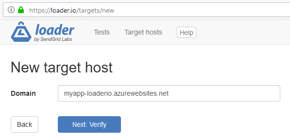
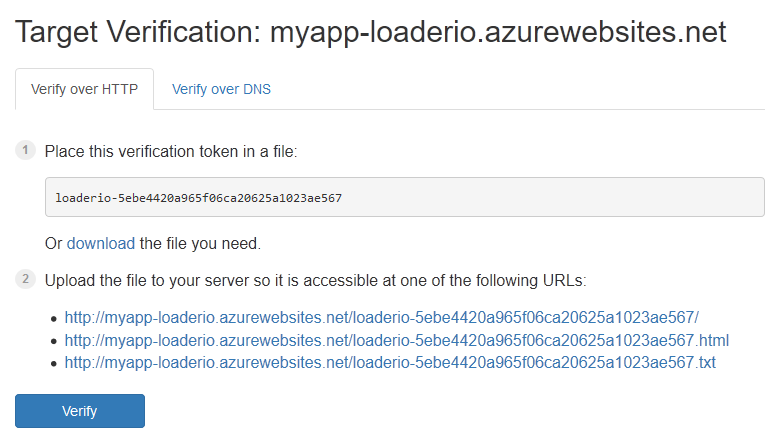
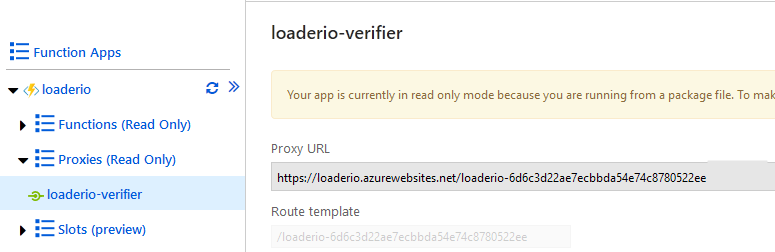
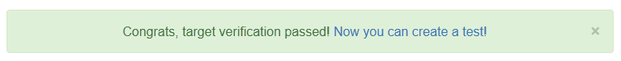
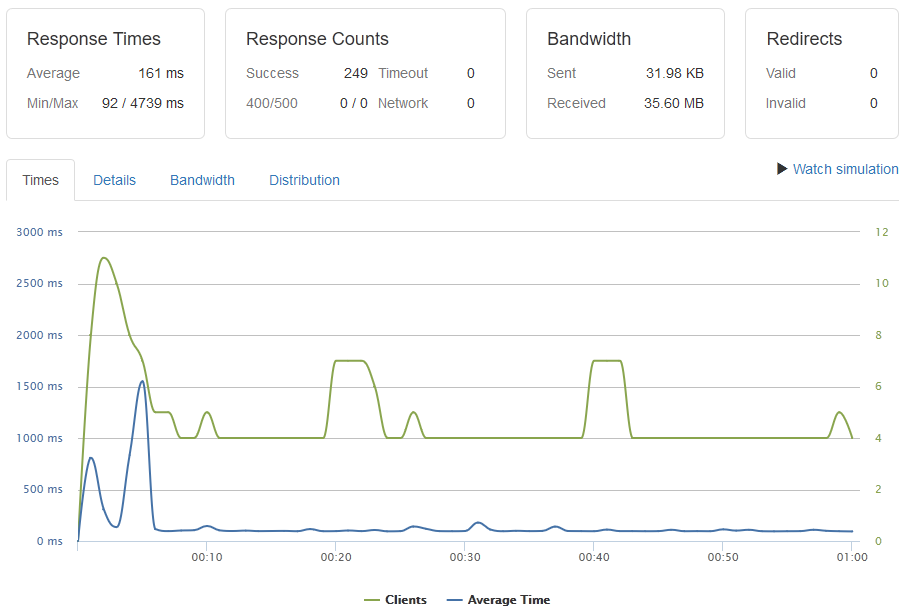

When Azure Functions team presented the new [Premium plan](https://docs.microsoft.com/en-us/azure/azure-functions/functions-premium-plan), they made a series of demos which compared the response time of a Function App running on the Consumption plan vs. an App running on the Premium plan. Both apps would receive a rapid growth of incoming requests, and then the percentiles of response latencies were compared.

The demos used a tool called [Loader](https://loader.io/), also referred to as "Loader.io". The tool is visual and easy-to-use, but there is one step which might be just a little bit tricky to go through: verification. To avoid DDoS-ing somebody else's site, Loader requires users to verify each Target host by placing a key on a given URL of that domain.

If you want to follow along, it's time to create an account at [loader.io](https://loader.io/)&mdash;they have a free plan. After signing in, go to [New target host](https://loader.io/targets/new) and enter the URL of your Function App:



<figcaption><h4>Azure Function App as a new target host</h4></figcaption>

Click "Next: Verify" button, and you are given a token to put inside your Function App to prove the ownership of it:



<figcaption><h4>Target Verification of Azure Function App</h4></figcaption>

I know two ways to achieve verification.

## Option 1: Function Proxies

With [Azure Functions Proxies](https://docs.microsoft.com/en-us/azure/azure-functions/functions-proxies), you can specify endpoints in your Function App which aren't handled by Functions directly but redirect the requests to other endpoints or respond with a hard-coded response.

The later is exactly what we need. Create a `proxies.json` file in the root of your Function App, next to the `host.json` file, and put the following content in there:

``` json
{
    "$schema": "http://json.schemastore.org/proxies",
    "proxies": {
        "loaderio-verifier": {
            "matchCondition": {
                "methods": [ "GET" ],
                "route": "/loaderio-your-token-goes-here"
            },
            "responseOverrides": {
                "response.body": "loaderio-your-token-goes-here",
                "response.headers.Content-Type": "text/plain"
            }
        }
    }
}
```

Don't forget to replace `loaderio-your-token-goes-here` value with the token that you received at the previous step. Now, the hard-coded response is returned at the endpoint which Loader uses for verification.

If your Function App is a .NET project, include `proxies.json` to the `csproj`/`fsproj` file, so that it becomes a part of the deployment artifact:

```
...
      <None Update="proxies.json">
         <CopyToOutputDirectory>PreserveNewest</CopyToOutputDirectory>
      </None>
   </ItemGroup>
</Project>
```

After re-publishing the Function App, you should be able to see a new proxy in the portal:



<figcaption><h4>Loader Verifier Proxy in the Azure Portal</h4></figcaption>

You are all set to go! Click the "Verify" button to see



## Option 2: Another Function

Instead of dealing with Proxies, you could create another Azure Function in the same App and let it return the token.

I'll give you an example of defining such a Function with TypeScript and Pulumi.

Say, I want to load-test the following target HTTP function (it just pauses for 500 ms):

``` ts
const target = new azure.appservice.HttpFunction("Target", {
    callback: async (context, req) => {
        await new Promise(resolve => setTimeout(resolve, 500));
        return {
            status: 200,
            body: "Hello World!",
        };
    },
});
```

Now, I can add another HTTP function to handle the verification requests:

``` ts
const verifier = new azure.appservice.HttpFunction("Verifier", {
    route: "loaderio-your-token-goes-here",
    callback: async (context, req) => {
        return {
            status: 200,
            body: "loaderio-your-token-goes-here",
        };
    },
});
```

Finally, I put both Functions into a Function App and deploy them together:

``` ts
const app = new azure.appservice.MultiCallbackFunctionApp("loaderio", {
    resourceGroupName: resourceGroup.name,
    functions: [target, verifier],
    hostSettings: { extensions: { http: { routePrefix: "" } } },
});

export const endpoint = app.endpoint;
```

Note that I set `routePrefix` to an empty string to avoid `api` prefix in my URLs (I usually do it anyway). Now, as soon as Pulumi deploys my App, I can start testing it with Loader.

You can find a full example involving the `MultiCallbackFunctionApp` component [here](https://github.com/pulumi/pulumi-azure/blob/master/examples/http-multi/index.ts).

## Running the Load Tests

Regardless of which path you chose, you should now be good to start using Loader to run performance tests on your Azure Functions.

Here is a chart of a sample test that I ran to make sure the setup works:



<figcaption><h4>Loader.io Test Results</h4></figcaption>

Which test parameters to use and what kind of results you might get depends a lot on your application. That's a good topic for another post someday.

For now, happy testing!