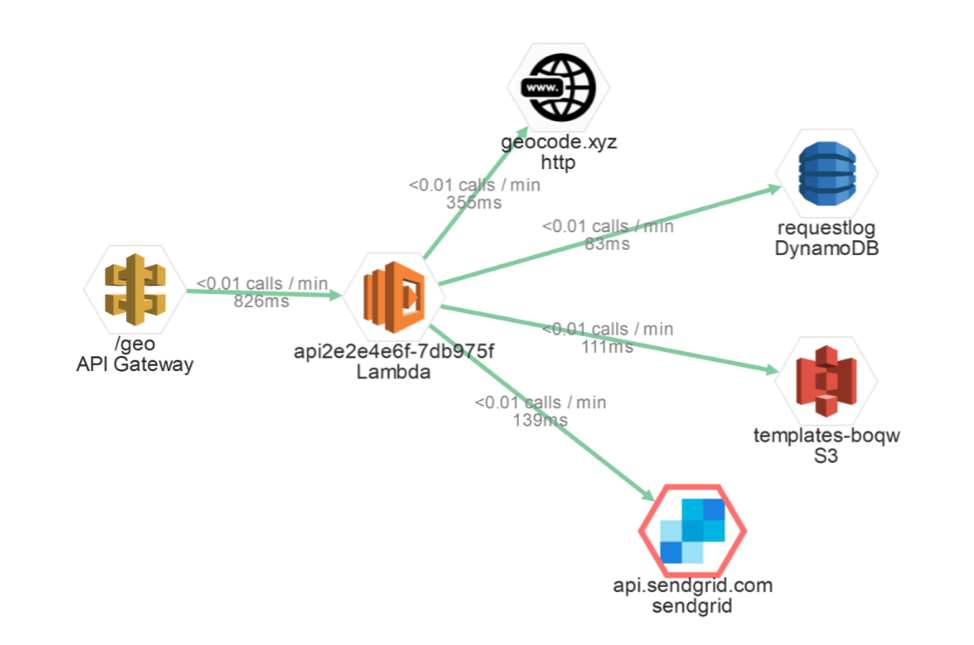

The modern software world runs on application programming interfaces, otherwise known as APIs. There is an API for everything: charging a credit card, sending an email, finding an address on a map, or hailing a taxi.

Likewise, the huge computing power of the cloud is entirely accessible via multiple layers of programming interfaces, including HTTP services and language-specific SDKs. Cloud vendors such as AWS have thousands of endpoints available to every developer in the world and modern businesses ought to embrace these existing services to stay productive. Instead of trying to reinvent the wheel, businesses should focus on the core values and differentiators for their specific market and simply purchase, adopt and reuse the remaining services required from third parties that have proven themselves in their given niche.

This principle stands at the core of the philosophy behind serverless architecture: focus on the crucial bits. Serverless tech has a low barrier of entry and was designed with the intention to require little boilerplate code to use. This helps to explain why so many reliable [APIs are an inherent part](https://epsagon.com/blog/the-importance-and-impact-of-apis-in-serverless/) of serverless applications today. Lambda functions, for their part, are used by developers as the glue between cloud services and internal as well as external API calls.

## Role of Performance

One thing to keep in mind when adopting APIs, in general, is performance. Most API calls are usually synchronous requests over HTTP or HTTPS. They may be fast to execute, but they may also be slow and responsiveness is not manifested in the API definition itself. Moreover, the latency may vary over time, as APIs can crash at seemingly random intervals or under higher loads. Throttling strategies might also kick in once the workload passes a given threshold.

This aspect of performance is arguably more decisive in the serverless world than ever before, as slow downstream APs for serverless platforms have numerous implications:

- Each Lambda function has a maximum duration threshold and it's going to time out and fail if the total duration of API calls goes above that value.
- AWS charges organizations for execution times for Lambda invocations. Even when a function is idle while waiting for the HTTP response, you pay for each 100 milliseconds consumed. Slow API calls lead to the inevitable [extra cost of the serverless application](https://epsagon.com/blog/how-much-does-aws-lambda-cost/).
- For synchronous invocations, when a user is waiting for the Lambda to complete, substantial slowdowns lead to poor user experience, as unhappy customers and lose time, and often, revenue.

Luckily, a lot can be done to prevent and mitigate such issues.

## Instrumenting API Performance

There are several strategies to assess the impact that the performance of a third-party API has on your serverless application.

While just getting started with a new API, it makes sense to research if the supplier has provided a performance SLA or not. Regardless of the answer, the next step is to execute the target calls and measure the latency profile. You should strive to do so well in advance, before signing up for a new service. Finally, it's worth running a load test to emulate your target workload over an extended period.

Your job is still not done even after an application is successfully deployed to production. For any non-trivial application, it's worth investing in monitoring tools and best practices. A monitoring toolkit provides both real-time and historical perspectives on the performance of your dependencies as well as their impact on application usability and cost.

The following section gives a sneak peek of such activities.

## Example: Geo-Alerting Application

Let's consider a sample application that processes telemetry from connected vehicles. Each vehicle sends periodic messages, which end up in the AWS cloud. A single AWS Lambda receives a message and executes the following steps:

- Decodes the payload and extracts data, including geo-coordinates and sensor values.
- Reverse geocodes the coordinates to infer the address with a call to the [xyz](https://geocode.xyz/) service.
- Saves a log entry containing the message properties and addresses to an [AWS DynamoDB](https://aws.amazon.com/dynamodb/).
- Compares the values against thresholds to check whether to send an alert.
- If needed, loads a suitable email template from an [AWS S3](https://aws.amazon.com/s3/) bucket.
- Sends an email notification using the [SendGrid](https://sendgrid.com/) mailing service.

It's a reasonably straightforward application and yet it depends on four external APIs: two AWS services and two third-party endpoints. Here, we will implement a prototype of such an application and link it to an [Epsagon](https://epsagon.com/) dashboard to see what kind of insights we can get about its performance.

## Timeline of a Single Invocation

Let's start by calling my AWS Lambda once, then find that invocation in the Epsagon dashboard and display the [timeline view](https://epsagon.com/blog/introducing-the-timeline-view/):

<figcaption><h4>The Epsagon dashboard: A Timeline view of a single call.</h4></figcaption>

You can see that this single invocation took 827 milliseconds to complete and that this time was entirely spent on waiting for the API calls to complete. You can also clearly see the breakdown of the execution time between the four dependencies and that the geocoding and email sending is slower than the calls to DynamoDB and S3.

The timeline view looks very familiar to any developer who has ever worked with performance and network tabs as part of a browser's developer tools. And it's beneficial for a similar purpose: hunting down the culprit of slow execution.

It's worth mentioning that you don't have to track the calls manually. All the data is collected automatically by the Epsagon library once you plug it into the Lambda.

## Tracking Invocations Over Time

The above was just one measurement, which might not be very representative of reality. The next step is to see how the target AWS Lambda behaves over time. Let's set up a test to execute the function several hundred times over several minutes. It's easiest to use AWS API Gateway and invoke the function via HTTP. Alternatively, you could use an SQS queue or another asynchronous trigger, but monitoring behaves similarly in all cases.

After the test, go ahead and navigate to the Architecture Map page:

<figcaption><h4>Architecture Map - Epsagon dashboard.</h4></figcaption>

The preceding Epsagon dashboard gives you an aggregate view of all recent function executions. In this case, the numbers happen to be quite similar to the previous test: about 800 milliseconds of invocation time on average with geocoding being the slowest call. SendGrid calls seem to go faster on average, but the red border around it indicates that some of the requests failed. This also points to a potential problem, which you would need to investigate. You may want to take some concrete actions based on the collected data, such as trying another geocoding service to see if it is faster for a comparable price.

You can estimate the cost of your application based on the predicted number of invocations multiplied by the price for 900 milliseconds of execution time. This function spends all the time waiting for I/O operations to complete and it's not CPU- or memory-heavy. Therefore, it makes sense to provision smaller sizes of AWS Lambda instances.

Finally, you may want to break down your "monolith" function into multiple functions that are interconnected with queues. Smaller single-purpose functions [have several benefits](https://epsagon.com/blog/the-right-way-to-distribute-messages-effectively-in-serverless-applications/), including higher resilience and potentially lower cost.

## Conclusion

Almost every serverless function relies on one or many API calls and a combination of other cloud services and third-party applications. The latency and stability of those calls directly affect the Lambda function, both in terms of performance and cost.

Be sure to test the performance of any newly adopted API before relying on it. In addition, you need to monitor the latency, reliability and [cost of the API calls in production](https://epsagon.com/blog/finding-serverless-hidden-costs/). It is important that you optimize the structure of your application to avoid long-running calls on the synchronous path that is observable by end-users. And for better cost manageability and higher resilience, complete the executions as fast as possible and delegate the remaining work to queue- or event-based functions.