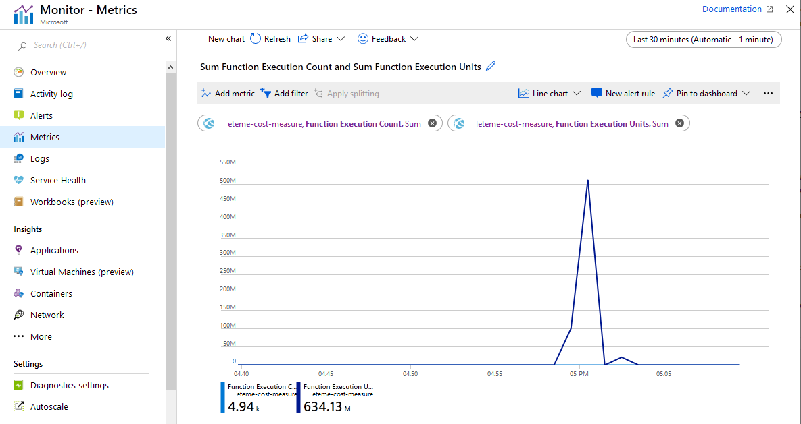
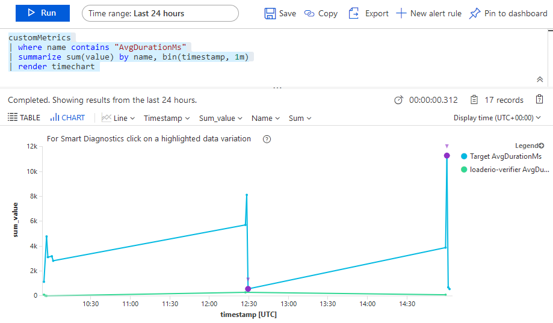

Azure Functions can be hosted in multiple ways: there's an App Service plan with a fixed cost per hour, a new Premium plan with both fixed and variable price components, not to mention self-managed options based on container technologies. Instead of any of those three, this article focuses on Consumption plan&mdash;the classic serverless offering billed purely based on the actual usage.

## How Is Serverless Different?

Serverless Functions have three important properties, each of them having a significant impact on the way we deal with the cost of an application:

- **Low management overhead**: the cloud provider manages the service. The total cost of ownership is minimal: developers create code to solve business problems&mdash;the rest is taken care of.

- **Pay-per-use**: Functions are charged per actual executions. Nothing is reserved in advance, so the cost of running a Function App grows linearly with the application demand.

- **Elastically scalable**: when a Function is idle, Azure scales the infrastructure down to zero with no associated cost. Whenever the workload grows, Azure brings enough capacity to serve all the demand.

#### Why does this matter?

In the past, the cost of infrastructure running an application and the value that the application provides were separated. A company would run multiple applications, each having numerous components and services, on a shared infrastructure of dedicated hardware, a pool of VMs, or IaaS services in the cloud. It's quite complicated to tear the expenses apart and determine the exact cost of each application, let alone a particular component. Moreover, the investments are planned and executed in advance, so the infrastructure can't follow the elasticity of workload and ends up overprovisioned and underutilized.

Today, the application portfolio can run on serverless functions, each component becoming a separate Function App. In turn, each App may contain multiple functions. Since the company pays per actual use, they can understand and manage the exact cost of each component.

This ability enables the business to:

- See which features are most profitable, and which ones are too expensive;
- Optimize the Functions that have high impact on the invoice and ignore the rest;
- Make informed decisions of whether to spend engineering time on such optimizations or create new business value while paying a premium to the cloud provider.

Note that the cost information is retrospective: the actual numbers come after the fact of spending. The lack of budgeting makes decision makers nervous: they are used to plan the cost of infrastructure long in advance. Therefore, our goal is to understand the cost structure and be able to predict the changes in invoices as applications and business evolve.

## Billing Model of the Consumption Plan

Let's dissect the structure of the Consumption plan. There are two core components of the cost of serverless Functions in Azure: **Execution Count** and **Execution Time**.

*Execution Count* is straightforward. Each Function defines a trigger&mdash;an event which causes the code to execute. It can be an incoming HTTP request or a message in a given queue. Every call counts: you get charged $0.20 per million executions. This component of the cost can be substantially reduced if you batch events: process several events in a single execution.

The second cost component is called *Execution Time* on the pricing page, which isn't exactly correct: it depends on both completion time and memory consumption and is metered in *GB-seconds*. You pay $16 per million GB-seconds. That is, if a Function runs 1 million times, it always consumes 1 GB of memory and completes in 1 second, you pay $16.

The memory consumption is always rounded up to the next 128 MB, and the minimum time charge is 100 milliseconds. Therefore, the minimal time charge is again $0.20 per million executions.

Holistically, there are other cost components of running serverless applications not tied directly to the Azure Functions service: I'll briefly touch on those at the end of the article.

## Azure Bill and Cost Analysis

The prominent place to see the cost of operating Azure Functions is the monthly bill. Open the Azure portal and navigate to your subscription's page, choose *Invoices* and then a period to look at. Here is a sample report from a subscription of mine:


<figcaption><h4>Consumed Function Units on an Azure invoice</h4></figcaption>

You should be able to see the incurred change for the two metrics we discussed above: *Total Executions* and *Execution Time* (the metric in GB-seconds).

With *Cost Analysis* tool, you can see the billing data at per day granularity. Depending on your analysis goal, you might need more details than that. For instance, you may wonder how the cost is spread over periods within a day or be able to predict the future cost based on short trials before the application (or its newer version) goes into production.

Let's see how to dig deeper into the details.

## Azure Monitor Metrics

**Azure Monitor** is a service for collecting, analyzing, and acting on telemetry from applications running in the Azure cloud. While mostly focusing on performance, it also collects some useful data related to service consumption.

Azure Functions issue two cost-related metrics into Azure Monitor: *Function Execution Count* and *Function Execution Units*. Each metric emits a value once every minute.

To see these metrics in the Azure portal, navigate to the *Monitor* service and select the *Metrics* item on the left. Click *Select a Resource* button and find the Function App that you want to investigate. Note that the *Resource Type* should be set to *App Service*: there's no value called *Function App* in that dropdown.

Select *Function Execution Count* in the Metrics dropdown, *Sum* as the aggregation type, and adjust the period selector as needed. You should now see a chart similar to this one:


<figcaption><h4>Function Execution Count in Azure Monitor</h4></figcaption>

In this particular case, there were about 4,940 executions in the last 30 minutes. You can view the stats per minute; in this example, all the executions come from a single spike&mdash;something that I might want to investigate.

Now, switch the metric to *Function Execution Units*. Alternatively, you can add it to the same chart, but the scale of the two metrics is so different that you won't be able to see both lines at the same time:



<figcaption><h4>Function Execution Units in Azure Monitor</h4></figcaption>

The value conversion gets a bit tricky here. The chart shows a total of 634.13 million *Function Execution Units* consumed in the last hour. These are not the GB-seconds mentioned above, though: the metric is nominated in MB-milliseconds. To convert this to GB-seconds, divide it by 1,024,000. So, in this case, my Function App consumed 634,130,000 / 1,024,000 = 619 GB-seconds in the last half-an-hour.

## Sum It Up

Let's estimate the monthly cost of the application based on the metrics above. We start with the  half-an-hour calculation:

```
Execution Count = 4,940 * $0.20 / 1,000,000 = $0.000988
Execution Time = 634,130,000 / 1,024,000 * $16 / 1,000,000 = $0.009908
30 Min Total = Execution Count + Execution Time = $0.010896
```

If I keep the same average workload over a month, the cost is going to be:

```
Monthly Cost = 30 Min Total * 2 * 24 * 30 = $15.69
```

My application costs about 2 cents an hour, or 15 bucks a month.

## Dashboards

If you only need to look at the data once, the *Metrics* screen above should be sufficient.

For continuous monitoring of the metrics, you can put the same charts onto your Azure Dashboard. On the same screen, Click *Pin to dashboard* button and then navigate to the *Dashboard* menu item of the portal. You should see your chart added:


<figcaption><h4>Monitoring Dashboard</h4></figcaption>

You might have several Function Apps to monitor at this point. You can either add a separate chart for each one of them, or add several lines to the same chart, or a combination of both. To customize the name of the dashboard item, click on the chart, edit the name, and click *Update Dashboard* button.

The dashboard has a period selector at the top, which allows changing the visible time interval of all charts on the fly&mdash;very handy to zoom in and zoom out to go from overview to a more nuanced view of the cost breakdown and back.

## API

The user interface of the Azure portal is helpful, but you might want to integrate the data into other tools used in your organization. For that, you can still use metrics from Azure Monitor but retrieve the values programmatically. One way to do so is to request information from the REST API periodically. In the following template, replace the parameters in curly braces with your actual Azure resources:

```
GET /subscriptions/{subscription-id}/resourceGroups/{resource-group-name}/providers/Microsoft.Web/sites/{function-app-name}/providers/microsoft.insights/metrics?api-version=2018-01-01&metricnames=FunctionExecutionUnits,FunctionExecutionCount
Host: management.azure.com
Authorization: Bearer {access-token}
```

The access token can be obtained from the Azure Command Line Interface (CLI) with the command `az account get-access-token`.

By the way, you can also get the same metric values within the CLI itself:

```
az monitor metrics list --resource /subscriptions/{subscription-id}/resourceGroups/{resource-group-name}/providers/Microsoft.Web/sites/{function-app-name} --metric FunctionExecutionUnits,FunctionExecutionCount --aggregation Total --interval PT1M
```

In both cases, you receive a JSON response with time series data. Here is a snippet to illustrate the most useful bits:

``` json
...
"name": {
    "localizedValue": "Function Execution Units",
    "value": "FunctionExecutionUnits"
},
"timeseries": [
{
    "data": [
    {
        "timeStamp": "2019-07-05T10:23:00+00:00",
        "total": 127.0
    },
    {
        "timeStamp": "2019-07-05T10:24:00+00:00",
        "total": 34.1
    }
    ...
```

The reported time interval and granularity are adjustable with HTTP query and command parameters.

Please note that Azure Monitor has a retention period of 30 days, which is as far as you can go to observe the historical data. At the moment, I couldn't find a built-in capability to stream the Function App execution metrics into long-term storage. Therefore, to store a copy of the data, you need to implement the integration based on periodic calls to Metrics API and persist the response into the storage of your choice. Azure Table Storage could be one pragmatic solution for this purpose.

## Application Insights Metrics

Azure Monitor is a great tool in addition to observing the monthly bill. However, its resolution is still limited in two ways:

- It reports aggregated values with a resolution of one minute
- It combines metrics coming from all the Functions belonging to the same Function App into a single value

There's currently no way to get the cost of *GB-seconds* consumption per single execution. However, you can get the duration of each execution from a tool called **Application Insights**. Since the metrics are reported individually per each Function and each execution, they should help you estimate the cost structure for a given Function App.

The best tool to explore this data is *Application Insights Logs*. Select the Application Insights account associated with your Function App and click *Logs (Analytics)* in the toolbar and put the following query into the editor:

```
customMetrics
| where name contains "AvgDurationMs"
| limit 100
```

The query retrieves a hundred sample metric values with the *name* column reflecting the Azure Function name, *Target* in this case, and *value* showing the execution duration in milliseconds:


<figcaption><h4>Duration in Application Insights Logs</h4></figcaption>

The same metric can be used to plot the duration distribution in time; here is a sample query:

```
customMetrics
| where name contains "AvgDurationMs"
| summarize sum(value) by name, bin(timestamp, 1m)
| render timechart
```



<figcaption><h4>Duration over Time in Application Insights Logs</h4></figcaption>

You can see that the Function plotted in blue has spent much more execution time than the green one.

## Cost Beyond Functions

It's important to note that we only discussed the direct cost of Azure Functions executions. There are several other potential costs associated with running an Azure Function App:

- Application Insights. Depending on the event volume and sampling settings, the cost of this monitoring service can become quite substantial and exceed the cost of Azure Functions themselves. Be careful and test your configuration before and soon after going to production.
- Network traffic. If your Functions serve the traffic to the outside world, the networking fees apply. They are usually relatively low, but the cost may build up for high-volume Functions serving bulk data.
- Storage. Azure Functions use a Storage Account for internal state and coordination. In my experience, these costs are negligible.

I hope this article gives you enough perspective to start looking into the real cost of your serverless applications. May your Functions stay performant and the bill low!