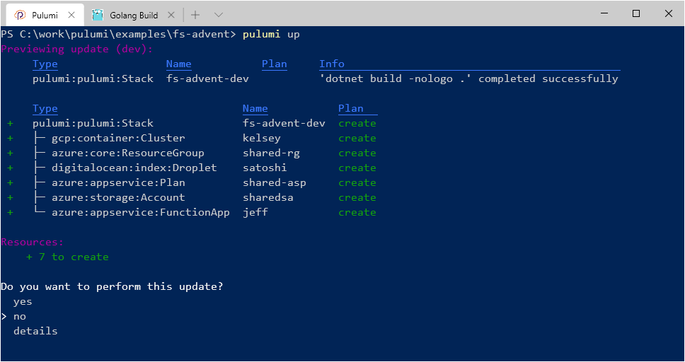

*The post is a part of
[F# Advent Calendar 2019](https://sergeytihon.com/2019/11/05/f-advent-calendar-in-english-2019/).
It's Christmas time!*

Cloud is everywhere, and yet it's still inaccessible to millions of developers and IT pros. With shining yet cloudy eyes return they from KubeCon's and re:Invent's, just to pick up an issue in Jira, fix yet another `SingletonProxyFactoryBean` in their J2EE application, commit it to SVN, and hope it will be delivered in three months to the data center in their HQ basement.

But hey, it's December now, which means it's time to write a letter to Santa Cloud! Santa Cloud brings gifts to the homes of well-behaved engineers on the night of Christmas Eve. He accomplishes this feat with the aid of his elves, who make the toys in their glorious workshops in the State of Washington.


Here are some typical letters that Santa gets these days:

<blockquote>I maintain 15 different apps, and each one has a custom deployment workflow. If only I had a <b>Kubernetes</b> cluster, I would stick all the apps in it and let the blue/green deployments do the magic!</blockquote>

<blockquote>My ten-year-old legacy application was designed for twenty users, and now it has to handle twenty thousand. It reached its performance limits! If only I could port it to <b>Serverless</b>, this would fix all my scalability issues.</blockquote>

> We have 2 TB of data to analyze! Could you please send me a data lake and a **Spark** cluster? Actually, can I have two... or maybe three?

There's enough cloud for everyone! Perhaps, a naughty engineer, who created a lot of technical debt and meeting invites, might only get a cozy single-core VM for their LAMP-stack website. But the lucky ones might get a whole Kubernetes cluster for themselves!

## Behind the Snow Curtains

While cloud elves are good at provisioning the underlying hardware and providing services, Santa still needs to coordinate them to fulfill wishes. There are millions of aspiring cloud engineers, and all of them believe in Santa. It's not feasible to click the buttons in web portals or run ad-hoc scripts for each and every wishlist.

Luckily, Santa Cloud is good at programming and automation. He codes in [F#](https://fsharp.org), and he's one of the early customers of the .NET SDK for [Pulumi](https://pulumi.com). Hey, it's my fairy tale, so I choose the tech stack, thank you. Worry not, even if you are not familiar with F# or Pulumi, you will be able to follow along.

The workflow looks approximately like this:

- Represent a letter as a value in the program
- Pick an elf which can fulfill the desire
- Produce the resource
- Wrap a note to the recipient

### Parsing wishlists

Too bad, not every wishful engineer knows F#. Maybe, next year, Santa can make an online form that wouldn't accept anything but valid code. For now, it's the duty of Mrs. Cloud to read every letter and convert it to a list of records. Here is a sample:

``` fsharp
let wishes = [
    { Recipient = Person "Kelsey" ; Resource = Kubernetes (Nodes 25) }
    { Recipient = Person "Jeff"   ; Resource = Serverless DotNet }
    { Recipient = Person "Satoshi"; Resource = Blockchain Public }
]
```

The value `wishes` is a strongly-typed list of records. Each record has multiple properties and utilizes "algebraic data types": each type would have a label ("Kubernetes") and an associated piece of data (25 nodes). The shape of data depends on the label: it's not possible to ask 25 nodes of serverless.

When the list is defined and compiled, it goes to production. But first, we need to assign an elf to each item in the list.

### Elves

All-powerful craftselves are represented as another F# type: a function type.

``` fsharp
type Elf = Wish -> (unit -> Identifier) option
```

Here is what it tells us:

- It's a function which expects a `Wish` as an input parameter
- It may return nothing if this elf can't fulfill the wish (represented by `option` type)
- If it returns something, it returns yet another function---of type `unit -> Identifier`
- This resulting function has a side effect (it accepts `unit`): the production of a cloud resource
- It returns an `Identifier` of that resource

Whoa, that's a lot of information conveyed by a single-line type definition!

In our program, each elf is a function, for example:

``` fsharp
let aws (wish: Wish) =
    match wish.Resource with
    | Kubernetes k8s -> makeEksCluster k8s |> Some
    | Serverless s8s -> makeAwsLambda s8s  |> Some
    //|  ... more resource types
    | _ -> None
```

The function matches the type of the desired resource and calls a corresponding resource provisioning routine.

### Resource provisioning

Pulumi handles the creation of cloud resources with its .NET SDKs spanning across all major cloud providers.

Here is a snippet which defines an Azure Function App:

``` fsharp
let makeFunctionApp (Person name) (runtime: Runtime) () =
    let app =
        FunctionApp(name,
            FunctionAppArgs
               (ResourceGroupName = io resourceGroup.Name,
                AppSettings = inputMap ["runtime", runtime.ToString() |> input],
                StorageConnectionString = io storageAccount.PrimaryConnectionString,
                Version = input "~2"))
    Url app.DefaultHostname
```

And here is a Google Kubernetes Engine cluster:

``` fsharp
let makeGkeCluster (Person name) (Nodes nodeCount) () =
    let masterVersion = input "1.15.1"
    let cluster =
        Cluster(name,
            ClusterArgs
               (InitialNodeCount = input nodeCount,
                MinMasterVersion = masterVersion,
                NodeVersion = masterVersion,
                NodeConfig = input (
                    ClusterNodeConfigArgs
                       (MachineType = input "n1-standard-1"))))
    Url cluster.Endpoint

```

### Production

The application logic of picking the right production facility and executing the order takes five lines of code.

``` fsharp
let fulfill wish =
    // Randomize the order of elves, so that they get equal opportunities
    let elves = shuffle [aws; azure; gcp]

    // Find the first elf which agrees to produce a resource
    let make = elves |> List.pick (fun elf -> elf wish)

    // Run the production!
    let identifier = make()

    wish.Recipient, identifier
```

We shuffle the order of elves to give them comparable workload, pick the first one in the list who agrees to execute the order, run the provisioning, and return the recipient name with their shiny resource identifier.

Go team Santa!

### Delivery

For a nice personal touch, a card needs to be printed, gift-wrapped, and delivered by Santa and reindeers. Programming the reindeers is for another blog post. For now, we just return a list of tuples of person names and resource URLs:

``` fsharp
let send (responses: Response list) =
    responses
    |> List.map (fun (Person name, Url url) -> name, url)
    |> dict
```

Finally, another line combines the steps into the workflow:

``` fsharp
let santaCloud () = wishes |> (List.map fulfill) |> send
```

And the last line defines the entry point of the application:

``` fsharp
[<EntryPoint>]
let main _ = Deployment.run santaCloud
```

Running the program produces an output like this:



## Retrospective

Honestly, the system is brand-new this year, so we still need to see how it plays out on Christmas Eve. Regardless, we learned a thing or two today:

- **Types**: F# has an excellent type system that allows expressing domain terms concisely and precisely.
- **Logic**: The program workflow is expressed in terms of function calls, pattern matching, and collections manipulation.
- **Infrastructure**: Cloud resources are defined in F# with Pulumi .NET SDK, which supports pretty much any resource in any cloud.
- **Application**: Blended together, these components enable writing expressive, cohesive, maintainable, cloud-native applications using familiar and loved tools and practices.

Learn more about [Pulumi for .NET](https://pulumi.com/dotnet) or browse [the full code](https://github.com/mikhailshilkov/fsharp-advent-pulumi/tree/master/2019) for this example.

Merry Cloudsmas, ho-ho-ho!