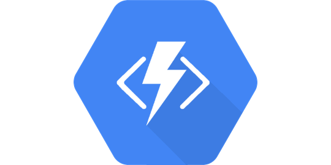

Suppose you are a .NET developer, you love the Function-as-a-Service (FaaS) model, but you want to run your serverless functions in Google Cloud. You want to keep using C# or F#, and still leverage all serverless benefits&mdash;ease of use, scalability, elasticity, pay-per-value cost model&mdash;running in GCP.

You look at Google Cloud Functions, the native FaaS service of Google Cloud, but it only supports JavaScript, Python, and Go. No C# or F#. Time to give up on the plans?

Not so quickly!

## Google Azure Functions?! Wat?

You are probably already familiar with Azure Functions&mdash;the .NET-based FaaS runtime in Azure. Azure Functions has two faces: it's a managed service in the Azure cloud, and also it is a self-contained runtime that can run anywhere: on your local machine, in a VM, or in a container. As I'm going to demonstrate, it can run in Google Cloud too.



Now, if I simply run an Azure Functions host on a VM in Google Cloud, I don't get all the serverless properties like scalability and pay-for-value. This is where Google Cloud Run comes into the mix.

Cloud Run is a fully managed cloud service that takes a container image and deploys it as an elastic HTTP application with scaling from zero to hero and applying per-request pricing. Cloud Run can host pretty much any container that listens to HTTP requests at a given port.

At the same time, Microsoft provides an official image of Azure Functions host. The host is a web application listening for HTTP requests... It sounds like we can stick it into Cloud Run!

## Deploying Azure Functions to Cloud Run

My plan has three steps:

1. Develop the code for an Azure Function App
2. Pack it as a Docker image that would fit the requirements of Google Cloud Run
3. Deploy the image as a Cloud Run service

### .NET Azure Function

Use your favorite tool to create a new Function App. I employed `func` CLI to create a new Function App project in C# and define an HTTP Function "HttpExample".

``` csharp
[FunctionName("HttpExample")]
public static async Task<IActionResult> Run(
    [HttpTrigger(AuthorizationLevel.Anonymous, "get")] HttpRequest req)
{
    string name = (string)req.Query["name"] ?? "World";
    var service = Environment.GetEnvironmentVariable("K_SERVICE") ?? "<unknown>";
    return new OkObjectResult($"Hello from Azure Function in {service}, {name}");
}
```

It's a standard hello-world Function, except it also retrieves the value of the `K_SERVICE` environment variable and appends it to the response. This variable should be present when hosted in Cloud Run.

### Container image

Now, we can wrap the Function App into a Docker image. Here is my `Dockerfile`:

```dockerfile
FROM mcr.microsoft.com/dotnet/core/sdk:3.0 AS installer-env

COPY . /src/dotnet-function-app
RUN cd /src/dotnet-function-app && \
    mkdir -p /home/site/wwwroot && \
    dotnet publish *.csproj --output /home/site/wwwroot

FROM mcr.microsoft.com/azure-functions/dotnet:3.0
ENV AzureWebJobsScriptRoot=/home/site/wwwroot \
    AzureFunctionsJobHost__Logging__Console__IsEnabled=true \
    ASPNETCORE_URLS=http://+:8080

COPY --from=installer-env ["/home/site/wwwroot", "/home/site/wwwroot"]
```

It uses the .NET Core SDK to build the application and publish the binaries to the `wwwroot` folder. Then I use the official Azure Functions host image to run the application from `wwwroot`.

The only statement that I have to customize for Cloud Run is `ASPNETCORE_URLS=http://+:8080`. It instructs my application to listen on the port 8080: the one defined by the Cloud Run's [container contract](https://cloud.google.com/run/docs/reference/container-contract).

### Deploy to Cloud Run

Finally, I can deploy the container definition to Google Cloud Run service. I use Pulumi to deploy all the infrastructure, see [this post](https://mikhail.io/2020/02/serverless-containers-with-google-cloud-run/) for a detailed walkthrough.

You can find the complete code of Azure Function deployment to Cloud Run [here](https://github.com/mikhailshilkov/mikhailio-hugo/tree/master/content/2020/02/azure-functions-in-google-cloud-run/code). After running `pulumi up`, I get a URL back

```
endpoint: "https://cloudrun-functions-4f40772-q5zdxwsb2a-ew.a.run.app/api/HttpExample?name="
```

I can append my name, query the endpoint, and get the response back:

```
curl $(pulumi stack output endpoint)Mikhail
Hello from Azure Function in cloudrun-functions-4f40772, Mikhail
```

It works! My Function confirms it's running in the `cloudrun-functions-4f40772` Cloud Run service.

## Pros and Cons

I showed that it's possible to run an Azure Function App inside the managed Google Cloud Run service. Let's spend a moment to discuss the benefits and limitations of this approach.

### The good parts

You take full advantage of a serverless application model:

- Google operates Cloud Run and requires next to none management from your side.
- The service automatically scales from zero to an arbitrary number of instances based on the actual workload.
- You pay per request in chunks of 100 ms. An application that needs to handle few requests may stay below the free allowance.

You write your application in a familiar language. I used .NET, it can be C#, F#, or VB, but the same approach should also work for other runtimes supported by Azure Functions, for example, JVM or PowerShell.

You can take advantage of many (but not all, see below) features of Azure Functions: HTTP routes, including parameters, authorization modes, logging, input and output bindings.

### Not so great parts

There is one substantial limitation to my approach, however. Cloud Run can only run HTTP-based workloads, so the set of Azure Function triggers available to you is basically limited to HTTP, EventGrid, and custom triggers based on HTTP. You can't deploy Functions listening to events like Service Bus, or Storage Queues. However, since your application runs in Google Cloud anyway, do you really need those? Google Pub/Sub has HTTP endpoint integration out of the box.

Azure Functions container is an ASP.NET Core application, and we ran it in Google Cloud Run. You may want to forgo the Azure Functions host and deploy your own custom ASP.NET Core application to Cloud Run. Both are possible, and the choice is yours.

## Conclusion

Open source and open standards open (dfjokasj) new horizons of possibilities. The team behind Azure Functions provides a way to host Function App inside containers, and Google Cloud Run service enables running arbitrary containers in a serverless manner. Therefore, we can combine the two products to come up with the usage that nobody anticipated in advance.

Isn't that cool? Happy hacking, my cloud friends!
