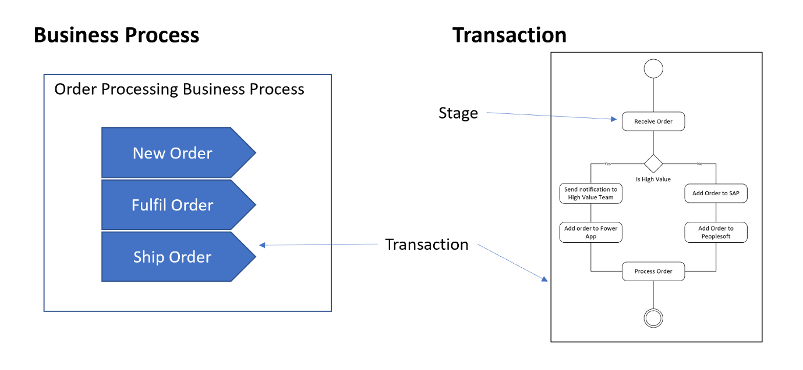
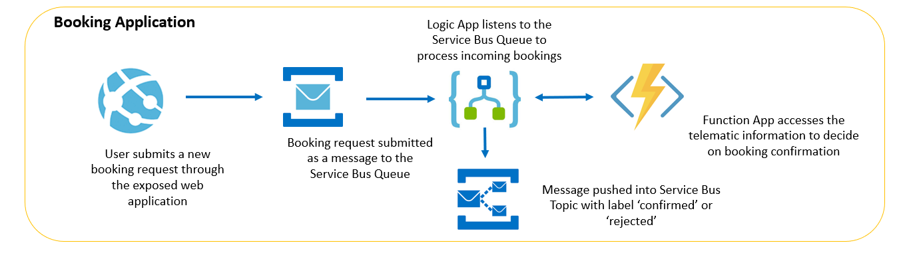
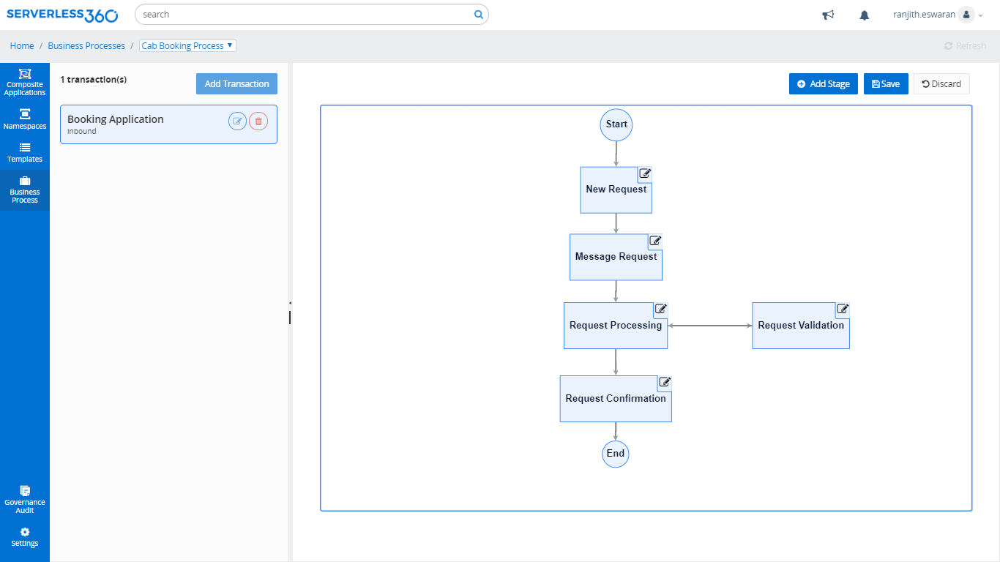
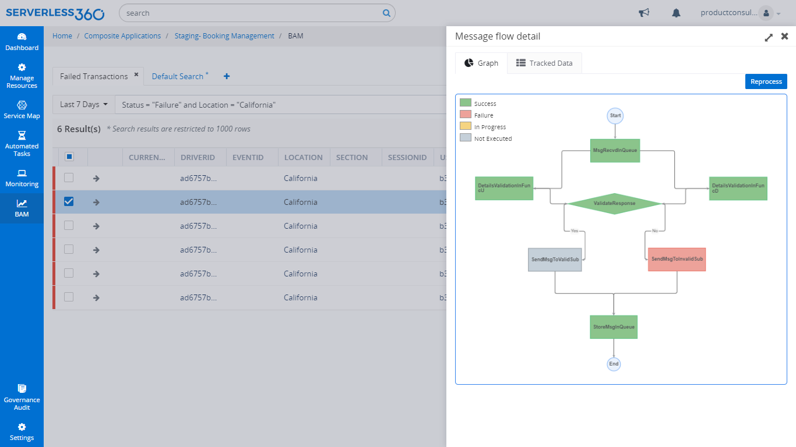
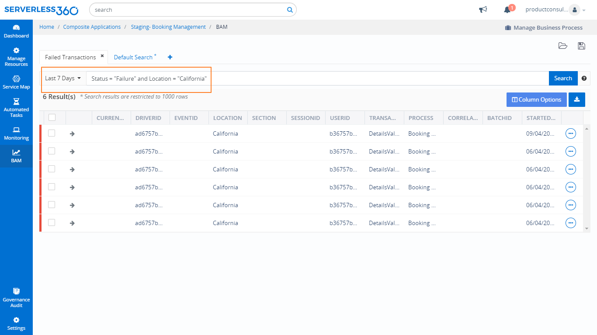
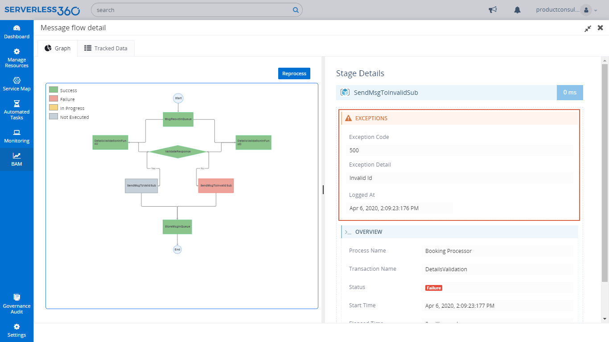
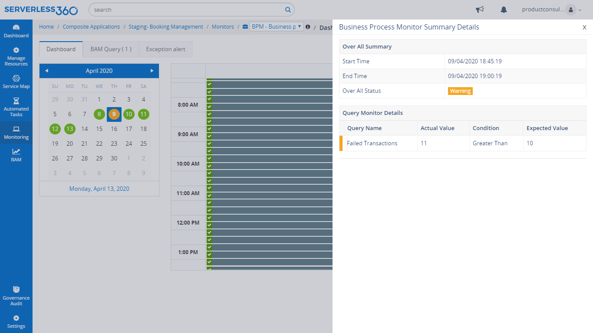
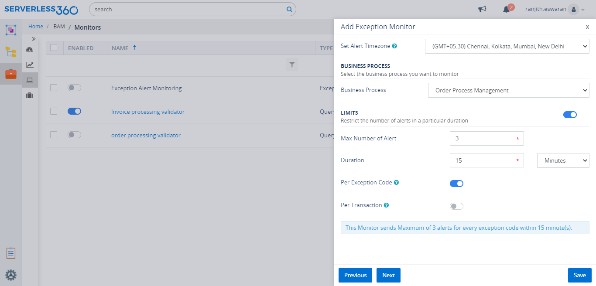
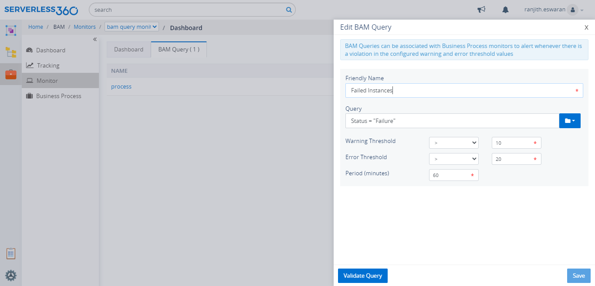
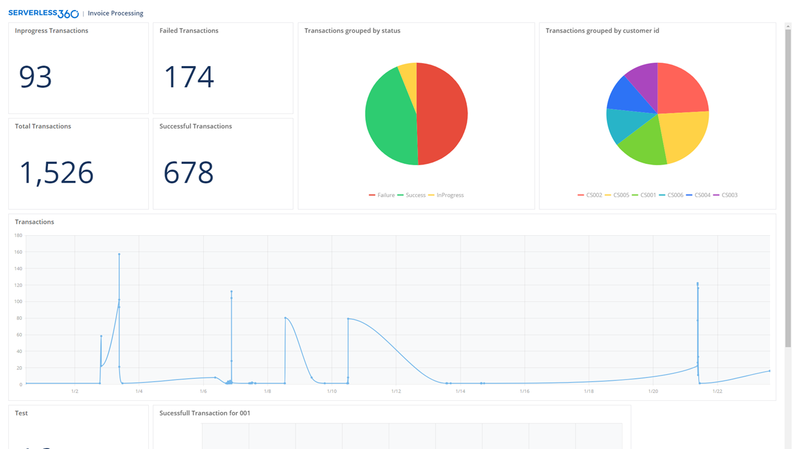

## Introduction

Business Activity Monitoring (BAM) plays a vital role in identifying and resolving issues in the flow of a business process. Also, the concept of BAM is not very new to the world of technology because there are already a handful of organisations leveraging BAM to achieve end-to-end business tracking.

This blog will feed you with everything that you must know about [Business Activity Monitoring](https://www.serverless360.com/business-activity-monitoring) starting right from scratch.

Moving forward, we will see terms like business processes, transactions, and stages very often. It would be better to figure out these terms to understand the concept of BAM.

- **Business Process** - A collection of one or more related business transactions
- **Transaction** - An operation of the business which represents a set of business activities
- **Stage** - An activity within the transaction. A transaction is made up of one or more stages.

## What is BAM?

- As mentioned above, BAM is a technology that is used to identify issues and risks in a business process where this increases the efficiency of any application.
- It is a process of tracking events and transactions and then presenting the information in the form of dashboards and reports which eventually helps in performing analysis on the collected set of data.

>**Business Activity Monitoring is used for both on-premise and cloud applications to gain complete visibility.**

Any BAM tool should cover the following key areas irrespective of the type of application (cloud, on-premise, or hybrid).

- **Aggregation** - This is the process of capturing & collecting data from your business processes.
- **Analysis** - After that, the data should be analysed by performing various data operations.
- **Presentation** - The analysed data is represented in the form of dashboards for quick understanding.

## Role of BAM in Monitoring Serverless Applications

Imagine a business scenario where mostly more than one Azure resource will be used to define a business process. As the needs of the user keep increasing, the business process keeps growing, which turns out to be complex and makes monitoring business processes hard and challenging.

Here is a real-time example to make you clearly understand what business process is and how Business Activity Monitoring can be used in these situations.

Below is a car booking application consisting of various Azure services like Web Apps, Service Bus, Logic Apps, and Azure Functions where all these are integrated to provide a particular solution.

- Consider a Business user, who needs message tracking through every stage in the above business activity.
- There would also be needs for the user to be informed of any exception in the business transaction along with the reason behind the failure. 
- A Business development manager would need to have analytic information on the booking trends at various locations.

Serverless360 is one tool that can satisfy all the above needs. It has an in-built feature called Business Activity Monitoring to provide complete visibility and end to end tracking on your business process.

The picture below is a sample flow diagram for the car booking application where each stage & message can be tracked very easily, and that would reduce the support overhead.

## Serverless360 BAM

This provides business process monitoring solution for cloud architectures, and there are numerous operations supported by BAM to perform on these business processes.

So, now lets look at what Serverless360 BAM is capable of when it comes to providing end to end visibility.

### Tracking

A graphical designer will facilitate modelling your business process transactions in the form of an activity diagram. You will define the stages of your business transactions here.

In the above-mentioned car booking example, there would be a need to track the Driver Id, User Id & Location, which can be achieved at ease by configuring the required properties in the stages of the business process.

**Also, each stage is represented with different colours to make it easy for the support team to identify if they are in success, failure, in progress, or not executed state.**

### Filtering

BAM in Serverless360 provides **advanced filtering** where you can comfortably filter the specified business transactions by using simple **search queries**. In Addition to query filtering, it also supports filtering based on the time interval.

In the car booking scenario, this feature allows you to manage and search for your business transactions using properties like customer id, driver id, location, and even by the status of the transaction.

### Reprocessing

By tracking the business processes, it would be offhand to identify the failed transactions but just identifying will not help the user in any way and that is why BAM in Serverless360 is enriched with a feature called Reprocessing. 

It also states the reason for failure, and that makes it easy for the support person to change the required data and reprocess the message to the stage by just clicking the reprocess option just above your business flow diagram.  

It supports two types of reprocessing

- **Dynamic reprocessing:** This can be useful when the user wants to reprocess along with the tracked property values as the header.
- **Bulk reprocessing:** For this, you need to map a reprocess setting of a particular stage to that respective transaction.

## Monitoring

Serverless360 has several monitors to monitor Azure Serverless applications, and in the same way, it also has a powerful monitor that is the Business Process Monitoring for BAM, which includes Exception Monitoring and Query Monitoring. 

### Business Process Monitoring

- Serverless360 comes with the out of box monitoring solution for **monitoring business processes based on queries and exceptions** called Business Process Monitor.
- These monitors support alerting through notification channels when the count of failed transactions goes beyond the certain limit at a location or alert whenever there is an Exception. 
- It is also possible to view the historical record of alert reports in the calendar view. 

### Exception Monitoring

- This allows users to log exceptions along with exception code in the stages of a business transaction.
- The logged exceptions will be displayed to the users on selecting the transaction instance.
- Users will also need alerts immediately whenever an exception gets logged in any of the stages of the transactions.

### Query Monitoring

- This type of monitoring will alert the configured user when a given query violates the configured threshold values on the business process.
- You can manually set the error and warning threshold conditions while creating the query monitor.

## Analytics

- **Dashboards** play a major role in analysing the data as it supports creating widgets and custom dashboards based on the data in your business processes. 
- It helps the support team to visualise the data in the form of easily understandable charts based on the configured queries. 

>**BAM in Serverless360 supports tracking not only Azure solutions but also other hybrid applications (a combination of cloud and on-premise components).**

## Conclusion

As discussed above, BAM is highly essential for both cloud and on-premise applications as it will reduce the pressure on the support team by identifying the issues in your business transactions. Also, I hope this blog would help you to get a basic idea of how Serverless360 works when it comes to Business Activity Monitoring.

Also read,

- [Serverless360 BAM – A Quick Walkthrough](https://www.serverless360.com/blog/serverless360-bam-quick-walkthrough)
- [BAM Message tracking in Azure Applications](https://www.serverless360.com/blog/bam-message-tracking-in-azure-serverless-application) 
- [Microsoft Flow Monitoring using Serverless360 BAM](https://www.serverless360.com/blog/microsoft-flow-monitoring-using-serverless360-bam) 
- [Hybrid Application Tracking Using Serverless360 BAM](https://www.serverless360.com/blog/hybrid-application-tracking-using-serverless360-bam) 
- [Know more features of BAM in Serverless360](https://www.serverless360.com/business-activity-monitoring)